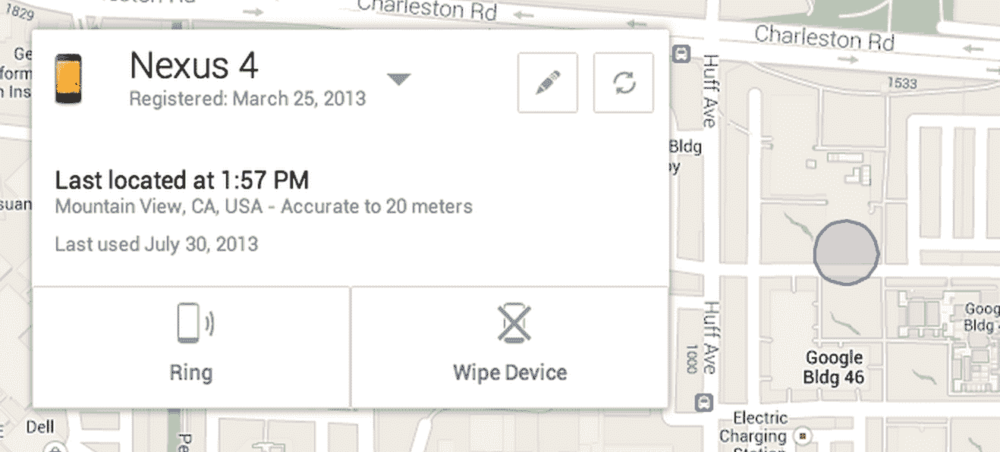

# 谷歌将很快让你通过其即将发布的基于网络的设备管理器 TechCrunch 定位、拨打和远程擦除你的 Android 手机

> 原文：<https://web.archive.org/web/https://techcrunch.com/2013/08/02/google-will-soon-let-you-locate-ring-and-wipe-your-android-phone/>

# 谷歌将很快让你从其即将推出的基于网络的设备管理器中定位、响铃和远程擦除你的安卓手机

苹果用户早就可以使用 iOS 的内置设备定位器和远程擦除功能，但安卓用户不得不[求助于](https://web.archive.org/web/20221006022210/http://www.theverge.com/2013/4/10/4177750/why-doesnt-google-help-consumers-find-their-lost-android-phones)第三方应用。这种情况很快就会改变。Google today [宣布](https://web.archive.org/web/20221006022210/http://officialandroid.blogspot.com/2013/08/find-your-lost-phone-with-android.html)将在本月晚些时候推出一款新的 Android 设备管理器，它将允许你定位和响铃你放错地方(或被盗)的设备，并执行远程擦除，这样你的数据就不会落入坏人之手。

谷歌表示，这项服务将在运行 Android 2.2 或更高版本的设备上提供，从今天的声明来看，Android 设备管理器网站将有一个专门的区域来检测你丢失的设备。然而，还不清楚用户在新的设备管理器网站上还能做什么。

当然，总的来说，这项新服务看起来很像苹果的 Find My iPhone 功能。例如，你可以让你的手机以最大音量响铃(以防它卡在你的沙发垫之间)。定位器功能将在地图上突出显示你手机的位置(这并不奇怪)，远程擦除只需点击几下。然而，与苹果平台不同的是，用户似乎无法向丢失的手机发送信息，或者使用类似于苹果远程锁定工具的东西。

当然，这里没有什么真正的新东西，一些原始设备制造商已经在他们的 Android 手机上提供了其中的一些功能，但 Android 用户肯定会很高兴听到谷歌终于向其用户提供自己的工具。