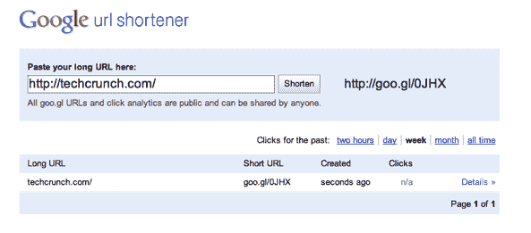

# Goo.gl 可以开始了。“网络上最稳定、最安全、最快的网址缩写程序”

> 原文：<https://web.archive.org/web/https://techcrunch.com/2010/09/30/googlegoo-gl-is-a-go-the-stablest-most-secure-and-fastest-url-shortener-on-the-web/>

# Goo.gl 可以开始了。“网上最稳定、最安全、最快的网址缩写”

谷歌的网址缩写器[刚刚向公众开放了](https://web.archive.org/web/20230324211527/http://googlesocialweb.blogspot.com/2010/09/google-url-shortener-gets-website.html)，拥有一个独立的网站。谷歌的竞争对手 [Goo.gl](https://web.archive.org/web/20230324211527/http://goo.gl/) 于去年 12 月在推出 [Bit.ly](https://web.archive.org/web/20230324211527/http://bit.ly/) 现在可以用于网络上的任何链接。谷歌承诺这个缩写是“网络上最稳定、最安全、最快的网址缩写”

来自博文:

有很多有着出色功能的 shorteners，所以有些人可能会怀疑这个世界是否真的需要另一个 shorteners。正如我们去年年底所说的，我们构建 goo.gl 的重点是质量。有了 goo.gl，你每缩短一个 URL，你就知道它会起作用，会很快起作用，会一直起作用。您还知道，当您单击 goo.gl 缩写的 URL 时，您可以使用我们在搜索和其他产品中使用的相同行业领先技术来抵御恶意软件、网络钓鱼和垃圾邮件。自从我们的初始版本发布以来，我们一直持续投资于服务的核心质量:

**

*稳定性:自从我们首次推出以来，我们已经有了接近 100%的正常运行时间，我们一直在幕后工作，使 goo.gl 更加稳定和健壮。
安全性:我们在 Gmail 中使用的过滤技术的基础上增加了自动垃圾邮件检测功能。速度:我们在九个多月的时间里速度提高了一倍多。*

新的 URL shortener 也有许多有趣的特性。例如，如果你登录到你的谷歌帐户，你将可以访问一个你在过去缩短的网址列表。您可以在任何缩短的 URL 旁边的“详细信息”链接中看到详细信息，在这里您可以找到公开的实时分析数据，包括一段时间内的流量、热门推荐人和访问者概况。

目前还没有可用的 API。但是 Goo.gl 可以通过 Chrome 和 Firefox 的扩展获得。谷歌表示，即将推出的 API 可以用来缩短网址，扩展网址，并直接在你自己的应用程序中查看分析。

Twitter 也在不久前发布了它的网址缩写工具 T1，脸书和 T2 也在测试它的服务 T3。也就是说，尽管有这些竞争对手，Bit.ly 这个在这个领域打拼的初创公司还是看到了[巨大的吸引力](https://web.archive.org/web/20230324211527/https://techcrunch.com/2010/06/03/bitly-pro-data/)。

**更多** : [Goo.gl 的超赞复活节彩蛋可以瞬间将任何链接变成二维码](https://web.archive.org/web/20230324211527/https://techcrunch.com/2010/09/30/googl-easter-egg/ "Goo.gl’s Awesome Easter Egg To Instantly Turn Any Link Into A QR Code")