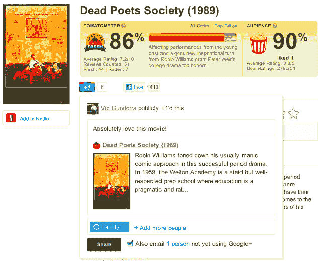

# 谷歌的+1 按钮得到了它的奖赏:现在你可以分享到谷歌+圈子 

> 原文：<https://web.archive.org/web/http://techcrunch.com/2011/08/24/googles-1-button-gets-its-treat-now-lets-you-share-to-google-circles/>

# 谷歌的+1 按钮得到了回报:现在你可以分享到谷歌+圈子

在过去的几个月里，你可能已经见过谷歌的+1 很多次了。你甚至可能点击了它，只是想知道你到底完成了什么。因为，至少从用户的角度来看，[点击它并没有得到任何回报。你按下按钮请客，却空手而归。这并没有阻止+1 按钮获得巨大的分发——它现在出现在 100 万个网站上，每天出现 40 亿次，但这种增长更多地是因为它是*谷歌*的事实，而不是因为这个按钮有用。](https://web.archive.org/web/20230204195514/https://techcrunch.com/2011/06/10/see-you-in-another-life-brother/)

当然，+1 按钮总是有一个微妙的目的:谷歌说它会影响搜索结果，所以你+1 的页面可能会在你朋友的查询中显示得更突出。但是谁知道这种情况有多常见。虽然这些+1 点击也会保存在您的 Google+个人资料中，但它们不会出现在您的朋友会看到的任何地方。

今天，这种情况正在改变:谷歌刚刚[宣布](https://web.archive.org/web/20230204195514/http://googleblog.blogspot.com/2011/08/doing-more-with-1-button-more-than-4.html),+ 1 按钮将让你直接从你正在浏览的任何页面分享到你在 Google+上的圈子。这意味着你有理由继续点击它们。

这个功能看起来很简单，很像脸书的“发送”按钮，让你可以向脸书的一群朋友发送内容。

当你点击+1 按钮并选择与你的 Google+圈子分享时，你会注意到分享的故事已经预先填充了一张图片和一些来自页面的文本(同样，脸书的分享功能也是如此)。谷歌还允许出版商指定他们希望在这些“+Snippets”中包含哪些文本。

对于谷歌的+1 按钮来说，这是一个很大的进步，因为它给了用户更大的动力去点击它们。

【YouTube = ' http://www . YouTube . com/watch？v = xvjrfwuira 4 ']

