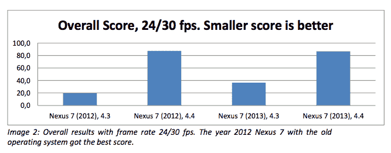
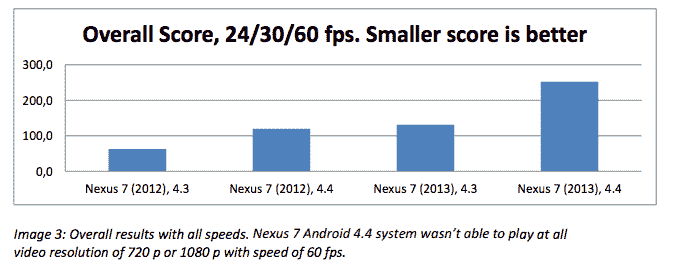

# 谷歌的 Android 4.4 更新似乎损害了 Nexus 7 TechCrunch 上的视频播放性能

> 原文：<https://web.archive.org/web/https://techcrunch.com/2013/11/29/googles-android-4-4-update-seems-to-hurt-video-playback-performance-on-nexus-7/>

# 谷歌的 Android 4.4 更新似乎损害了 Nexus 7 的视频播放性能

谷歌的 Android 4.4 KitKat 更新正在全球范围内向 Nexus 设备推出，我渴望在我的 Nexus 7 平板电脑上安装它。结果是，我可能应该离得远远的。在更新后不久(通过官方 OTA 渠道)，我注意到性能似乎受到了影响，现在芬兰移动视频和触摸测试公司 [OptoFidelity](https://web.archive.org/web/20230131000416/http://optofidelity.com/) 进行的一项研究增加了一些可靠的数据来支持我的观察。

OptoFidelity [比较了高清视频播放的性能](https://web.archive.org/web/20230131000416/http://www.optofidelity.com/wp-content/uploads/2013/11/OF_VideoMultimeter_Nexus7-_EN.pdf)，2012 年的 Nexus 7 和 2013 年的 Nexus 7 在升级到 KitKat 前后分别以 30 和 60 fps 播放 720p 和 1080p 的视频。结果显示，在两款平板电脑都转向谷歌最新的移动操作系统之前，安卓 4.3 的性能明显更好。可怕的是，2013 年的 Nexus 7 在更新后甚至无法播放任何 60fps 的视频。

 

分数差异也不小，因为根据 OptoFidelity 的分类系统，Nexus 7 设备都从提供“令人满意”的性能下降到提供“不令人满意”的性能，新型号的损失最大。我发现使用我自己的设备，动画似乎执行得不太流畅，而且我比 KitKat 更新之前更容易遇到错过的触摸。

对于一个应该向后兼容许多低端设备的更新来说，最现代的平板电脑上的性能倒退有点令人挠头。希望这只是一个发布错误，将在未来的更新中被清除。我们已经向谷歌寻求更多信息，但现在你可能想推迟更新，除非你真的非常需要这些表情符号。