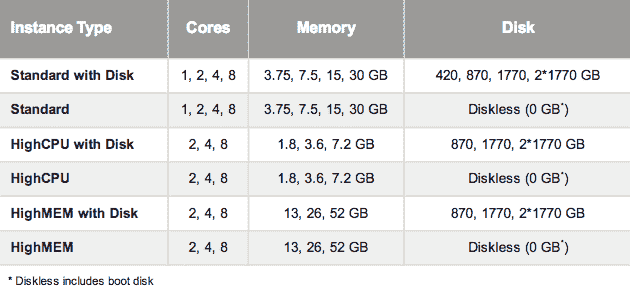

# 谷歌的云平台获得了 36 种新的计算引擎实例类型、更低的存储价格、耐用的低可用性存储等等

> 原文：<https://web.archive.org/web/https://techcrunch.com/2012/11/26/googles-cloud-platform-gets-36-new-compute-engine-instance-types-lower-storage-prices-durable-reduced-availability-storage-more/>

# 谷歌的云平台获得了 36 种新的计算引擎实例类型、更低的存储价格、持久的低可用性存储等等

就在亚马逊 [AWS](https://web.archive.org/web/20221206001350/http://aws.amazon.com/) 在拉斯韦加斯召开的 [re: Invent 会议的前一天，谷歌](https://web.archive.org/web/20221206001350/https://reinvent.awsevents.com/)[刚刚宣布](https://web.archive.org/web/20221206001350/http://googleenterprise.blogspot.com/2012/11/google-cloud-platform-new-features.html)其云平台产品系列的一系列重大更新。在这次更新中，Google 为 Compute Engine 引入了 36 种新的实例类型以及跨平台的许多其他新特性。

使用谷歌应用引擎、云存储和谷歌云 SQL 的开发人员现在也可以在该公司的欧洲数据中心部署他们的应用程序，对计算引擎的支持即将推出。

谷歌云平台上的另一个新功能是谷歌新的[持久降低可用性(DRA)存储解决方案](https://web.archive.org/web/20221206001350/https://developers.google.com/storage/docs/durable-reduced-availability)，这听起来有点像亚马逊冰川[的竞争对手，尽管价格更高，限制更少。目前，这款产品只是预览版，但就像 Glacier 一样，谷歌指出，这款产品主要是为希望“以更低的成本存储数据，以比标准谷歌云存储更低的可用性为代价”的开发人员提供的。DRA 存储的起价为第 1tb 的每月每 GB 0.07 美元，对于需要更多存储的用户，价格会降低。](https://web.archive.org/web/20221206001350/https://developers.google.com/storage/docs/durable-reduced-availability)

尽管如此，即使是那些需要快速访问他们存储的数据并且不能使用新的 DRA 解决方案的开发者也能在他们的账单上节省几美元。谷歌正在降低标准谷歌云存储的价格[超过 20%](https://web.archive.org/web/20221206001350/https://cloud.google.com/pricing/cloud-storage) 。

至于 36 种新的计算引擎实例类型，应该会在未来几周内推出，以下是谷歌对这三种类型的描述:

*   **高内存实例**–为需要大量内存的应用程序定制的高性能实例。
*   **高 CPU 实例**–当应用程序不需要太多内存时的低成本选项。
*   **无盘配置**–对于不需要临时磁盘并且可以专门利用永久磁盘的应用程序，这是一个更低成本的选项。

除此之外，谷歌还推出了[持久磁盘快照](https://web.archive.org/web/20221206001350/https://developers.google.com/compute/docs/reference/v1beta13/snapshots)，正如谷歌所说，这一功能“使即时创建磁盘备份、在谷歌数据中心移动磁盘、使用快照启动新虚拟机变得简单。”