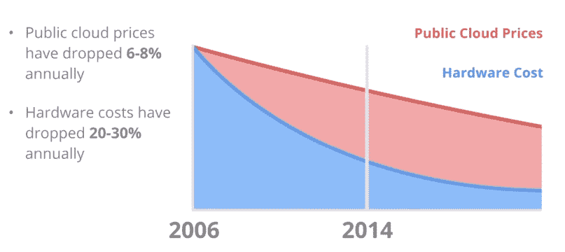
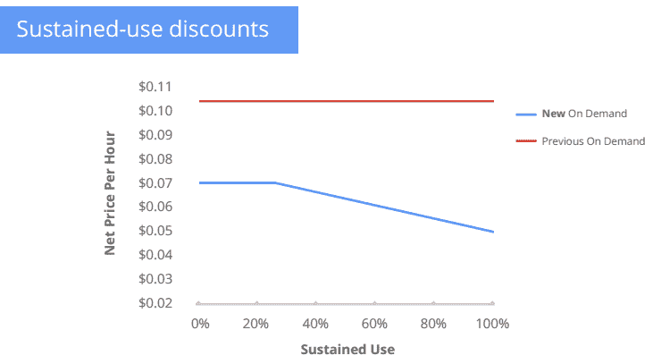
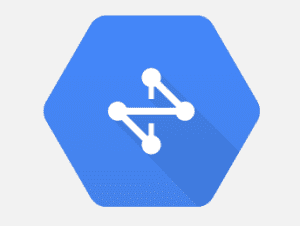

# 谷歌的云平台通过降价和新功能发动攻势 

> 原文：<https://web.archive.org/web/https://techcrunch.com/2014/03/25/googles-cloud-platform-goes-on-the-offensive/>

谷歌今天为其[云平台](https://web.archive.org/web/20221206074005/https://cloud.google.com/)发布一系列更新，旨在使其在亚马逊网络服务仍然是基于云的应用程序的事实平台的市场中更具竞争力。

说谷歌变得咄咄逼人可能是一种保守的说法。该公司今天[宣布大幅降价](https://web.archive.org/web/20221206074005/https://beta.techcrunch.com/2014/03/25/google-drops-prices-for-compute-and-app-engine-by-over-30-cloud-storage-by-68-introduces-sustained-use-discounts)，几乎覆盖其所有服务，这些服务通常比竞争对手的价格更低。例如，[计算引擎](https://web.archive.org/web/20221206074005/https://cloud.google.com/products/compute-engine)的成本在所有规模、地区和阶层下降了 32%。云存储价格下降了 68%，谷歌点播价格下降了 85%。

谷歌认为，价格并没有遵循摩尔定律，即使硬件成本在过去几年里迅速下降。展望未来，谷歌预计价格也将遵循这一模式。到目前为止，值得注意的是，谷歌一直是价格下降方面比较保守的云供应商之一。现在，看起来它实际上可以领先群雄。

谷歌现在也为开发者提供了一个简化的定价模型。虽然亚马逊的定价以复杂著称，但谷歌想走另一条路。例如，谷歌推出了所谓的“持续使用折扣”，如果你一个月使用该服务超过 25%，它就会自动生效，而不是为了获得折扣而必须预订实例和预付费。

此外，谷歌还为开发者提供新工具，以提高他们的工作效率。这些包括 git 支持，但更容易访问所有实例的日志，用于跟踪 bug 的新工具，以及用于从云控制台快速更改应用程序的在线代码编辑器。

随着[托管虚拟机](https://web.archive.org/web/20221206074005/https://beta.techcrunch.com/2014/03/25/google-launches-managed-virtual-machines-gives-developers-a-middle-ground-between-compute-and-app-engine)的推出，谷歌也在其平台上推出了一项新功能，为开发者提供了更大的灵活性。现在，他们可以使用一种新的虚拟机，只需更改几行代码，就可以成为应用引擎应用的一部分，而不必选择易于扩展但限制用户操作的应用引擎或几乎没有限制但更难管理的计算引擎。他们获得了在虚拟机上运行代码的充分灵活性，但 App Engine 仍然管理他们，并负责扩展和其他问题。

谷歌今天也宣布了云域名系统，这是亚马逊的 53 号路线的竞争对手。谷歌表示，云 DNS 提供权威的 DNS 服务，将使谷歌云用户更容易从他们已经用于管理网络基础设施的同一个控制台管理他们的 DNS。

谷歌还通过在有限预览版的计算引擎上支持 [Windows Server 2008 R2](https://web.archive.org/web/20221206074005/http://cloud.google.com/r/windows) 来更有力地推动企业发展。它还将 [Red Hat Enterprise Linux](https://web.archive.org/web/20221206074005/http://www.redhat.com/products/enterprise-linux/) 和[SUSE Linux Enterprise Server](https://web.archive.org/web/20221206074005/http://www.redhat.com/products/enterprise-linux/)加入其阵容。最后两个现在每个人都可以使用。

对于这些类型的企业用户——或者处理大量数据的初创公司——谷歌今天也推出了 BigQuery 流媒体服务。该平台现在每秒钟可以接收多达 100，000 行数据，并使这些信息可用于近实时分析。尽管谷歌自身规模庞大，但它之前并没有提供这种功能，即使亚马逊正在积极推进实时大数据服务。

如果有人担心谷歌是否致力于其云服务，今天的一系列更新清楚地表明，该公司是长期的。在许多方面，它仍在追赶领先几年的亚马逊。然而，与此同时，谷歌有点晚的事实意味着它没有被现有的商业模式所束缚，并且由于其庞大的业务规模，它可以将节省的成本传递给用户，这是较小的参与者根本无法与之竞争的。然而，最重要的是，来自谷歌的新一轮竞争将推动亚马逊、Rackspace 和该领域的所有其他参与者更快地创新。

谷歌将今天的活动安排在[亚马逊自己在三藩市](https://web.archive.org/web/20221206074005/https://aws.amazon.com/aws-summit-2014/san-francisco/)举行的 AWS 峰会的前一天，这可能并不奇怪。亚马逊肯定为明天计划了自己的惊喜，但通过今天发布自己的公告，谷歌可能只会让亚马逊看起来像是在跟随它的脚步。

