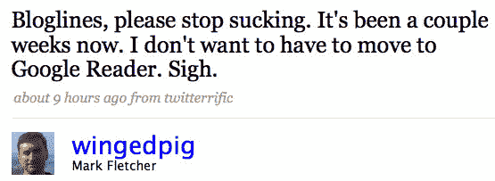
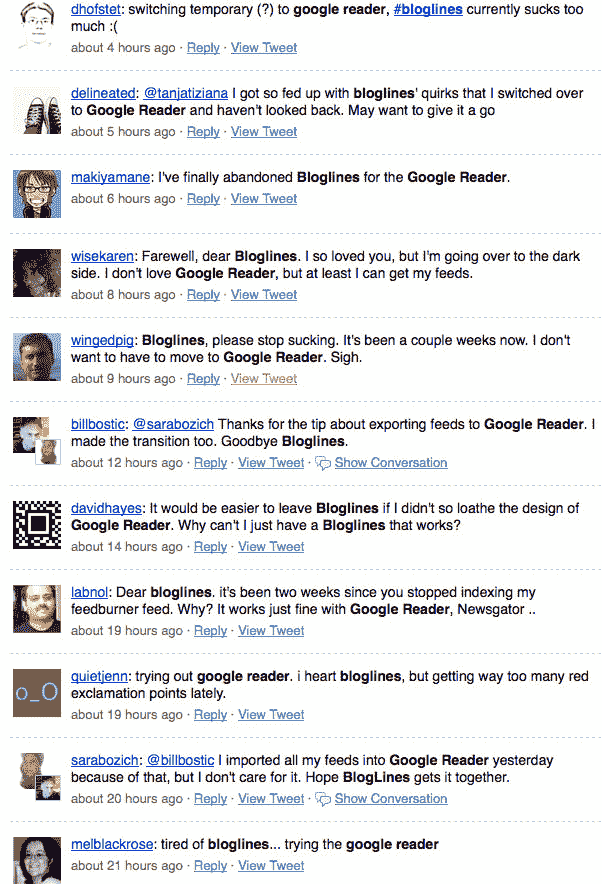

# Bloglines 的破坏现在完成；创始人准备转向谷歌阅读器 TechCrunch

> 原文：<https://web.archive.org/web/https://techcrunch.com/2008/10/18/googles-destruction-of-bloglines-now-complete/>

# Bloglines 的破坏现在完成；方正准备改用谷歌阅读器

那些还没有离开 [Bloglines](https://web.archive.org/web/20221007005326/http://www.bloglines.com/) 使用谷歌阅读器和其他功能性 RSS 阅读器的用户现在正在这样做，主要是因为 Bloglines 已经停止工作，该公司完全没有做任何事情来告诉用户正在发生什么或者什么时候会被修复。

甚至 Bloglines 的创始人马克·弗莱彻(Mark Fletcher)也准备跳槽，他于 2005 年将公司卖给了 Ask.com。昨天他在推特上说:“博客们，请停止吮吸。已经几周了。我不想不得不转向谷歌阅读器。叹。”

问题是 Bloglines 没有更新成千上万个博客的订阅源，包括这个博客(我关注的大约三分之一的订阅源有错误)。这是一个持续的问题。与此同时，这些提要在其他提要阅读器中也非常可读，如 [Newsgator](https://web.archive.org/web/20221007005326/http://www.newsgator.com/) 和 [Google Reader](https://web.archive.org/web/20221007005326/http://www.google.com/reader) 。我们的 25，000 多名博客读者看到的最近一篇 TechCrunch 帖子是在 5 月 14 日。

那么，如果你是 Bloglines 的读者，并准备认输，你会怎么做呢？简单。登录后，点击 Bloglines 页面左下方的“导出订阅”链接，然后将其导入到您选择的任何订阅源阅读器中。问题解决了。

又有一些受够了博客的推特用户:

