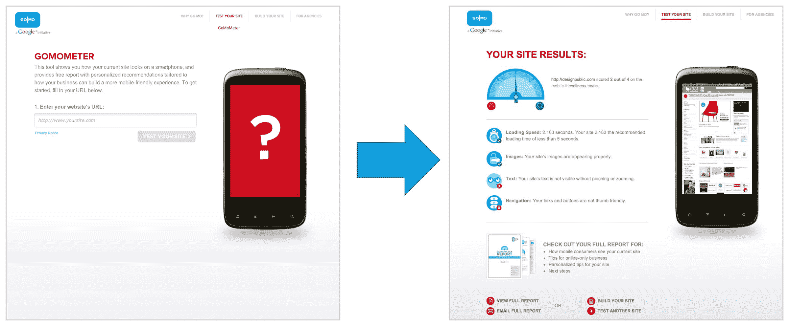

# 谷歌推出 GoMo 帮助企业走向移动技术

> 原文：<https://web.archive.org/web/http://techcrunch.com/2011/11/01/googles-gomo-launches-to-help-businesses-go-mobile/>

# 谷歌推出 GoMo 帮助企业走向移动化

正如之前[透露的](https://web.archive.org/web/20230205024413/http://www.techmeme.com/111031/p39#a111031p39)，谷歌现在[推出](https://web.archive.org/web/20230205024413/http://googlemobileads.blogspot.com/2011/11/gomo-helping-businesses-create-mobile.html)其新的 GoMo 服务，旨在帮助企业轻松创建一个移动友好网站。这项服务的网站在本周早些时候被发现，但详细信息隐藏在有密码保护的首页后面。今天，谷歌正在向公众提供 [GoMo](https://web.archive.org/web/20230205024413/http://www.howtogomo.com/) 。

在 HowToGoMo.com，企业主可以输入他们当前网站的网址，看看这个网站在手机上是什么样子。GoMo 随后会就该网站如何进行移动优化提出建议和意见。GoMo 还将展示优秀移动网站的例子以获取灵感，并指出一系列可以帮助设计更好体验的移动网站开发者。

当然，谷歌自己也通过其最近更新的 [Google Site Builder](https://web.archive.org/web/20230205024413/http://www.google.com/sites/help/intl/en/mobile-landing-pages/mlpb.html) 提供这项服务，它很乐意链接到这个网站。但值得称赞的是谷歌:它没有成为第一链接，而是 Atmio，Inc .和 DudaMobile，这两家公司在列表中位于谷歌之上。(当然，那只是因为列表是按字母顺序排列的。)

提供商列表也可以通过服务类型(DIY、全面服务)、成本和时间框架进行筛选。

GoMo 实际上更多的是一种营销努力，推动企业主转向移动，后者符合谷歌的总体目标，即在(移动)网络上获得更多网站，以便谷歌可以扩大其广告覆盖范围。

尽管如此，作为一个经常在小小的智能手机屏幕上与非移动网络斗争的消费者，很高兴看到这样的事情发生。

[YouTube http://www.youtube.com/watch?v=Ja7abx3OPOQ]