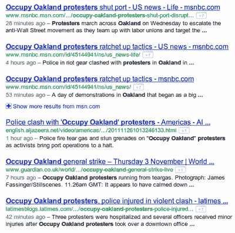

# 谷歌的新算法更新影响了 35%的搜索 

> 原文：<https://web.archive.org/web/http://techcrunch.com/2011/11/03/googles-new-algorithm-update-impacts-35-of-searches/>

今天，谷歌[宣布](https://web.archive.org/web/20230203092510/http://insidesearch.blogspot.com/2011/11/giving-you-fresher-more-recent-search.html)对其搜索算法的改变，该公司称这将影响 35%的网络搜索。这一变化建立在[之前的“咖啡因”更新](https://web.archive.org/web/20230203092510/https://techcrunch.com/2010/06/08/google-caffeine/)的基础上，以便提供更多最新和相关的搜索结果，特别是那些新鲜度重要的领域。这包括最近的事件，热门话题，当前评论和突发新闻。

谷歌表示，新算法知道不同类型的搜索有不同的新鲜度需求，并据此进行权衡。例如，搜索几年前发布的最喜欢的食谱可能仍然很受欢迎，排名很高，但搜索一个正在展开的新闻故事[或 iPhone 4S 的最新评论应该首先带来更新、更新鲜的内容，然后是旧的结果。](https://web.archive.org/web/20230203092510/http://www.google.com/search?q=occupy+oakland+protest)

谷歌表示，对于近期事件和新闻的搜索，它现在可能会在页面顶部显示几分钟前的搜索结果。对于经常发生的事件，比如[总统大选](https://web.archive.org/web/20230203092510/http://www.google.com/search?q=presidential+election)，奥斯卡，足球比赛，公司收益等。，Google 知道您可能对最近的事件感兴趣，即使您没有指定表示该兴趣的关键字。

也就是说，在搜索“苹果收益”时(理论上)不需要输入“2011 年第四季度”即可查看最新信息。这意味着你*指的是最近一个季度的*，不需要额外的文字。当然，当用户执行与金融相关的搜索或当前信息的搜索时，谷歌已经将新闻项目和股票符号排在了页面顶部，但这一算法变化也会影响到有机的搜索结果，而不是来自垂直领域(搜索、金融、图像等)的结果。)已经整合到谷歌的[通用搜索](https://web.archive.org/web/20230203092510/http://googleblog.blogspot.com/2007/05/universal-search-best-answer-is-still.html)中。

对于需要定期更新的项目，比如消费类电子产品点评、某款车的点评等等，谷歌将优先考虑最新信息。

这次“更新新鲜感”是对谷歌去年推出的 Caffeine 的延伸，这是一项暗地里的改进，除其他外，它还帮助谷歌更快地对内容进行索引，从而使结果更实时。今年，谷歌也发布了《熊猫烧香》的最新版本，旨在降低所谓“内容农场”的排名。批评者称，所谓“内容农场”是优化了搜索引擎优化的实体，结果往往质量不高。

现在，很明显，谷歌明白了最相关的搜索结果往往是相关的*或现在的*，也就是给你带来新信息的结果。此次更新对谷歌搜索(Google Search)的影响相当大，谷歌声称大约 35%的搜索结果将受到这些变化的影响。

谷歌曾经有一个垂直搜索，专门搜索 www.google.com/realtime,的最新更新，它在那里索引 Twitter 的更新。然而，当与 Twitter 的合同到期后，[谷歌关闭了网站](https://web.archive.org/web/20230203092510/https://techcrunch.com/2011/07/04/realtime-search-on-hiatus-while-google-and-twitter-figure-themselves-out/)(它现在重定向到谷歌主页)。谷歌当时表示，它计划重新开放该网站，提供 Google+搜索结果以及其他实时信息来源。但是随着新的谷歌搜索更新，实时信息的特定垂直搜索变得不那么必要了。