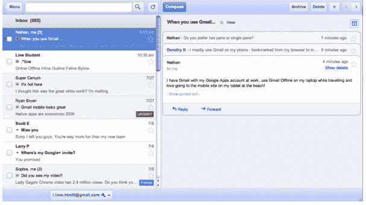

# 谷歌用于 Gmail、日历和文档的新 HTML5 Chrome 应用让用户可以离线访问 

> 原文：<https://web.archive.org/web/http://techcrunch.com/2011/08/31/googles-new-html5-chrome-apps-for-gmail-calendar-and-docs-give-users-offline-access/>

# 谷歌为 Gmail、日历和文档开发的新 HTML5 Chrome 应用让用户可以离线访问

正如我们在 5 月份的谷歌 I/O 上报道的那样，谷歌一直在开发其三个最受欢迎的应用程序的离线版本:Gmail、谷歌日历和谷歌文档。谷歌之前为 Gmail、日历和文档提供离线访问，但[利用了 Gears。](https://web.archive.org/web/20230204223738/https://techcrunch.com/2009/01/27/gmail-goes-offline-with-google-gears/)但是谷歌不再支持 Gears，因为 Chrome 通过 HTML5 获得了许多相同的功能。离线访问功能受到限制。今天，谷歌[宣布](https://web.archive.org/web/20230204223738/http://gmailblog.blogspot.com/2011/08/using-gmail-calendar-and-docs-without.html?utm_source=feedburner&utm_medium=feed&utm_campaign=Feed%3A+OfficialGmailBlog+%28Gmail+Blog%29)它已经以 HTML5 Chrome 网络应用的形式重建了这些应用的离线访问。Gmail 离线版将于今天推出，谷歌日历和谷歌文档的离线版将于下周推出，从今天开始。

HTML5 驱动的 Gmail Offline 是一款 Chrome 网络商店应用，基于平板电脑的 Gmail 网络应用，无论是否可以访问网络。从 Chrome 网络商店安装 Gmail 离线应用程序后，当您失去连接时，可以通过单击 Chrome“新标签”页面上的 Gmail 离线图标继续使用 Gmail。无论电子邮件连接如何，您都可以阅读、回复、发送和整理电子邮件。

谷歌集团产品经理 Rajen Sheth 告诉我们，只要你有互联网连接，Gmail 应用程序就会同步邮件，即使应用程序没有在标签页中打开。以前，Gmail 脱机版是浏览器的插件，Sheth 说，不打开实际应用程序就能同步是 Gmail 团队在开发应用程序时的一大目标。很快，您还可以自定义想要同步的邮件数量。

谷歌日历和谷歌文档的 Chrome 网络应用可以在在线和离线模式之间转换。当您在 Google 日历中离线时，您可以查看日历中的事件并回复约会。使用谷歌文档，你可以查看文档和电子表格。不幸的是，谷歌还没有在 Docs 中加入离线编辑功能，但它正在努力。

Gmail 和其他流行应用程序的离线访问是该公司与微软 stronghold 竞争的关键。Chrome 现在提供离线访问，这是帮助 Chromebooks 和基于浏览器的操作系统与 Windows 竞争的一大进步。

