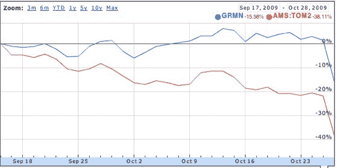

# 谷歌新的移动应用程序令 GPS 导航公司望尘莫及 

> 原文：<https://web.archive.org/web/https://techcrunch.com/2009/10/28/googles-new-mobile-app-cuts-gps-nav-companies-at-the-knees/>

# 谷歌新的移动应用程序让 GPS 导航公司相形见绌

谷歌今天发布了一款新的移动导航应用，像 Garmin 和 TomTom 这样的 GPS 导航公司看到他们的[股票暴跌](https://web.archive.org/web/20221209205652/http://www.google.com/finance?chdnp=1&chdd=1&chds=1&chdv=1&chvs=maximized&chdeh=0&chdet=1256756284254&chddm=29.999999999999996&chls=IntervalBasedLine&cmpto=NASDAQ:GRMN&cmptdms=1&q=AMS:TOM2&ntsp=0)。仅这一宣布就让 Garmin 的市值缩水了 12 亿美元。其股价今天迄今下跌超过 16%，至 31.60 美元。TomTom 的股价下跌了 21%，至 8.11 美元。

而这只是针对一款安卓应用。但是谷歌很有可能让其他手机也能使用它，这正是投资者所担心的。GPS 导航应用程序是所有手机应用程序中最昂贵的之一，也是最赚钱的。TomTom 的 iPhone 应用售价在 50 到 100 美元之间，每个国家有不同的应用。

谷歌刚刚通过免费发布可能是一个更好的产品，击败了传统的 GPS 导航公司。它不是一个独立的导航应用程序。相反，它利用了谷歌在网络上提供的大量资源，包括谷歌地图、街景、语音识别和复杂的搜索。你可以使用语音搜索，就像你在谷歌搜索引擎上找东西一样。“帕洛阿尔托市中心的必胜客在哪里”？如果谷歌的搜索引擎可以找到它，那么谷歌的导航应用程序也可以。Garmin 和 TomTom 无法与这种网络规模的计算能力竞争。

谷歌很乐意免费提供它的导航应用，因为它利用了许多已经为网络开发的现有技术，而且它鼓励更多的人使用有网络功能的手机，在上面进行本地搜索。它的策略是免费提供软件，并通过搜索广告赚钱。