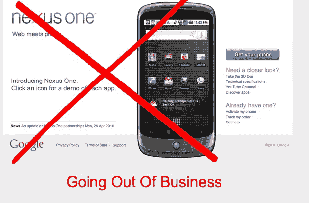

# 谷歌的 Nexus One 商店即将倒闭 

> 原文：<https://web.archive.org/web/https://techcrunch.com/2010/05/14/googles-nexus-one-store/>

# 谷歌的 Nexus One 商店要倒闭了

当谷歌推出其 Nexus One 安卓手机时，它还推出了一个[在线手机商店](https://web.archive.org/web/20230210064234/http://www.google.com/phone)，在那里将出售 [Nexus One](https://web.archive.org/web/20230210064234/https://techcrunch.com/2010/01/05/google-nexus-one-the-techcrunch-review/) 和未来的安卓手机。将手机购买与实际运营商脱钩是一个有点破坏性的举措。这个想法是，你可以选择你的手机，选择你的计划，混合搭配。

好吧，结果不是那样的。运营商不喜欢放弃控制权。事实上，威瑞森决定根本不卖 Nexus One，而是选择自己的[更不可思议的](https://web.archive.org/web/20230210064234/https://techcrunch.com/2010/04/26/verizon-nexus-one-incredible/)安卓手机。手机商店最终失败了，谷歌刚刚宣布将关闭网上商店:

> 虽然 Android 平台的全球采用率超出了我们的预期，但网络商店却没有。对于早期用户来说，它仍然是一个利基渠道，但很明显，许多客户在购买手机之前喜欢亲身体验，他们也希望有广泛的服务计划可供选择。

Nexus One 手机仍将通过运营商合作伙伴提供。但是谷歌的在线手机商店将成为一个“在线商店窗口”,展示全球可买到的安卓手机——直接来自运营商。谷歌有足够的理由对抗苹果。如果它想赢得这场更大的战役，它需要航空母舰站在自己一边。