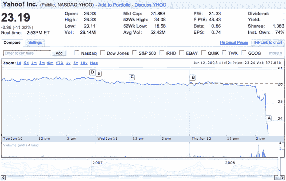

# 今天下午 1:30 谷歌/雅虎搜索合作公告(更新)

> 原文：<https://web.archive.org/web/https://techcrunch.com/2008/06/12/googleyahoo-announcement-at-130-this-afternoon/>

# 今天下午 1:30 谷歌/雅虎搜索合作公告(更新)

雅虎和谷歌将在加州时间今天下午 1:30 发布一份联合声明，我们从接近其中一家公司的可靠消息来源处获悉。公告是什么？最有可能的答案是，两家公司之间的搜索合作伙伴关系，将雅虎搜索营销的全部或部分业务外包给谷歌，可能还包括搜索本身。

两家公司宣布他们将于四月在 T2 测试搜索合作。有争议的交易[引起了国会](https://web.archive.org/web/20230316074936/https://techcrunch.com/2008/04/24/does-the-google-yahoo-advertising-test-amount-to-collusion/)和其他人的[关注，但是合作的初步测试](https://web.archive.org/web/20230316074936/https://techcrunch.com/2008/04/10/somebody-greased-the-lobbyists-congress-notices-googleyahoo-deal/)[被报道为](https://web.archive.org/web/20230316074936/https://techcrunch.com/2008/04/17/yahoo-puts-all-the-chips-on-the-table-time-for-somebody-to-fold/)积极的。我们认为健康的互联网需要一个竞争激烈的搜索市场。

**更新:**我听到的所有消息都说，两家公司将在 1:30 宣布某种形式的搜索合作。既然我们在这里谈论的是上市公司，我想强调的是，这一点还没有得到雅虎或谷歌的证实。

**更新 2:** 另有消息称，雅虎也将在今天下午 1:30 宣布另一位高管离职。我们不知道是谁，但我们听说这不是关于杰夫·韦纳离职的公告。

**更新 3:** 基于这篇报道和路透社的后续报道，以及与微软谈判的最终破裂，雅虎的股票急剧下跌。

**更新 4:** 我们仍在等待公告。

**更新 5:** (下午 3:16)公告已经发出。这里的[细节](https://web.archive.org/web/20230316074936/https://techcrunch.com/2008/06/12/yahoo-announces-non-exclusive-search-agreement-with-google/)，以及我们从相关电话会议中得到的[分析](https://web.archive.org/web/20230316074936/https://techcrunch.com/2008/06/12/yahoo-runs-into-googles-arms/)和[笔记](https://web.archive.org/web/20230316074936/https://techcrunch.com/2008/06/12/liveblogging-yahoo-google-conference-call/)。