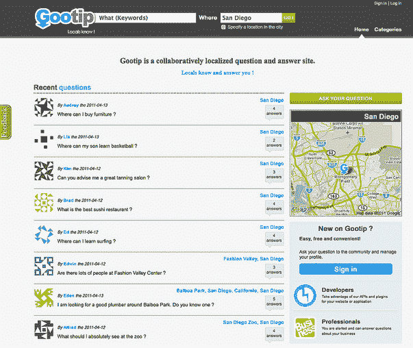

# Gootip 将 Twitter 转变为基于位置的问答服务；发布 iPhone 应用程序、API 等 

> 原文：<https://web.archive.org/web/https://techcrunch.com/2011/09/01/gootip-turns-twitter-into-a-location-based-qa-service-launches-iphone-app-apis-and-more/>

Gootip 是一家来自法国的基于位置的 Q 初创公司，于 5 月份成立，与 T2 的潮人 T3(我们认为，潮人仍在潜行)和其他类似的网站竞争，试图让雅虎问答成为一项有价值的实时服务。Gootip 由[价格部长](https://web.archive.org/web/20230204184938/http://www.crunchbase.com/company/priceminister)校友马修·比达特、埃里克·加涅尔和蒂埃里·塞巴创建，在法国西南部的一个小车库里运营。我看过图片，这些家伙一路高歌猛进，看起来就像是法国西南部的乔布斯和沃兹。

尽管名字有问题，但 Gootip 正试图将自己与其他问答服务区分开来，例如 LocalMind，不仅让用户能够在特定城市、城镇或特定地点的背景下提问和回答问题，还走得更远。

Gootip 允许用户注册并将其账户链接到 Foursquare 和脸书，以整合他们的入住数据，以及他们的家庭和工作地点。用户然后将他们的问题分类(可以是夜生活、购物、艺术和娱乐等。)并输入他们需要回答问题的截止日期，无论是 24 小时还是一周。

正如 Steve O'hear 在我们最初的报道中指出的, , Gootip 正在证明，利用脸书和 Twitter 数据集的基于位置的问答网站的准入门槛已经“变得更低”,年轻、精明的初创公司可以迅速建立服务，为流行的社交网络提供有价值的扩展。然而，正如他指出的那样，在他们推出测试版时，有几个关键部分丢失了。

因此，为了让 Gootip 不仅仅是一个简单的网站或移动应用程序，这家初创公司的目标是建立一个平台，可以从内部*和*外部服务中检索和分析本地问题和答案:Web、移动、API、SMS、社交网络等等。这是一个雄心勃勃的目标，但为了开始并展示功能如何与其他大型社交网络合作，Gootip 创建了[“ask gtip”](https://web.archive.org/web/20230204184938/http://www.gootip.com/askgtip/)，它称之为“提及的应用程序”，与 Twitter(很快将与脸书、Foursquare 和 Gowalla)合作，询问他们最喜欢的社交网络的问题——在这里是 Twitter。

Askgtip 允许用户直接向 Twitter 提问，然后初创公司将分析问题，提取位置数据，并将其发布到 Twitter 和 Gootip.com，这样两者的用户都可以看到问题并发布答案。该应用程序检索 Twitter 上给出的答案，并将其显示在主页上，指定答案中给出的位置。

Askgtip 还支持 Twitter 的主题，这些主题通常链接到一个事件(例如#tcdisrupt)，应用程序将分析这些主题并链接到一个特定的位置。这是 Gootip 试图解决的主要问题:查找位置和分析问题以产生正确位置和位置正确数据的困难。

因此，举例来说，如果你问“谁是旧金山‘传教区’最好的医生？”Gootip 会将“Mission District”转换为存在于 Gootip 网站上的位置，以便当 Askgtip 回答问题时(因为用户已经在 Gootip 上回答了)，将其转换为两个网站上的地图和位置，简而言之，将 Gootip 的功能引入 Twitter。

随着这家初创公司为各种社交网络推出服务，它也开放了自己的 API 和插件。Gootip 的联合创始人 Mathieu Bidart 表示，在未来几周内， [Sud Quest](https://web.archive.org/web/20230204184938/http://www.sudouest.fr/) (法国最大的本地日报集团之一)将整合这家初创公司的 API，允许用户直接从 Sud Quest 的网站上提出本地问题。

除了添加插件和小工具以使合作网站利用 Gootip 的功能，这家初创公司还推出了一款名为[的 iPhone 应用程序](https://web.archive.org/web/20230204184938/http://itunes.apple.com/en/app/gootip-wall/id437032534?mt=8)，使用户能够搜索、提问和回答问题，内容基于用户的 GPS 位置呈现——所有这些都可以在你的 iPhone 上舒适地完成。

Gootip 最酷的一点是，它已经与超过 3000 万个地点合作，因此可以通过关键字(或通过使用移动设备上的 GPS 默认值)从全球数百万个城镇和城市进行每一次 Gootip 搜索。结果以问题答案的数量呈现，位置被钉在交互式地图上，地图上有所有细节，包括地址、电话号码等。

Gootip 还为新的移动应用程序提供了脸书和 Twitter 认证，允许用户通过社交网络登录，除了简单地通过 Gootip.com 登录——该网站已经提供了脸书、Twitter、Foursquare、Gowalla 和谷歌的认证——此外，该服务现在有英语和法语版本，德语和西班牙语版本将在未来几周内推出。

O'hear 指出了 Gootip 在推出测试版后需要完成的几件事情，随着新的 iPhone 应用程序(Android 即将推出)、插件和小部件、开放 API、Twitter 功能和新语言的出现，Gootip 无疑取得了一些重大进展。UX 确实还需要一点调整(以及一些翻译)，但对于三个在车库里自举的人来说，Gootip 已经取得了长足的进步。潮人最好准备好。

更多关于 Gootip 的内容，请点击这里查看，点击这里和[一起玩。](https://web.archive.org/web/20230204184938/http://www.gootip.com/askgtip/)

