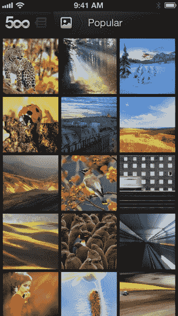

# 华丽的照片，现在在你的口袋里:500 像素到达 iPhone TechCrunch

> 原文：<https://web.archive.org/web/https://techcrunch.com/2012/11/28/gorgeous-photos-in-your-pocket-500px-arrives-on-iphone/>

紧接着[收购了一个流行的 iPhone 应用程序](https://web.archive.org/web/20221225235229/https://techcrunch.com/2012/11/20/500px-acquires-french-ios-appmaker-pulpfingers-to-beef-up-european-presence/)的开发者，以浏览其服务上的照片，多伦多的照片共享创业公司 [500px](https://web.archive.org/web/20221225235229/http://500px.com/) 今天首次推出了自己的 iPhone 应用程序。就在一年前，[公司发布了其第一款 iOS 应用](https://web.archive.org/web/20221225235229/https://techcrunch.com/2011/10/17/gorgeous-photos-tablet-browsing-500px-debuts-new-ipad-app/)，500px 用于 iPad，今天也有了小的更新，因为这两款应用现在作为 iPhone 和 iPad 的通用二进制程序发布。

像之前的 iPad 应用一样，新的 iPhone 应用共享相同的黑白用户界面，这使得照片真的很流行。然而，它也引入了自己独特的导航，而不是依赖于现在常见的单屏幕界面，导航隐藏在左侧(例如，类似于脸书或 Google+应用程序)。这家公司显然由完美主义者组成，实际上在早期的迭代中尝试了这种风格的导航，并认为它不起作用。“用户对交互很熟悉，”500px 首席执行官 Oleg Gutsol 说，“但我们对结果并不满意。”

相反，新的 iPhone 应用程序在顶部提供了可点击的菜单，这些菜单不是那么明显的导航元素，但也有逐渐消失在应用程序界面中的好处。点击“500”标志，您可以访问通知、设置和帮助。图片图标可以让你在应用程序的主屏幕上切换到你的个人资料和服务上其他人的照片，图片图标右侧的文本可以让你进一步过滤这些照片。

例如，在浏览网站范围内的照片时，您可以选择查看热门照片、编辑选择、即将发布的照片、新鲜照片或执行搜索。与此同时，在你的个人资料中，你可以在你的关注者(即你的 500 像素好友)、你的收藏夹和一个名为“流量”的新部分之间切换这有点像朋友的朋友查看你网络上分享的照片，因为它提供了你的朋友在 500px 上评论和喜欢的照片。这也是寻找新摄影师的好方法。

另一种寻找关注对象的方式是通过个人资料下的“寻找你的朋友”功能，该功能允许你连接你的脸书和 Twitter 账户，以便在 500px 上找到你认识的人。在这里，该应用程序还在服务上推荐顶级摄影师，这对新用户有帮助。Gutsol 解释说，这个列表不是编辑选择，而是通过编程建立的。

 “我们有一套算法来决定最好的摄影作品，以及有趣的人和有趣的摄影师，”他说。该算法在一定程度上使用了早期 500 像素收购的技术，Algo Anywhere ，并根据他们照片的新近度和质量推荐人。但是，Gutsol 指出，该公司在了解照片质量方面有着悠久的历史，大约八年前就从 LiveJournal 社区发展出了自己的服务，在那里，版主们煞费苦心地审查每张照片。他说，现在做同样事情的算法是 500px“秘方”的一部分。

iPhone 应用程序在发布时明显缺少的一个功能是实际上传照片的功能，但该公司表示，该功能将在以后的版本中推出。同样，这是一个团队对用户界面不满意的情况，所以他们决定等待。我们问它优先级较低的原因是否是因为有多少专业摄影师使用 500 px——也就是说，那些用比智能手机稍好的相机拍摄照片的人。但是 Gutsol 说事实并非如此，他估计只有 5%-10%的网站用户是专业人士。500px 的广大用户只是对摄影感兴趣，想拍出更好的照片。他补充道，他们被高质量的体验所吸引。

iPad 应用程序对该公司来说是成功的，150 万注册用户中超过 50%也在 iPad 上，93%的回头客和会话时间在 40 分钟以上。在安卓系统上，这个数字要低一些，因为安卓应用不仅限于平板电脑。Gutsol 认为 iPhone 应用程序的使用将类似于 Android 智能手机应用程序的使用:每天大约 5 分钟。

除了未来更新 iPhone 应用程序以带来急需的上传功能等，500px 还计划推出一个由小组和论坛组成的社区网站，并扩大自己的团队。现在每月增长 100，000 名用户，该公司将在未来 6 至 12 个月内将员工人数从 31 人增加一倍，找到更大的办公空间，并筹集 a 轮融资。

更新后的 iOS 应用程序将可在 App Store 的[这里](https://web.archive.org/web/20221225235229/https://itunes.apple.com/ca/app/500px/id471965292?mt=8)下载。