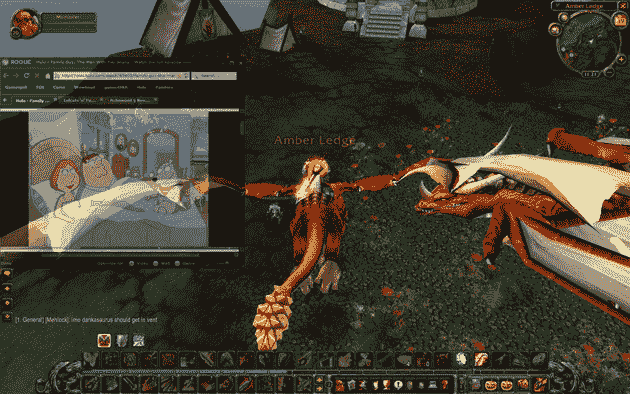

# GotGame 发布游戏集成网页浏览器；观看 Hulu 获得 1337 

> 原文：<https://web.archive.org/web/https://techcrunch.com/2008/11/20/gotgame-releases-integrated-web-browser-for-games-watch-hulu-as-you-get-1337/>

# GotGame 发布游戏集成网页浏览器；看 Hulu 当你得到 1337

对于所有迷人的图形和肾上腺素刺激的游戏，非游戏玩家可能会感到惊讶的是，今天许多最受欢迎的电脑游戏都因停机而陷入困境(我应该知道——我在 1999 年的大部分时间里都在 Ultima Online 上开采虚拟矿石，以成为一名铁匠大师，并享受了大约 10 分钟)。像《魔兽世界》这样的大型多人在线游戏见证了史诗般的战斗，其间不时会有几个小时在空旷的荒野中游荡，而 FPS 游戏通常会让玩家坐在一旁看着他们的同伴战斗，直到下一轮开始，以此来惩罚他们的死亡。

今天 [GotGame](https://web.archive.org/web/20221006042001/http://rogue.gotgame.com/) 给这些游戏玩家在无聊的时候找点事做。该公司发布了 [Rogue](https://web.archive.org/web/20221006042001/http://rogue.gotgame.com/) ，这是一款基于 WebKit 和 Adobe AIR 平台的网络浏览器，可以直接集成到当今大多数流行的游戏玩家中，允许用户通过一个热键在游戏和网络之间切换。游戏玩家将能够检查他们的电子邮件，听潘多拉音乐，看 Hulu 视频，或者在闲暇时随意浏览网页，只要他们需要，就可以在几秒钟内跳回到游戏中(浏览器支持不透明，所以很容易判断何时需要转移注意力)。

Digg _ URL = " http://www . beta . TechCrunch . com/2008/11/20/got game-releases-integrated-web-browser-for-games-watch-Hulu-as-you-get-1337/"；

通过将游戏置于“窗口”模式(这不会让它们占据整个屏幕)，可以完成类似的多任务处理，但这使得游戏容易崩溃，性能很差。相反，GotGame 表示，Rogue 应该可以很好地运行大多数游戏，应该只会轻微影响性能(尽管如果你观看像 Hulu 这样基于 Flash 的电影，这种影响会显著增加)。

虽然对于非游戏玩家来说，这似乎违反直觉，但 GotGame Rogue 是一个很好的想法——我很希望在我的游戏生涯中拥有它(但我被迫坐在电脑显示器旁边看电视)。如果这款应用像 GotGame 声称的那样稳定，它可能会做得很好。这一领域的其他玩家包括 Xfire，它提供了一个游戏内应用程序来与其他玩家进行交流。

[YouTube http://www.youtube.com/watch?v=j009K9_kpAk&hl=en&fs=1]

