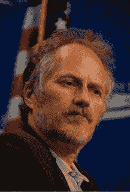

# Gov 2.0:一切都在于平台| TechCrunch

> 原文：<https://web.archive.org/web/https://techcrunch.com/2009/09/04/gov-20-its-all-about-the-platform/>

***编者按**:以下客座博文由 **[蒂姆·奥莱利](https://web.archive.org/web/20230315125430/http://www.crunchbase.com/person/tim-oreilly)** 撰写，他是计算机图书出版商奥莱利传媒的创始人兼首席执行官，也是一位会议组织者。五年前，O'Reilly 创造了 Web 2.0 这个术语。现在他认为是 Gov 2.0 的时候了，并帮助组织了下周的峰会来讨论这可能意味着什么。*

今天，很多人把 Web 2.0 等同于社交媒体；三四年前，他们把它等同于 AJAX 应用程序和 API。许多人现在开始认为这完全是云计算。事实上，它是所有这些和更多。我一直定义 Web 2.0 的方式是，它对互联网意味着什么，而不是个人电脑，是占主导地位的计算平台。网络为平台的商业规则和竞争优势是什么？

政府 2.0 也是如此。很多人把这个词等同于政府使用社交媒体，要么是为了吸引公众参与，要么是以新的方式传递信息。一些人认为这意味着让政府更加透明。有些人认为这意味着在政府网站中添加 AJAX，或者用政府 API 替换那些网站，或者为共享的政府服务建立新的云平台。是的，它意味着所有这些事情。

但是和 Web 2.0 一样，政府 2.0 成功的真正秘诀是把政府当成一个平台。如果说我们从科技行业学到了什么，那就是每个大赢家都是一家平台公司:他们的成功让其他人受益，他们在自己的工作基础上再接再厉，扩大了自己的影响。微软让“每张桌子和每个家庭都有一台个人电脑”，互联网连接了这些个人电脑，谷歌造就了一代靠广告支持的创业公司，苹果让开发者自由开发任何手机公司都想不到的应用，颠覆了手机市场。在每一个案例中，平台提供商都提高了门槛，为其他人创造了可乘之机。

有迹象表明，政府开始采纳这种平台思维。

在 data.gov 联邦首席信息官维韦克·孔德劳的网站背后，是政府机构不应该仅仅提供网站，他们应该提供网络服务的理念。这些服务实际上变成了政府的 SDK(软件开发工具包)。政府可能会使用这些 API 构建一些应用程序，但公民个人和创新公司也有机会构建新的、意想不到的应用程序。这是 Jonathan Zittrain 称之为“生成性”的现象，即开放式平台创造其创造者未预见到的新可能性的能力。

当然，就像商业网络服务的兴起一样，“黑客”已经攻击大门一段时间了。早在 2005 年，Adrian Holovaty 的 chicagocrime.org(现在是 everyblock.com[的一部分)就是第二个谷歌地图混搭。它向世界展示了把政府数据放在地图上可以创造多少价值。华盛顿特区民主应用竞赛的大多数获胜者都是芝加哥犯罪的直系后代。同样，](https://web.archive.org/web/20230315125430/http://everyblock.com/) [Openstreetmap](https://web.archive.org/web/20230315125430/http://openstreetmap.org/) 在地图数据昂贵的英国，也是利用众包创建免费地图起家的；他们为巴勒斯坦绘制更好地图的举动导致了联合国和欧洲共同体的贡献。

我们开始看到在地方、州和联邦层面开发应用生态系统的正式努力，通过像 Apps for Democracy、 [Apps for America](https://web.archive.org/web/20230315125430/http://www.sunlightlabs.com/contests/appsforamerica/) 和其他类似项目这样的竞赛。像 [SeeClickFix](https://web.archive.org/web/20230315125430/http://seeclickfix.com/) 这样的初创公司正在推动政府服务的标准化 API(比如 [Open311](https://web.archive.org/web/20230315125430/http://open311.org/) )。但是还有很长的路要走。

在下周于 DC 举行的 [Gov 2.0 博览会展示](https://web.archive.org/web/20230315125430/http://gov2expo.com/)和 [Gov 2.0 峰会](https://web.archive.org/web/20230315125430/http://www.gov2summit.com/)上，我的目标是鼓励更多这种平台思维。我们邀请了科技界一些最重要的平台提供商的领导人——TCP/IP 的创始人温顿·瑟夫、Twitter 的杰克·多西和微软的克雷格·芒迪等——来讨论是什么让技术平台运转起来。我们邀请了像 [GSA 首席信息官凯西·科尔曼和亚马逊首席技术官沃纳·威格尔](https://web.archive.org/web/20230315125430/http://www.gov2summit.com/public/schedule/detail/10422)这样的人来谈论政府可以从私营部门学到什么来建设云计算基础设施，尤其是如何构建可互操作的云。正如我们在与谷歌首席经济学家 Hal Varian 的台上对话中一样，我们透过表面现象来看，谈论测量和“[实时经济](https://web.archive.org/web/20230315125430/http://www.gov2summit.com/public/schedule/detail/10534)”在 Web 2.0 平台的成功中扮演的角色。我们将尝试把这些见解应用到联邦政府面临的一些重大举措中，包括医疗保健和教育。当然，我们将与政府互联网战略的设计师、联邦首席信息官[维韦克·孔德劳](https://web.archive.org/web/20230315125430/http://www.gov2summit.com/public/schedule/detail/10421)、联邦首席技术官[安尼什·乔普拉](https://web.archive.org/web/20230315125430/http://www.gov2summit.com/public/schedule/detail/10395)、白宫新媒体负责人[梅肯·菲利普斯](https://web.archive.org/web/20230315125430/http://www.gov2summit.com/public/schedule/detail/10463)、联邦通信委员会主席[朱利叶斯·格纳考斯基](https://web.archive.org/web/20230315125430/http://www.gov2summit.com/public/schedule/detail/10428)以及军事和情报部门的领导人进行接触。

在我与克雷格·芒迪的一次预备通话中，他强有力地推动了杀手级应用推动平台采用的想法。我突然想到，杀手级应用可能已经出现了；我们只是没有给予政府足够的信任。我说的是地理定位的奇妙世界，汽车上的 GPS 设备可以提供路线指引，电话应用程序可以告诉你下一辆公交车什么时候到，很快，增强现实应用程序会告诉你附近有什么。人们很容易忘记，GPS 和最初的互联网一样，是由政府发起的一项服务。这里有一个关键点:空军最初发射 GPS 卫星是为了自己的目的，但是在一个关键的*政策*决定中，同意发布一个不太精确的信号用于商业用途。空军从提供应用程序转变为提供平台，其结果是私营部门的创新浪潮。

位置是政府与其公民以及一系列非政府服务相关的关键。但是关于谁拥有这些数据已经有了争议。例如，[纽约大都会运输署针对 StationStops iPhone 应用发布了一个下架令](https://web.archive.org/web/20230315125430/http://www.nytimes.com/external/readwriteweb/2009/08/21/21readwriteweb-ny-transportation-authority-cites-schedules-76211.html)。这正是我们希望通过揭示政府平台建设的最佳实践来补救的那种糟糕的政策。
。人们很容易忘记政府干预是多么富有成效。互联网本身本来就是政府资助的项目。州际公路系统也是如此。如果没有政府干预，沃尔玛会存在吗？如果没有交通、水、电、垃圾收集和所有其他我们认为理所当然的服务，我们的城市会繁荣吗？就像操作系统为应用程序提供服务一样，政府提供了促进私营部门活动的功能。

重要的是，“政府作为平台”的理念要远远超出 It 领域。meetup.com 公司的创始人斯科特·黑弗曼向我强调了这一点。Meetup 是一个让人们想做什么就做什么的平台。他们中的许多人将它用于公民参与:清理公园、海滩和道路；识别和解决本地问题。

在我最近的一些演讲中，我使用了唐纳德·凯特在《美国下一届政府》中提出的一个形象。太多时候，我们认为政府是一种自动售货机。我们交了税，得到了服务:道路、桥梁、医院、消防队、警察保护……当自动售货机不能给我们想要的东西时，我们就抗议。我们的公民参与理念不知何故被简化为摇动自动售货机。但 meetup 告诉我们的是，参与可能意味着伸出我们的手，而不仅仅是我们的声音。

在这方面，我喜欢讲一个 CNN 去年四月的故事:考艾岛一条通往州立公园的道路被冲毁，州政府说他们没有钱修复它。公园将被关闭。了解到对当地经济的影响，一群企业参与进来，组织了一群志愿者，自己修好了路。我称之为[公民规模的 DIY](https://web.archive.org/web/20230315125430/http://radar.oreilly.com/2009/04/change-we-need-diy-civic-scale.html)。斯科特·黑弗曼纠正我说:“这是 DIO:不是‘自己动手’，而是‘自己动手’。”“想象一下，如果州政府不把自己想象成自动售货机，而是公民行动的组织引擎。DIO 能帮助我们解决困扰我们的其他问题吗？我们能想象在政府和公众之间达成一种新的契约吗？在这种契约中，政府为由私人公民而不是政府提供的服务建立机制。换句话说，政府可以成为一个平台吗？

我们现在有一个巨大的机会来改变现状。对新思想的接受度是我们这一代人从未见过的。各级政府都发出了求助的呼吁。这取决于技术社区，用我们的想法、我们的声音、我们的创造力和我们的代码来回应。

*(图片来源:Flickr/ [美国进步中心](https://web.archive.org/web/20230315125430/http://www.flickr.com/photos/americanprogress/3597368485/) )*