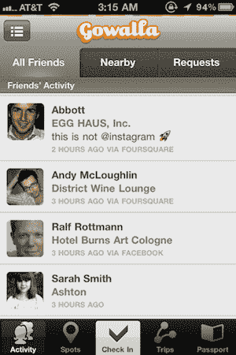
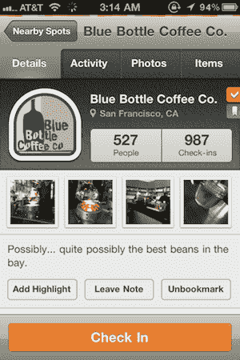
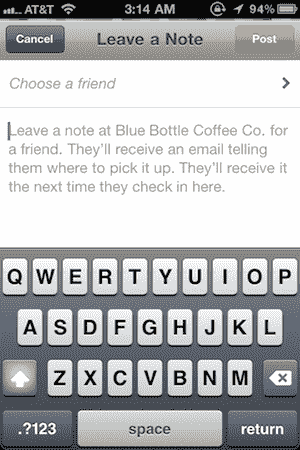

# Gowalla 3.0 统一了签到、脸书、Twitter 和 Foursquare 的位置

> 原文：<https://web.archive.org/web/http://techcrunch.com/2010/12/02/gowalla-3-foursquare-facebook-twitter/>

今年三月，我带着一个问题从 SXSW 回家。所谓的“位置战”[并没有让](https://web.archive.org/web/20230202235302/https://techcrunch.com/2010/03/14/foursquare-gowalla-location-war/)一个签到服务统治所有人。事实上，仅在那次会议上就出现了几个新的。[登机疲劳](https://web.archive.org/web/20230202235302/https://techcrunch.com/2010/03/19/check-in-fatigue-location-war/)开始了。

从那以后，问题变得越来越严重。现在，脸书已经把自己放在了位置空间的正中央。而 Yelp 等其他公司仍在那里努力推进。越来越失控了。我准备宣布入住破产了。或者说我曾经是，直到 Gowalla 决定做一些大胆的事情。

基于位置的服务已经决定从根本上改变他们的应用程序，让你不仅可以登录他们的服务，还可以登录脸书甚至 Foursquare 的服务。是的，他们刚刚开始与他们的主要对手兼容。

今天为 iPhone 推出的 Gowalla 3.0 是这项服务自近两年前在 SXSW 推出以来经历的最大变化。当时，这款应用似乎更多的是在不同地点收集精美的虚拟商品，并在镇上交换。现在 Gowalla 是一个直接的签到机器。你不仅可以在上面提到的服务上签到，Gowalla 还会在这些服务上收集你朋友的所有签到信息。

是的，他们创建了统一的登记服务。你可以看到你所有朋友的签到*，即使他们根本不使用 Gowalla*。太棒了。

它实际上更深入。简单的从其他服务拉进来签到给你看，允许你签到是一回事。但 Gowalla 实际上已经做了手工劳动，在他们自己的地点数据库、脸书的地点数据库、Foursquare 的地点数据库，甚至 Twitter 的地点数据库之间同步场馆。这项工作仍在进行中，但联合创始人[乔希·威廉姆斯](https://web.archive.org/web/20230202235302/http://www.crunchbase.com/person/josh-williams)表示，大部分艰难的工作已经完成。

最终结果是，当你在 Gowalla 应用程序的所有服务中签到时，它们会同步到其他服务中的位置。

在 3.0 版本中，Gowalla 还采取措施简化了登记流程。在主屏幕上，你会在底部中间看到一个漂亮明亮的签到按钮。当你点击这个，Gowalls 扫描附近的地方，并与你经常去的地方进行交叉引用。然后他们会建议你去一个他们认为你在的地方，如果他们是对的，你只需点击两下就可以登记入住。

威廉姆斯说，在他们的测试中，目前他们的正确率约为 80%。如果他们错了，只需点击场地选择附近的新场地。所以是三下而不是两下。

在这个签到界面上，你还可以一键分享你在脸书、Foursquare、Twitter 甚至 Tumblr 上的签到信息。前两个显然会让你在其他服务上登记到相同的位置。如果您将入住信息发送到 Twitter，您将在 Twitter 上发布一个到该地点 Gowalla 页面的链接，该推文将被地理标记到您的位置。如果你把它发送到 Tumblr，这个场馆的图标和名称将会被制作成一个 Tumblr 帖子放在你的博客上，并配有“我在场馆”这样的文字。

 

那么 Gowalla 为什么要这么做呢？这是他们向比他们大的竞争对手认输了吗？威廉姆斯不这么看。相反，他谈到人们经常告诉他，他们喜欢 Gowalla 的设计和功能，但他们并不怎么使用它，因为他们所有的朋友都已经在 Foursquare 或脸书上签到了。所以威廉姆斯和他的团队排除了这个借口。

一个大问题是 Foursquare 对此会有什么反应？虽然像这样的网站大肆渲染 Gowalla/Foursquare 的竞争，但事实是双方并不了解对方。事实上，威廉姆斯和 Foursquare 联合创始人丹尼斯·克劳利在去年 3 月下旬才第一次见面。是的，*后* SXSW。我哪里知道？我主持了[他们俩都参加的一个小组](https://web.archive.org/web/20230202235302/http://where2conf.com/where2010/public/schedule/speaker/69661)。尴尬。

威廉姆斯说，从那以后，他们只在活动中短暂互动过几次。他真的认为 Foursquare 会接受新的 Gowalla 功能。毕竟，他们只是使用 Foursquare 的公共 API 来做所有这些事情。在某种程度上，他希望它们是建立在 Foursquare 平台之上的最好的应用。

脸书可能会更好地接受这一举措。这种东西正是他们希望其他服务构建的。脸书希望成为基础位置平台，在此基础上提供最好的服务。尽管他们可能更希望 Gowalla 只使用他们的平台，而不是 Foursquare 的。这就是这个领域的另一个玩家 [Loopt](https://web.archive.org/web/20230202235302/http://loopt.com/) 正在做的事情。

如果 Gowalla 开放他们的同步位置数据库，事情可能会变得有点混乱，Williams 说他们计划通过他们的 API 这样做。这些公司都想拥有这些数据，Foursquare 花了很多时间来构建他们现在拥有的数据。与此同时，[公众](https://web.archive.org/web/20230202235302/https://techcrunch.com/2010/04/17/open-database-places/)和[开发商](https://web.archive.org/web/20230202235302/https://techcrunch.com/2010/05/08/place-database/)都在为此鼓噪。所以我们走着瞧。

绝对值得注意的是，Gowalla 并不是第一个尝试统一签到的服务。大约在去年 SXSW 的时间，一个叫做 [check.in](https://web.archive.org/web/20230202235302/http://check.in/) 的服务建立了一种通过移动网络[来做这件事的方法。但是 Gowalla 的执行力要好得多。Gowalla 也不是从零开始，他们已经有了很多用户。Check.in 由 Brightkite 的两位创始人创建，但它是一项独立的服务。(从那以后，他们开始关注其他事情。)](https://web.archive.org/web/20230202235302/https://techcrunch.com/2010/03/25/check-in/)

除了这些大的新增功能，Gowalla 3.0 还有几个更小的功能，使它成为一个全面更好的应用程序。这些包括更好的图片整合，亮点([一个很好的功能](https://web.archive.org/web/20230202235302/https://techcrunch.com/2010/09/01/gowalla-highlights/)在网站上)整合，一个新的用户界面，和一个新的功能叫做书签。正如您所想象的，这允许您轻松地标记任何地方，将其添加到列表中，以便您以后可以轻松地找到它。

另一个非常好的附加功能是一个叫做 Notes 的功能。这使您可以在世界任何地方轻松地为任何 Gowalla 用户留下个性化的消息。当给某人创建一个便笺时，他们会收到一封电子邮件告诉他们这件事。但是直到他们出现并在它被标记的地点签到时，他们才能看到它。

也可以给自己留笔记。这对于购物清单之类的东西很有用。你可以在杂货店留一张单子，这样当你登记的时候，它就在那里。

威廉姆斯还设想，这样下去，你也许可以给朋友留下小额付款或免费饮料之类的东西。

再说一次，现在 Gowalla 3.0 仅限 iPhone 使用。但 Android 版本应该会在几周内推出。iPad 和黑莓版本也将更新。

所以趁热吃吧。或者至少在 Foursquare 封杀他们的 API 之前！[你可以在 App Store 的这里](https://web.archive.org/web/20230202235302/http://itunes.apple.com/us/app/gowalla/id304510106?mt=8)找到 Gowalla。

