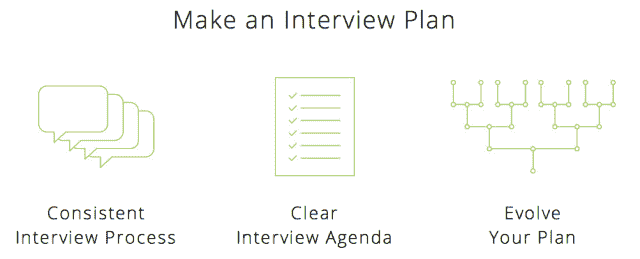

# Greenhouse 筹集了 270 万美元，让招聘成为 Airbnb  等高速增长的初创公司的一门科学

> 原文：<https://web.archive.org/web/https://techcrunch.com/2013/11/14/greenhouse-recruiting/>

“招聘是我们的首要任务，”大多数严肃的创业公司说，然而他们在这方面很糟糕。临时采访，杂乱的笔记。但对于 Airbnb、Upworthy 和 General Assembly 等快速发展的初创公司来说, [Greenhouse](https://web.archive.org/web/20230404151228/http://www.greenhouse.io/) 将杂乱的招聘流程变成了运转良好的机器。经过近两年对其软件的悄悄完善，今天它筹集了 270 万美元来颠覆 Jobvite 并壮大自己。

“每个高管和商业领袖都在谈论招聘，但不是每个人都真的很棒，”Greenhouse 的联合创始人兼首席执行官丹尼尔·柴特告诉我。他在厨房的桌子上创建了定制银行软件初创公司 Lab49，承担起招聘的责任和压力。

当他在 2011 年将公司卖给华尔街软件公司 Corpus 时，Chait 认为招聘“似乎是一个很好的机会”他创办了 Greenhouse，探索“是什么让一家公司在招聘方面表现出色，我们如何才能让招聘自动化？”

事实证明，招聘最佳实践并不神秘，但人们并不遵循它们。公司在知道他们在找谁之前就开始招聘，让面试官当场提出一大堆问题，不提供一致的反馈，也不跟踪员工的工作表现。

温室的软件将所有这些标准化。你定义了理想的候选人，你想要雇佣的技能，以及你想要的员工的个性和文化契合度。你运行招聘广告，尝试不同的变体，找到最有效的。然后你拿着申请和招聘，做电话筛选，发布带回家测试，然后进行几轮面试。面试官会问每个应聘者同样的问题，并将他们的反馈记录在表格中。公司可以很快看到候选人的记分卡，人力资源主管可以跟踪他们的招聘团队的进展。

我们的目标是能够进行比较，这样就能清楚地知道谁是最适合雇佣的人。之后，Greenhouse 可以与公司的绩效评估系统集成，进行招聘回顾，并确定哪些员工成为了摇滚明星，以及公司如何才能雇用更多的员工。

申请人跟踪系统市场肯定是拥挤的，所以温室是看着一场严重的战斗。它将不得不与 Jobvite 竞争，Chait 说他看到大多数顾客从 Jobvite 转移。还有 Jobscore、Taleo 等等，其中一些更专注于候选人招聘，而不是温室。

但 Chait 表示，它的许多竞争对手只是管理你现有的、可能是粗制滥造的招聘系统，而 Greenhouse 试图改变你的方式，让你正确招聘。Greenhouse 在产品内部提供说明和最佳实践，因此工程师和其他帮助处理该过程的员工知道该做什么，而无需提前进行强化培训。

除了 Airbnb、Upworthy 和 General Assembly，温室客户还包括 Klout、Quirky、HUGE、Gawker 和 Lookout。他们根据公司规模支付年费，购买两年或三年的合同可以获得折扣。

硅谷的人才大战向投资者发出了一个信号，招聘是一个热门的投资领域，帮助 Greenhouse 获得了由 Social+Capital Partnership(Chait 对其评价极高)和 Resolute.vc 牵头的新一轮 270 万美元的投资。这轮投资的天使投资人包括尼克·甘居(Nick Ganju)、塞思·戈尔茨坦(Seth Goldstein)(DJZ 和 Turntable.fm)、撒切尔·贝尔(Thatcher Bell)(DFJ 哥谭)、托马斯·勒曼(Thomas Lehrman Group 和 MasterStreet)和比尔·罗斯(Bill Lohse)。

这笔钱将用于建立一个更大的工程团队、销售和营销，并发展到能够处理更多的客户。接下来，Chait 告诉我，Greenhouse 希望建立一套跨行业招聘基准。“当我购买招聘广告时，我应该期待有多少候选人？当我打开一个职位，我应该期望做多少面试？Chait 解释说:“归根结底，公司想知道他们的表现如何。

我交谈过的许多创始人说，招聘是他们生存的祸根。当他们想专注于生产产品和发展业务时，他们知道他们必须非常小心地招聘员工。每位员工每年都是六位数的投资，几个不合适的员工可能会损害公司的文化和进步。也许这是温室效应，但是谁能简化招聘，最大限度地雇佣优秀员工，同时最大限度地减少花费的时间，谁就能大赚一笔。