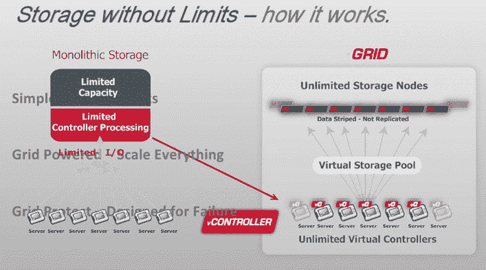
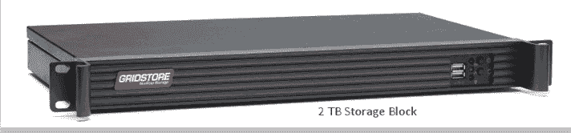

# Gridstore 为基于网格的横向扩展存储筹集了 1250 万美元的 A 轮融资 

> 原文：<https://web.archive.org/web/https://techcrunch.com/2012/10/15/gridstore-raises-12-5-million-in-series-a-financing-for-grid-based-scale-out-storage/>

# Gridstore 为基于网格的横向扩展存储筹集了 1250 万美元的首轮融资

[Gridstore](https://web.archive.org/web/20230131171058/http://gridstore.com/) 为其横向扩展存储产品筹集了 1250 万美元的首轮融资。这轮融资由 GGV 资本和 Onset Ventures 领投，现有投资者也参与其中。这项投资使该公司的风险投资总额达到 1500 万美元。

Gridstore 提供了一个基于软件的存储系统，该系统提供了一个简单的“构建块”，即扩展存储的方法。Gridstore 声称，它终结了大型机风格的整体存储及其破坏性叉车式升级的时代。它通过在分布式网格环境中虚拟化存储来实现这一点。

【T2

随着数据块的增加，虚拟存储池的大小也会增加。无限数量的虚拟控制器意味着可以适当地分配存储池。控制器本质上是分布式的，随着存储块的增加，允许有更多的带宽。

Gridstore 对 EMC、IBM 和 NetApp 等传统存储提供商构成了另一个威胁。这些提供商的整体系统建立在另一个时代的架构之上。这些系统在某种程度上已经现代化，但其根源可以追溯到 10-30 年前。它们旨在管理软件解决方案，而不是公司现在必须管理的大量数据。

该公司提供“随增长而付费”的解决方案。客户在其认为合适的时候向网格中添加更多的块。他们永远不需要过度配置和为他们不使用的容量付费。

Gridstore 代表了新一代的存储提供商，他们正在引起相当大的市场混乱。Gridstore 面临的挑战在于扩大其产品范围。大型存储提供商可能没有尖端技术，但他们确实有销售和营销渠道，可以用来销售他们的最新产品，这些产品通常会出售给客户，这些客户通常愿意与值得信赖的知名供应商合作。