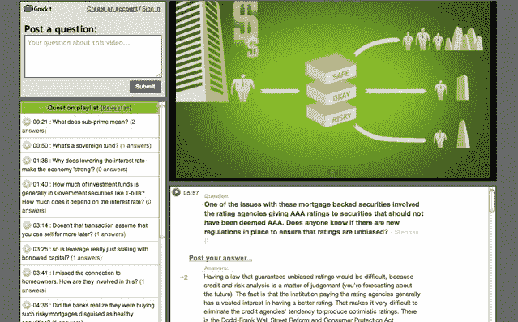

# Grockit 获得 700 万美元风险投资，推出视频问答网站 Grockit Answers 

> 原文：<https://web.archive.org/web/http://techcrunch.com/2011/10/17/grockit-7-million-answers/>

# Grockit 获得 700 万美元风险投资，并推出视频问答网站 Grockit Answers

社交学习初创公司 [Grockit](https://web.archive.org/web/20230203074755/https://grockit.com/) 筹集了第四轮资金，700 万美元的 D 轮融资，当前投资者 Atlas Ventures 领投该轮融资。现有投资者 Benchmark 和 Integral Capital 也参与其中，新投资者是 NewSchools Venture Fund(一家由约翰·杜尔登和雷德·霍夫曼支持的教育基金)和 GSV 资本首席执行官迈克尔·莫(Michael Moe)。这轮融资远少于 T2 刚刚筹集的 3300 万美元的教育初创公司 Knewton，事实上与 Grockit 在 2010 年 5 月的 C 轮融资相同，也是 T4 的 700 万美元

Grockit 正在打造一套在线社交学习服务。它从 SAT、GMAT 和 LSAT 的备考开始，然后转移到高中的 AP 课程。它的最新服务是 Grockit Answers，这是一个为 YouTube 上的任何视频创建 Q 页面的网站。这里有一篇关于信用危机的文章。视频根据每个问题被提出或被回答的点被分成章节，社区可以提供他们自己的答案。“任何人都可以提出问题或回答，”exlpains Nivi 说，“并将其固定在视频中的那个点上。”Grockit 本身已经在其 YouTube 频道上收集了 3700 个教育视频，创始人 Farb Nivi 声称这比 Khan Academy 还多。

Grockit 是关于学生、老师和导师在线回答彼此的问题。大约一周前，Grockit 通过了第 1000 万个已回答的问题，整个网站的聊天信息数量接近 1 亿条。在它的 100 万注册用户中，大约有 25000 到 50000 人在任何一个月都很活跃，这表明大多数学生用它来准备考试，然后继续前进。

