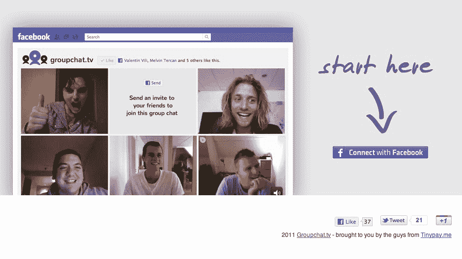
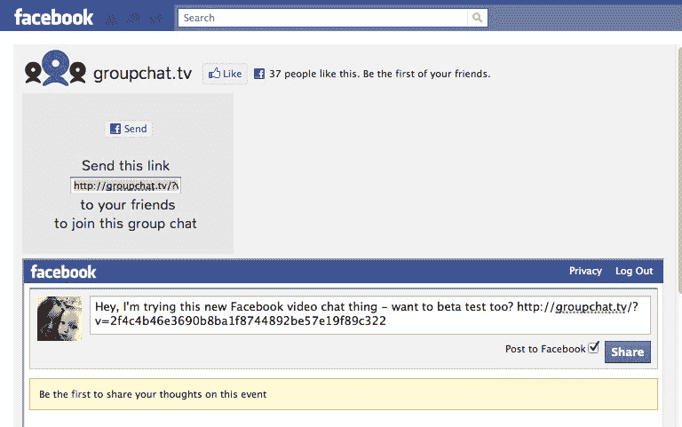
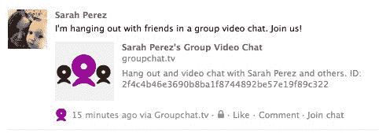

# Groupchat.tv 为脸书 TechCrunch 带来类似 Google Hangouts 的体验

> 原文：<https://web.archive.org/web/http://techcrunch.com/2011/08/16/groupchat-tv-brings-a-google-hangouts-like-experience-to-facebook/>

Groupchat.tv 是一款新的脸书应用，为脸书带来了类似 Google Hangouts 的群组视频聊天体验。这款应用是由运营电子商务网站 [TinyPay.me](https://web.archive.org/web/20230205002527/http://tinypay.me/) 的同一批人在上周末于旧金山举行的 [HAPI 黑客马拉松](https://web.archive.org/web/20230205002527/http://hapihack.com/)期间开发的。

最疯狂的是，Groupchat.tv 同时支持多达 50 个视频流！

然而，这款应用的开发者并不建议你把 Groupchat.tv 推得那么远。但值得注意的是，每次聊天没有 10 人的硬性规定限制，而在 Google+上，“Hangouts”是该网站的关键卖点之一。

要在 Google+上进行视频聊天，你可以通过点击一个按钮来启动一个视频聊天会话，然后根据你的选择与一个或多个圈子、个人朋友或公众分享。

要使用 [Groupchat.tv](https://web.archive.org/web/20230205002527/http://groupchat.tv/) ，您必须首先授权脸书应用程序，然后与您的朋友分享它生成的特殊链接。该链接可以通过即时消息共享，例如在脸书自己的聊天中，例如，通过电子邮件、墙贴或您选择的其他方式。不过，Groupchat.tv 的主界面提供了一个脸书状态更新框，这使得分享过程相对容易。

您的朋友还必须授权脸书应用程序，才能与您聊天。在今天早上测试群聊时，我们遇到了典型的 Mac/Flash 问题(它不“只是工作”——你必须在这里配置你的 Flash 设置[。)然而，该应用程序至少提供了一个简单的“如何”弹出窗口，解释如何进行必要的更改。](https://web.archive.org/web/20230205002527/http://www.macromedia.com/support/documentation/en/flashplayer/help/settings_manager06.html)

当然，使用 Tokbox 的 opentok API 的 Groupchat.tv 并不像 Google Hangouts 或脸书自己的 Skype 集成那样流畅。例如，您可以在朋友的电脑扬声器上听到自己的声音。但是如果你非常想和脸书的朋友进行群聊，这当然值得一看。

据该应用的首席开发人员梅尔文·特尔坎(也是 Tinypay.me 的联合创始人兼首席执行官)称，该团队已经在考虑新功能的想法，比如每个人都可以加入的公共群聊列表。但目前，他们只是希望这款应用能迅速走红。

你认为现在可能会发生吗？

http://twitter.com/#!/melvinmt/status/103255132640247808

***更新**:我应该注意到，当你发起聊天会话时，这个应用会向你的脸书墙发布一条消息。自动墙柱似乎是脸书的正常现象，所以我对此并不感到惊讶或吃惊。然而，你可能会有不同的感受。被警告！*

*更正:这篇文章最初署名为 Richard Straver，因为 Melvin Tercan 用 Richard 的电子邮件地址给我们发了邮件。哎呀！*