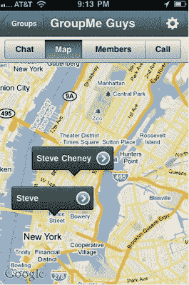

# GroupMe 给了推送通知一个大大的拥抱，还有地图和 Foursquare 签到

> 原文：<https://web.archive.org/web/https://techcrunch.com/2011/03/01/groupme-push-notifications-maps-foursquare/>

# GroupMe 给了推送通知一个大大的拥抱，还有地图和 Foursquare 签到

好，好，看这里的。 [GroupMe](https://web.archive.org/web/20221208073325/http://groupme.com/) 的应用程序变得更加友好。群发短信应用今天为 iPhone 和 Android 推出了一个大规模的新更新，支持推送通知作为默认的消息选项，而不是昂贵的短信，地图，聊天中的内嵌照片，更好的 Foursquare 集成，以及与 Twitter，脸书和电子邮件的联系人同步。

到目前为止，GroupMe 应用基本上是一种建立短信群的方式，但仅此而已。实际的信息会在应用程序之外通过短信发送。在新版本中，你可以选择在应用程序中获取消息，而不是通过推送通知。如果蜂窝数据信道很弱，在紧要关头，信息总是可以回复到 SMS。这不仅对用户来说是一个更好的体验，而且最终可以为创业公司节省一大笔钱。每天有超过 100 万条短信，它能做的任何事情都是聪明的，把这些信息卸载到免费的数据管道。(这正是我一直主张的事情)。

所有的群发短信应用程序都是一样的，最重要的是支持最小公分母——短信。但随后他们的应用变得更好，如果你有一部 iPhone 或 Android 手机，很快你就会完全忘记短信频道。我相信大多数拥有 iPhones 或 Android 手机的 GroupMe 用户都会遇到这种情况。

除了推送通知功能，现在您所有的群聊都会出现在应用程序中。您可以添加照片并在聊天流中查看，而不是作为链接查看。现在，你可以在地图上看到团队中每个人的位置(竞争对手的应用程序中已经有这个功能，如 [Fast Society](https://web.archive.org/web/20221208073325/https://beta.techcrunch.com/2011/01/13/fast-society/) 和 [Beluga](https://web.archive.org/web/20221208073325/https://beta.techcrunch.com/2010/12/23/beluga/) )。你甚至可以通过 Foursquare 签到。这最后一次整合超越了该公司最近共同开发的 [Foursquare 好友查找](https://web.archive.org/web/20221208073325/https://beta.techcrunch.com/2011/02/18/groupme-foursquare/)功能。你可以通过 GroupMe 应用程序登录 Foursquare 网站。

这一切加起来是一个令人印象深刻的更新，将应用程序放在前面和中心，正好赶上 SXSW。快社会和白鲸，你最好快点拿出同样牛逼的东西。