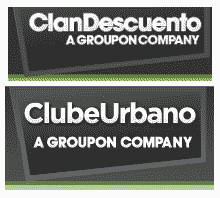

# Groupon 收购智利的 ClanDescuento.com，在巴西开设 club eurbano 

> 原文：<https://web.archive.org/web/https://techcrunch.com/2010/06/24/groupon-clandescuento-clubeurbano/>

# Groupon 收购智利的 ClanDescuento.com，在巴西开设 ClubeUrbano

看来获得巨额资金支持的每日交易轰动效应 [Groupon](https://web.archive.org/web/20221209115619/http://www.crunchbase.com/company/groupon) 已经将注意力转向拉丁美洲新兴的电子商务市场。该公司显然已经[收购了](https://web.archive.org/web/20221209115619/http://www.clandescuento.com/pages/groupon)智利交易网站 [ClanDescuento](https://web.archive.org/web/20221209115619/http://www.clandescuento.com/) 并在巴西开设了一个名为 [ClubeUrbano](https://web.archive.org/web/20221209115619/http://www.clubeurbano.com.br/) 的新网站。

西班牙语新闻报道和博客[对前一条新闻的报道引起了我们的注意，但具有讽刺意味的是，我们通过毫无疑问将是其在该国最激烈的竞争对手之一的新融资](https://web.archive.org/web/20221209115619/http://www.uberbin.net/archivos/comunidades-online/groupon-llega-a-latinoamerica-2.php) [ClickOn](https://web.archive.org/web/20221209115619/http://clickon.com.br/) 了解到了其新的巴西网站。

几个月前，ClanDescuento 和 Needish 在智利和其他拉丁美洲地区推出了 Groupon 克隆版，我们也听到了一些不太好的消息，但之后会有更多的消息。

团购网站 Groupon 的创始人兼首席执行官安德鲁·梅森(Andrew Mason)表示，这仅仅是个开始。

> “Groupon 在拉丁美洲的扩张是我们成为全球领先互联网品牌的重要一步。我们希望向世界各地的人们展示这种新的本地商业模式。”

(使用谷歌翻译翻译的新闻稿)

Groupon 最近收购了柏林的 Citydeal，组建了一个国际管理团队，负责监管 Groupon 在拉丁美洲的所有业务。新闻稿称，Groupon 的路线图还包括在阿根廷、墨西哥和周边国家的进一步扩张。

并非所有智利人和其他国家的人都对 ClanDescuento 的快速退出拍手称快。知名企业家和博客作者 [Mariano Amartino](https://web.archive.org/web/20221209115619/http://www.crunchbase.com/person/mariano-amartino) 写了一篇[的博客文章](https://web.archive.org/web/20221209115619/http://www.uberbin.net/archivos/comunidades-online/groupon-llega-a-latinoamerica-2.php)关于收购智利每日交易服务，明确地将该服务称为“Spamdescuento”。

基本上，Amartino 以及其他联系我们并对新闻报道进行评论的评论员-声称 ClanDescuento 几乎完全通过积极和不太合适的收购策略(又名垃圾邮件)建立了自己的用户群。显然，很难证实这是事实，但熟悉 Needish 和市场的专家们普遍认为，Groupon 从智利公司手中收购 ClanDescuento 是落入了陷阱。

当然，由于我们不知道这家总部位于芝加哥的初创公司支付了多少钱(如果有的话，可能是另一种类型的交易)，Groupon 现在有了在拉丁美洲进一步扩张的起点。听起来他们非常想用 ClanDescuento 这个名字来宣传即将在其他拉丁美洲城市和国家推出的产品。

(向劳蕾娜·瓦里斯科·波拿巴致敬)