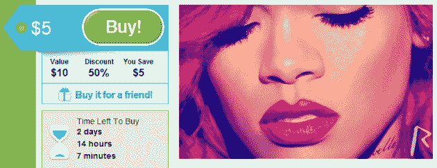

# Groupon 的第一笔 Grouponicus 音乐交易开始了:花 5 美元购买蕾哈娜的新专辑 TechCrunch

> 原文：<https://web.archive.org/web/http://techcrunch.com/2010/11/22/groupon-grouponicus-rihanna/>

# Groupon 的第一笔 Grouponicus 音乐交易开始了:花 5 美元获得蕾哈娜的新专辑

正如之前[在](https://web.archive.org/web/20230202214513/http://www.dailydealmedia.com/groupon-creates-new-holiday-grouponicus474/)宣布的那样， [Groupon](https://web.archive.org/web/20230202214513/http://www.crunchbase.com/company/groupon) 今天以其[‘Grouponicus’](https://web.archive.org/web/20230202214513/http://blogs.wsj.com/digits/2010/11/19/groupon-girds-for-holiday-shopping-aka-grouponicus/)交易开启了假日季。有趣的是，第一个[的](https://web.archive.org/web/20230202214513/http://www.businesswire.com/news/home/20101122005856/en/Groupon-Expands-Music-Deal-Category-Megastar-Rihanna)之一是……录制音乐的协议，即蕾哈娜的第五张录音室专辑[‘LOUD’](https://web.archive.org/web/20230202214513/http://www.groupon.com/deals/rihanna-new-york)。

毫无疑问，Groupon 将成为这位歌手的巨大分销渠道:这张专辑以 5 美元的数字下载价格提供给美国用户，比正常价格低 50%，并将在给全国数百万 Groupon 订户的电子邮件中进行介绍。东部时间今天上午 12 点，Grouponicus 商店正式开业。

此外，蕾哈娜的新专辑将通过 Groupon 网站以及 Groupon 在脸书和 Twitter 上的北美网络大力推广。

看到 Groupon 进军数字音乐分销领域并不令人惊讶，但这并不意味着这不是一个令人着迷的举动。毫无疑问，我们将很快从世界各地的众多音乐艺术家那里看到更多这样的东西。

让我们希望该公司很快分享一些关于这笔交易及其整体假日闪电战的数据——Grouponicus 将在整个季节提供总共 650 笔交易。

**更新:**正如一些人正确指出的那样，亚马逊经常为音乐提供特别优惠，目前提供蕾哈娜的 Loud，售价为 [$4.99](https://web.archive.org/web/20230202214513/http://www.amazon.com/Loud-Explicit/dp/B004B4RCDE/ref=sr_1_3?ie=UTF8&qid=1290438895&sr=8-3) 。但是亚马逊是一个“传统的”在线零售商，而 Groupon 不是，这就是为什么我认为看到这种演变很有趣。