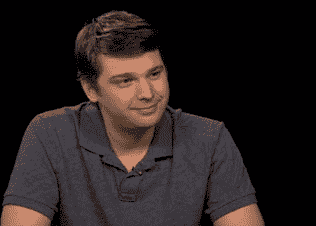

# Groupon 的安德鲁·梅森对查理·罗斯说:“我们是‘网站的超级男孩乐队’

> 原文：<https://web.archive.org/web/https://techcrunch.com/2010/12/10/groupon-mason-charlie-rose/>

昨晚，Groupon 首席执行官安德鲁·梅森在 *[查理·罗斯](https://web.archive.org/web/20221218150350/http://www.charlierose.com/view/interview/11338)* 做客。他拒绝回答任何关于 Groupon [为何拒绝谷歌 60 亿美元收购要约的问题，但他透露了一些数据和他对 Groupon 成功原因的思考。Groupon 现在拥有 4000 万每日交易用户，仅上周就增加了 300 万。今年年初，该公司每周仅增加约 10 万名新用户。](https://web.archive.org/web/20221218150350/https://techcrunch.com/2010/12/03/confirmed-the-groupongoogle-deal-is-off/)

梅森将 Groupon 的高速增长归因于其固有的社会性，以及脸书和 Twitter 加速了它的增长。交易传播的速度比以往任何时候都要快，因为“社交图”。。。只是让企业以前所未有的速度增长。”他解释说，Groupon 的成功需要在这样的背景下理解:

> 当人们称我们为有史以来发展最快的公司时，我认为我们就像是“网站的超级男孩乐队”,就像我们有很好的音乐，但我们不是披头士。我们又不是最好的。。。。我认为，我们将继续看到更多像我们这样的公司，它们让我们——几年后，它们的增长速度让我们感到羞愧。

梅森还将 Groupon 的商业模式描述为“按效果付费营销”(我之前已经提到过这一点):

> 当地企业从未有过吸引顾客的好方法。。。。因此，Groupon 所做的是——这是本地企业首次获得基于绩效的营销。他们只有在这些顾客进门时才付钱。我们让他们进门，然后由他们来给他们一个惊人的体验。

你可以在这里观看完整的采访[或者阅读下面的完整文字记录(由*查理·罗斯*提供):](https://web.archive.org/web/20221218150350/http://www.charlierose.com/view/interview/11338)

**成绩单:**

查理·罗斯:安德鲁·梅森在这里。他是创始人之一

也是 Groupon 网站的首席执行官。它每天都提供本地交易

从酒店到瑜伽到健身，所有商品都有大幅折扣的市场

餐馆。

自从梅森 2008 年创办 Groupon 以来，它已经呈指数级增长。它

已经在全球 300 多个城市拥有 3500 万用户。它是

还创造了一个有利可图的商业模式，预计将导致

今年数亿美元的收入。

他做到了这一切，却没有失去幽默感。这些交易是

每天都有 Groupon 的员工写的奇怪的描述

作家。梅森曾经雇了一个人穿着芭蕾舞鞋在办公室里走来走去

不做任何解释，只是想看看他会有什么反应。

我很高兴安德鲁·梅森第一次来到这里。

欢迎光临。

安德鲁·梅森:查理，谢谢你邀请我。

**查理·罗斯:**那么你如何定义我刚才所说的一切

关于什么？

**安德鲁·梅森:**我认为让 Groupon 真正有趣的部分原因是

消费者是发现的要素，发现新事物，感到惊讶

每天早上交易是什么。我们努力保持惊喜，我们努力

去做事，不管是你得到的交易还是方式

我们写的是交易，还是品牌和文化

这家公司不断给人们带来惊喜，因为这有点

生活的情趣。

查理·罗斯:告诉我们这件事的历史。

ANDREW MASON: 我们在 2008 年 11 月创立了 Groupon，在我们的

芝加哥的家乡。

**查理·罗斯:**两年前。

**安德鲁·梅森:**两年零一个月。我们刚刚从聊天

我认为两年是你了解我们的时间

当你为一家公司工作时，对一个婴儿来说是这样。

在此之前，另一个网站是一个更广泛的应用的想法

团购网站。这就是所谓的“重点”，这是一种方法

人们走到一起，组织行动，不管这个行动是

抵制公司或组织集会或筹款或组织

某种团体折扣。

有一个伟大的想法试图解决世界上

无法解决的问题，但它太抽象和复杂。所以我们说让我们

举一个例子，团购，关注它，看看会发生什么

会发生。所以我们开始做这个副业。

**查理罗斯:**于是“团购”和“优惠券”就成了一个词。

安德鲁·梅森:是的。所以我们的想法是每天都有一个当地的

商业——可能是餐馆，可能是电影票，可能是

做一次水疗——我们提供很大的折扣——50%或更多。但是在

为了获得折扣，最低人数需要加入。

这样，企业就知道他们获得了大量新的

顾客。为此他们愿意提供很大的折扣。

所以我们在芝加哥花了大约五六年的时间研究这个想法

在我们推出第二座城市的几个月前。然后我们推出了第三个

城市和第四个城市，在我们知道之前，我们现在增加了 30 个城市

一个月左右。我们在一个国家进入了 2010 年。我们现在在 35 个国家，

上周又增加了四个。我们实际上已经到了——你说的 35 分钟

百万，但实际上是 4000 万用户。

查理·罗斯:现在有 4000 万，是的。你有多快

用户数量在增长？

安德鲁·梅森:上周我们增加了 300 万人。

**查理·罗斯:**上周三百万。你一个人加了多少

今年年初的一周，2010 年的一月和二月

2010?

安德鲁·梅森:也许 10 万。

查理·罗斯:你上周增加了三百万，三百万

新订户。原因是什么？

安德鲁·梅森:嗯，它解决了许多不同领域的实际问题

人们的类型。

**查理罗斯:**尤其是当地的生意。

安德鲁·梅森:是的。当地企业从来没有一个很好的方法

让顾客进门。有一个术语—

查理·罗斯:他们从来没有对网络广告着迷过。

安德鲁·梅森:不，因为他们不知道如何让它工作。他们

不知道如何让非互联网广告发挥作用。他们差不多就是这样做的

因为他们觉得必须这么做。但是 100 家企业中有 99 家

报纸上的广告最终对此感到失望。他们不能

衡量回报，在他们能感觉到的程度上

失望。

所以 Groupon 所做的是——这是第一次本地企业

获得基于绩效的营销。他们只在这些顾客走的时候付钱

在门里。我们让他们进门，然后由他们来给他们

一次奇妙的经历。

所以我们把所有这些小型的利基企业都放在地图上，

无论是提供飞行服务的直升机俱乐部

课程，我们卖了 2500 张优惠券—

查理·罗斯:那是一个非同寻常的故事。讲故事。在…里

直升机俱乐部提供课程的人的条件

突然间他们期待 20 个？

安德鲁·梅森:他们预计可能会有几百人左右。和

我们总是试图让他们做好准备，并说这可能是巨大的。不要

如果我们卖出 1000 个会很惊讶。

查理·罗斯:他们得到了多少？

安德鲁·梅森:我们卖出了 2500 辆。在这个行业的历史上

这已经存在了 20 年，或者说 25 年了

查理·罗斯:直升机飞行课程。

安德鲁·梅森:是的。这笔生意总共赚了 5000 英镑

顾客。所以在一天之内，我们增加了他们的——我们做了一半

他们在过去的 25 年里做了什么。

查理·罗斯:它的发生是因为人们对价值的渴望

便宜货和一种感觉—

安德鲁·梅森:我想不止这些。我认为这是一种渴望

生活。是对经历的渴求。

查理·罗斯:这是他们喜欢的购买体验？

安德鲁·梅森:他们喜欢走出家门，开着飞机

直升机或者去跳伞或者别的什么。

查理·罗斯:这些是他们可能没有的东西吗

想过？他们不知道有这种交易？

安德鲁·梅森:是的。我认为——我认为就是这样。我认为

折扣是我们对人们玩的一个大把戏，因为

我们骗他们走出家门，过自己的生活，因为

它在那里一天。

就像“我一直想去跳伞。如果我要做的话，

我还不如现在就做，因为它永远不会更便宜。“所以我们

最后，让人们下定决心，离开沙发，出去玩。

**查理·罗斯:**然后你们五五分成？

安德鲁·梅森:是的。

查理·罗斯:大多数人对结果满意吗？

安德鲁·梅森:是的。

查理·罗斯:百分之九十还是百分之七十？或者—

安德鲁·梅森:我们调查了我们所有的特色业务，95%的

说他们想再次成为主角。

**查理·罗斯:**也有这个优点。这是一个广告

为他们做模特，一个促销模特。即使他们赚不到钱，

他们的公司在某种程度上引起了人们的注意。

安德鲁·梅森:对。所以我们免费发了一封独家邮件

主题是这个行业，我们做这个有趣的报道

即使他们对购买交易不感兴趣，也要阅读。

在像芝加哥这样的城市，有一百万人参与

比《太阳时报》和《论坛报》的发行量加起来还多，

所以这对这些小企业来说是惊人的曝光率。有这个术语

“隐藏的宝石”,我们用来指小企业，我认为

这是一个很好的方式来表达某人擅长他们的手艺，但是

作为营销人员真糟糕。我们想粉碎整个概念。我们想

确保如果外面有人——

查理·罗斯:你想为他们做市场推广？到底是哪个？

安德鲁·梅森:我们想要粉碎隐藏宝石的概念。如果

你的生意很好，如果你的手艺很好，人们也应该如此

进来吧。不应该是这个秘密。

查理·罗斯:哦，我明白了。我们想展示伟大的想法。

安德鲁·梅森:对。

查理·罗斯:或者能为你提供一些东西的企业。

安德鲁·梅森:对。

**CHARLIE ROSE:** 竞争—每个人都说

就你的未来而言，你已经开始看到一整类的

模仿者。这是一种严肃的奉承，但你担心吗？

安德鲁·梅森:大约有 500 个克隆的 Groupon。和

很奇怪。第一次发生在 2009 年 4 月左右，

我记得我看到它的时候很惊讶有人会复制它

我们做得一模一样，比如网站的布局，版权保护

在做什么。

但是克服这一点，我认为证据就在数字中。我们有

只是试图专注于为人们打造真正伟大的产品

现在，有了 500 个克隆体，其中 499 个是相关的。我们仍然保持着

非常好的引导，我认为这是因为我们真的专注于创造

伟大的产品—

查理·罗斯:但这仅仅是经验的引导还是

编写代码、技术和软件的领导者？

**安德鲁·梅森:**我认为——就是所有这些东西。它有一个

为我们的客户和商家提供持续的良好体验。

我认为人们——至少在互联网上，因为我认为

这些公司拥有巨大的坡道。我们不是

首先。也许我们做得快了一点，但这主要是一个方面

社会媒体对我们生活的世界的影响

脸书和推特是传播思想的渠道

更快。

但是我想到了是什么在召唤这些朋友或者我的空间

崩溃。而且通常都是那些公司输给自己。他们

失去他们的注意力。也许他们太专注于比赛或者

他们去采访查理·罗斯了，而不是继续工作

发展他们的业务。

查理·罗斯:拜托，别这么说。

(笑声)

安德鲁·梅森:但我认为只要我们继续关注我们的

客户和我们的商家希望并像我们一样对此狂热

当我们开始做生意的时候，我们的状况会很好。

查理·罗斯:所以，焦点就是那些不擅长的人，或者那些擅长的人

失去他们的迅速崛起，这是焦点。他们忘记了—

安德鲁·梅森:什么是重要的。

查理·罗斯:什么是重要的。他们忘记了他们为什么要去

他们在哪里？

安德鲁·梅森:也许吧。

查理·罗斯:那么，除了国家之外，Groupon 还有什么未来

你没去过的地方，你没去过的城市？

**安德鲁·梅森:**自动驾驶汽车。我们会谈到这一点。

除此之外—

查理·罗斯:什么是自动驾驶汽车？虽然我知道

一直在谈论这个话题，但是请告诉我们。

安德鲁·梅森:这实际上是我目前所知道的全部。

(笑声)

但是我知道我想做。

除此之外，我们认为公司确实有机会

来改变人们从当地商店购物的方式

就像亚马逊这样的网站改变了人们购买产品的方式。

查理·罗斯:对。

安德鲁·梅森:我们希望努力成为那样的公司。我们认为我们已经

只触及了表面。

查理·罗斯:所以你是世界上小企业的救星。

安德鲁·梅森:我们是小企业的救星。对于消费者来说，

我们想扭转这种在电脑上花费越来越多时间的趋势

帮助人们重新发现他们的城市。

就公司而言，我认为我们想要建立一个公司

随着我们变得越来越大，我们对品牌和公司保持诚实

文化使我们成为一个很酷的工作场所，当我们

我们很小，希望能创造一些例子来说明你不必如此

像其他公司一样，即使你是一个大公司。

查理·罗斯(CHARLIE ROSE):现在商人的名声是这样的，当

他们听到你的呼唤，激动不已。

安德鲁·梅森:是的。

**查理·罗斯:**他们也在排队给你打电话。

安德鲁·梅森:我们的订单有时会积压 6 个月之久

城市。

查理·罗斯:说“我，我，我”？

**安德鲁·梅森:**是的，企业给我们打电话——

查理·罗斯:你能左右交易吗？

ANDREW MASON: 我们和他们一起制定交易。这是我们的

最大的问题。对于我们的每一项业务，我们都要传递七个

企业。这就是需求的大小，因为我们是自我强加的

我们认为重要的一天一笔交易的限制。这就是

导致了—

查理·罗斯:为什么一天一笔交易这么重要？为什么不是一个

一小时交易？

安德鲁·梅森:我不知道。也许一小时一笔交易也可以。

但是我们坚持每天一笔交易模式的原因是

专注。它把商家放在聚光灯下，让它感觉真的

特别的，它为消费者做出了一个简单的是或否的决定。

我的意思是，我认为这是我们区别于

之前的优惠券和交易网站只有这个列表

交易，它势不可挡，一切都感觉很便宜。但是我们真的可以

让这些真正特别的企业感到特别，让它们成为

我们网站一天的独家主题。

查理·罗斯:有这样一个古老的想法，人们已经说过了

很长一段时间以来——有人曾在比尔·盖茨如日中天的时候问他

他最害怕的是微软的声望。他说，“我不知道，

但这是两个人在车库的某个地方做一些我从未做过的事情

听说过。“这正是他所担心的。

这是怎么回事？这是你和埃里克的故事吗？

你知道，那种联合创始人和非常成功的人

支持成功？是这样吗？是不是两个家伙刚刚

想法，还是两个男人是对的？还是你们两个在看

下次休息的时候？

安德鲁·梅森:说到恐惧，我还是最害怕弗雷迪

克鲁格。

(笑声)

查理·罗斯:是的。你的童年塑造了你，是吗？

安德鲁·梅森:是的。我是说，他还是很吓人。但是有了公司，

我认为我们试图做的是找到一种方法来创建一个公司

不知何故改变了世界。

查理·罗斯:改变世界？

安德鲁·梅森:是的。

查理·罗斯:你真的——你有那个想法，让我们创造吧

能够改变世界的东西，而不是什么可能有效，什么

可能会做一些——这是一个好主意。如果我们能以某种方式展示一个

小企业可以给他们一种全新的体验

一笔交易，并没有改变世界，而是说—

那是生意？

安德鲁·梅森:是的，让我详细说明一下。所以当我开始这个观点时，我

最初是在研究生院，我有—

**查理·罗斯:**那有不同的目的。那是为了筹钱

为了一项社会事业。

**安德鲁·梅森:**是的，那是有目的的。这个想法和其他

我过去做的事情几乎就像一个负担。你感觉

被迫，你有这个想法，你有责任出去做

与它有关的东西。所以我想这就是我们开始的原因。

然后转向 Groupon 是任何人都没有预料到的，包括我们。

我的意思是，我想我们开始的时候只是一个附带项目，就像，这是

这太酷了。我们没想到我们会启动这十亿美元

生意。

查理·罗斯:这是我们可以为一群人做的一件很酷的事

他们是社交网络的一部分。与其筹集资金，我们将展示

那些便宜货。

安德鲁·梅森:对，没错。因为——这看起来很棒

消费者的视角。这里有一种方法可以找到很酷的事情做

芝加哥。

但是让我们惊讶的是它对

企业，因为我们没有来自一个我们知道很多的背景

关于经营实体企业的艰难困苦。

但是他们真的很难获得新的客户，我们最终做了

比世界上任何一个人都好。

所以当我们——当我们看到这些时，它让我们能够真正挖掘

英寸我认为这一直是我们前进的动力，我们来到这里是为了

救命啊。我们——我的意思是，请记住，我们的 DNA 是引发这一切的人

因为我们想——因为我们想——而开了一家公司

改变世界，让它变得更好。

**查理·罗斯:**它说了互联网的今天和未来

社交网络的今天和移动的今天在哪里？告诉我。

安德鲁·梅森:我想它说的是有这个管道

就像在管道里一样。

查理·罗斯:对。

安德鲁·梅森:这是一个通过工具存在的社交网络，比如

脸书和推特，它让公司以

是空前的。

我认为当人们称我们为有史以来发展最快的公司时，我

把我们想象成网站上的 N-Sync，就像我们有好听的音乐，

但我们不是披头士。我们又不是最好的。但是

我们的成功和我们赚的钱主要是因为

我们公司成长的环境。

所以我认为我们会继续看到更多像我们这样的公司

我们——几年后他们的速度让我们感到羞愧

成长。

查理·罗斯:五年后会发生什么？

安德鲁·梅森:我的意思是，我想我们会觉得我们已经成功了

如果五年后，你没有和现在一样的经历

今天，当你走在大街上，80%的商店

空的。如果我们能更好地管理——管理小型企业的供应

这样就有更多的人参与进来，而不是

库存会不断浪费，所以如果我们能把同样的

真正智能的库存管理，适用于亚马逊或

沃尔玛到每一家夫妻店，那是一件令人兴奋的事情

朝着…努力。

**查理·罗斯:**那么脸书和推特对你来说意味着什么？

**安德鲁·梅森:**这是一个很好的方式——首先，Groupon 是

本质上是社交服务，因为内容是社交的。它是

餐馆。是剧场。这是你和朋友一起做的事。

查理·罗斯:今天在纽约是瑜伽课。

安德鲁·梅森:瑜伽课，人们和朋友一起上的。我确定

你和朋友一起做瑜伽。当人们得到瑜伽交易时，他们会把它寄出去

对别人说“我们都买这个，一起去吧。”

所以脸书和推特是人们传播信息的方式

这些东西以前从未存在过，它们让公司很容易

像我们一样存在。

查理·罗斯:所以如果有人听了这个然后说，伙计，我想

试试这个，他们会怎么做？

**安德鲁·梅森:**“我想试试 Groupon”？去 www.Groupon.com。你们

键入您的电子邮件地址，然后您开始获得每日交易每

早上好。如果它看起来像是你想做的很棒的事情，

你买吧。如果它看起来很蠢，那么你删除它，如果它看起来很蠢

比如连续三四天，然后你退订。

查理·罗斯:然后说 Groupon 不适合我。

安德鲁·梅森:是的，不是给你的。但希望不会这样

发生。Groupon 的一大优点是，我们每天都在

展示了从未——不仅从未经营过

折扣之前，他们从来没有做过广告，像世界知名的艺术

博物馆、詹姆斯·比尔德获奖餐厅。我们找到了一种方法

优惠券酷。

查理·罗斯:告诉我博物馆的故事。

安德鲁·梅森:我们报道过——我们报道过的第一个博物馆是

芝加哥艺术学院。

查理·罗斯:对。

安德鲁·梅森:我们办了半价会员。所以通常是 80 美元。

查理·罗斯:他们有大约 5000 名新成员？

安德鲁·梅森:是的，5000 名新会员增加了他们的

总的会员基数——我忘了是多少了。好像是六，七，

百分之八。

查理·罗斯:出价是多少？

安德鲁·梅森:优惠是会员半价。

查理·罗斯:然后你从哪里剪掉的？每个人都知道

想要明白了吗？

安德鲁·梅森:每个想要的人都得到了。

**查理·罗斯:**所以芝加哥的每个艺术组织

想要 Groupon 体验？

安德鲁·梅森:我们是芝加哥乔佛里芭蕾舞团的会员

最近他们的会员基础增加了 30%左右。

查理·罗斯:所以谷歌出现了。

安德鲁·梅森:我的意思是，已经有很多东西写在

关于它的新闻。不幸的是，我无法用任何方式和它说话。

查理·罗斯:假设你做了那笔交易。假设像这样的交易

那——你会怎么做？对你来说什么是优势

像那样交易？不是谷歌，不是那里提供的交易，无论什么

那是 60 亿美元或者其他什么，那会是多少

优势？

安德鲁·梅森:这是我能说的。我认为我们做的每一个选择

公司的核心理念就是我们对 Groupon 的理解

以及它在世界上和其他地方的地位

21 世纪。

我们做的每一个选择都是哪个选项更有可能

让我们到达那里？所以我认为无论我们决定对公司做什么，

我们雇佣的人，我们经营的交易，每一个微小的选择，如何

我们把这家公司建设成改变人们购买方式的东西

来自当地的企业。

查理·罗斯:所以你唯一的问题是你是否接受

有人给了你一个诱人的机会，或者你继续像现在这样做，或者

你是否会上市并筹集资金，这意味着会帮助我们

到达我们想去的地方？就这样？

安德鲁·梅森:就是这样。

**查理·罗斯:**那么，你为什么选择淘汰谷歌

喜欢命题并倾向于其他命题？

安德鲁·梅森:这和我是否会打我妻子有关。

查理·罗斯:不，不是的。这是你用的东西。我知道

这个战术，所以我是有心理准备的。所以——你知道我在问什么。

安德鲁·梅森:我知道我在问什么。你知道我无法回答。

(笑声)

查理·罗斯:一个男孩可以尝试，不是吗？

安德鲁·梅森:这很有趣。

查理·罗斯:很有趣。但这是另一种观点。在

你受脸书所做决定的影响吗？

(笑声)

安德鲁·梅森:我不能谈这个，查理。

查理·罗斯:但我不明白你为什么不能谈这件事。

安德鲁·梅森:你不可能谈论所有的事情，很大程度上

因为——和每个和你约会的人一样，你

不要马上把它们带回家给父母。

(笑声)

查理·罗斯:这是一个完美的答案。这就是我想要的。

你能来真是太好了。谢谢您们。

安德鲁·梅森:谢谢你邀请我。

**查理·罗斯:** Groupon 是一个伟大的故事。

**安德鲁·梅森:**能成为其中的一员真是太好了。

查理·罗斯:是的。谢谢你。

安德鲁·梅森:谢谢你邀请我。