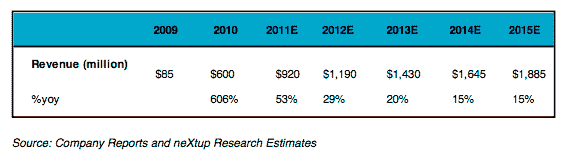

# SharesPost 报告:Groupon 交易价值 60 亿美元 

> 原文：<https://web.archive.org/web/http://techcrunch.com/2011/02/03/groupon-sharespost-6-billion/>

# SharesPost 报告:Groupon 是一笔 60 亿美元的交易

Groupon 最近以 47.5 亿美元的估值筹集了 9.5 亿美元的资金，它正在与银行家们讨论在今年晚些时候以 150 亿美元的估值上市。但它现在值多少钱？私人股票销售市场 SharesPost 今天刚刚发布了一份报告，估计 Groupon 的价值约为 60 亿美元(准确地说在 59.5 亿美元到 60.7 亿美元之间)。

它根据自己对 Groupon 收入增长的估计得出这个数字，并乘以一个倍数。(该报告是由 NeXtup Research 为 SharesPost 准备的)。上图显示了从 2009 年的 8500 万美元到 2015 年的 19 亿美元的收入估计。2010 年的估计数为 6 亿美元，2011 年为 9 . 2 亿美元。这些估计比我们之前报道的 20 亿美元的收入增长率要保守得多(这意味着 Groupon 今年的收入将达到或超过 20 亿美元)。当然，这些数字只是猜测，因为 Groupon 作为一家私人公司不发布经审计的财务数据。

这份报告深入介绍了 Groupon 的业务背景，它与 LivingSocial 等竞争对手的比较，甚至是优惠券的历史。它提供了一份 Groupon 客户的人口统计数据(68%的人在令人垂涎的 18-34 岁年龄段)。整个报告可在 Sharespost 上查阅。

