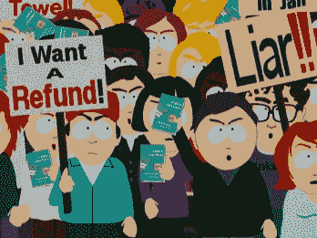

# Groupon 对小企业不利吗？

> 原文：<https://web.archive.org/web/http://techcrunch.com/2011/07/02/groupon-small-businesses/>

***编者按**:以下帖子是对我们[嘉宾系列](https://web.archive.org/web/20230204145329/https://techcrunch.com/author/rockya/)对日常交易行业进行批判性审视的回应。这是由 [Yipit](https://web.archive.org/web/20230204145329/http://yipit.com/) 的首席执行官 [Vinicius Vacanti](https://web.archive.org/web/20230204145329/http://www.crunchbase.com/person/vin-vacanti) 撰写的，Yipit 是一家每日交易聚合网站，收集来自 300 多个每日交易网站的交易。*

如果你看晚间新闻，你会认为每个街区都有谋杀案，如果你最近看了 TechCrunch 的文章，你会认为 Groupon 正在谋杀每个城市的小企业。

鉴于过去一年有数十万商家每天都在进行交易，不可避免地会有一些人有过糟糕的经历。然而，假设这些轶事完全代表了商人日常交易的经验是不充分和不负责任的。

Rocky Agrawal 的一系列客座博文批评了日常交易，并基于交易未能为企业带来利润的例子，建议小企业远离交易。虽然洛奇的帖子肯定是出于好意，但他的证据很大程度上是基于一些轶事和对日常交易经济学的基本误解。

正如我们在 Yipit 的[每日交易](https://web.archive.org/web/20230204145329/http://yipit.com/data/) [行业研究](https://web.archive.org/web/20230204145329/http://yipit.com/data/) [报告](https://web.archive.org/web/20230204145329/http://yipit.com/data/)中详细介绍的那样，基于 100，000 多笔过去的交易，5 月份 43%的报价涉及至少第二次进行交易的商家。这么多商家能妄想吗？明明[有些](https://web.archive.org/web/20230204145329/http://news.ycombinator.com/item?id=2654788)商家已经想通了。

虽然我理解并赞赏 Rocky 保护小企业的动机，但这些企业真的能够忽视一个营销渠道吗？这个渠道可以在每次收购成本模型中提供数百甚至数千个新客户。不仅大多数小企业在苦苦挣扎，他们标准的黄页和报纸营销渠道也变得越来越低效。

与其告诉小企业避免日常交易，不如试着理解为什么一些小企业会成功？

有了这种理解，我们就可以教育其他小企业如何复制自己的成功。

这是一个数字游戏

像大多数营销选择一样，每天的交易归结于数字。好消息是，小企业可以通过日常交易结构和执行来优化影响日常交易成功的大多数关键变量。

我的联合创始人[吉姆·莫兰](https://web.archive.org/web/20230204145329/http://twitter.com/jdmoran)在[上写了一篇关于日常交易经济学](https://web.archive.org/web/20230204145329/http://blog.yipit.com/2011/01/10/daily-deal-success-is-all-about-new-customers/)的文章，其中包括一个计算器。虽然这个计算器有很多假设，但它是小型企业便捷工具的开端。

小型企业可以优化的两个最重要的变量是:

**超额**:这个指标代表客户为企业创造的收入比优惠券价值多多少。超额越多，对小企业越有利。小企业可以做许多事情来增加超额收益，包括:

*   **战略性定价**。如果你经营一家餐馆，平均每人的账单是 30 美元，提供一张 15 美元换 30 美元的凭证。这个人很可能会带其他人来，把这顿饭变成 60 美元买 45 美元的交易。
*   **追加销售用户。**在一篇黑客新闻中，这家跳伞公司很好地解释了[他们如何追加销售](https://web.archive.org/web/20230204145329/http://news.ycombinator.com/item?id=2654788)跳伞者获得他们跳伞的视频(60%的客户)，甚至当天第二次跳伞的视频(40%的客户)。

**回头率**:该指标代表使用每日交易后，有多少百分比的客户会再次成为常客。正如上面提到的计算器所示，改进这一指标有可能为小型企业带来最大价值。在莱斯大学撰写的一份[报告中，小企业报告称 20%的顾客会再次光顾，这通常被认为是日常交易具有挑战性的原因。那实际上是巨大的！如果一家公司销售 1000 张代金券，就会有 200 名顾客回来。正如上面的计算器所暗示的，这是一个足够高的回报率，使得大多数小企业的交易非常成功。为了进一步提高回报率，小型企业可以:](https://web.archive.org/web/20230204145329/http://fortunebrainstormtech.files.wordpress.com/2011/06/ssrn-id1863466.pdf)

*   **让日常交易的顾客感到惊喜**。日常交易客户在使用交易时可能会有点尴尬。小企业应该反其道而行之，让他们感到受欢迎，而不是表现出失望。他们应该感谢顾客的光临，告诉他们生意的故事。这实际上是一个给客户惊喜的简单机会。
*   为他们回来提供激励。拿着他们的账单，给他们打八折，或者，如果你是一家餐馆，提供免费的开胃菜，让他们再次光临。
*   **收集他们的联系方式。告诉他们你经常发送特殊活动和促销的通知**
*   **打折只是第一届。**如果你的业务涉及几个会议，如基于类别的业务，只在第一个会议上提供折扣。如果用户喜欢这个课程，他们会以全价再次参加余下的课程。

提高日常交易经济性的其他因素:

*   **违约**:10%到 30%的交易没有兑现。北美企业可以保留与这些代金券相关的利润，而不会产生成本。
*   曝光:小企业会收到数万甚至数十万用户的电子邮件。这种曝光通常是大多数其他营销渠道为小企业提供的全部价值。

如果小型企业专注于为他们的日常交易创建正确的结构以增加超额收益，并执行日常交易体验以增加回报率，日常交易可以成为一个非常有吸引力的营销选项。

**不适合所有人**

也就是说，目前形式的日常交易并不适合所有企业。绝大多数交易是针对水疗、沙龙、餐厅、活动、活动和其他服务的。这些商家都有很大的固定成本基础，易腐库存和相当低的可变成本。因此，他们增加一个客户的边际成本足够低，允许他们积极地打折。这就是为什么数百年来商家一直在提供折扣。

另一方面，传统零售类别在 Yipit 数据库中出现的频率最低，占所有产品的不到 10%。

**一个不容忽视的强大工具**

日常交易代表了一种强大的、可扩展的新的每次采购成本营销渠道，小型企业可以通过战略定价和良好的执行来优化该渠道。

如果我们真的想帮助小企业，我们应该停止告诉他们避免日常交易。相反，让我们把精力集中在教育小企业如何有效利用这一新的营销渠道上。或者，我想我们可以继续引导他们去黄页广告。