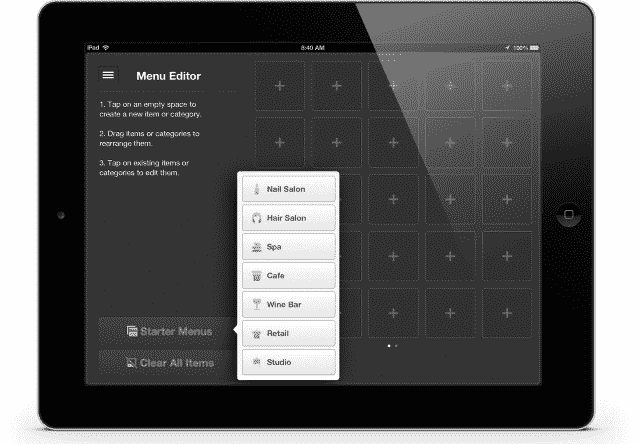

# Groupon 更新了面包屑支付应用，增加了交易兑换、离线模式和餐厅以外的更多定制功能 

> 原文：<https://web.archive.org/web/https://techcrunch.com/2013/07/23/groupon-updates-its-breadcrumb-payments-app-with-deal-redemptions-offline-mode-and-more-customization/>

今年 5 月，为了提高与 Square 和 PayPal 等公司的竞争力， [Groupon 重新推出了](https://web.archive.org/web/20221201070242/https://beta.techcrunch.com/2013/05/14/groupon-rebrands-its-mobile-payments-business-as-breadcrumb-adds-ipad-merchant-app-and-a-5k-no-fee-sweetener-to-bring-on-new-users/)其 [Breadcrumb 销售点应用程序](https://web.archive.org/web/20221201070242/https://itunes.apple.com/us/app/breadcrumb-pos/id588436209?mt=8)——最初是为餐馆设计的支付应用程序——为所有当地商户提供免费支付应用程序。

如今，daily deals 公司正着手实施该战略的第二阶段，在更新中添加了许多新功能，以使该应用程序(该公司更广泛的支付服务和应用程序套件的一部分)变得更加可用(但仍是免费的)。这些功能包括在你离线时接受支付、兑现 Groupon 交易，以及定制应用程序以适应特定的商业类别，如美容院或咖啡馆。Groupon 希望，这些举措不仅能通过 Breadcrumb 推动更多的交易，还能给 Groupon 多一种向其他服务(比如 Groupons 本身)推销这些商家的方式。

负责 Breadcrumb 的产品主管 Jyri Engestrom 表示，Groupon 更新该应用程序的部分原因是为了回应迄今为止收到的一些最强烈的反馈。

对 Groupon 来说，这听起来像是一个陡峭的学习曲线，在 5 月份推出应用程序后，收集了成千上万用户的反馈。“我们注意到，如果你以前从未使用过销售点应用程序，要花很长时间才能上手，”他说。“当你登陆应用程序时，你被丢进了一个空画布，商家真的很难知道下一步该做什么。”

为此，用户现在被要求识别他们是什么类型的企业，这反过来为他们提供了一个适合该垂直市场的预设菜单。然后，用户可以选择更多地定制这些设置——比如，如果你是咖啡馆，可以选择不同的咖啡和价格，如果你是水疗馆，可以选择不同的护理。(预设垂直行业的完整列表:美发和美甲沙龙、水疗中心、工作室、酒吧、咖啡馆和零售机构。)目前，Engestrom 表示，该应用程序将保持“横向”，时间将会证明每个垂直领域最终是否会有自己的、更强大的应用程序。该公司没有透露任何具体的下载或使用数字，但我怀疑推出更多的应用程序将取决于这一个最终有多受欢迎。

尽管所有这些听起来都很实际，但 Engestrom 将离线模式的增加描述为“至关重要的”，这意味着商家即使没有互联网连接也可以进行支付。他描述了商人之间正在发生的巨变。“就像诺基亚被智能手机革命摧毁一样，我认为类似的事情正在 iPads 和 Android 平板电脑的本地企业中发生，”他表示。但是技术的承诺变得有点空洞——至少不太可靠——如果当宽带出现故障时，商家不得不停止支付。

这些支付费用是这样的:Groupon 对 Visa、MasterCard 和 Discover 刷卡交易收取 1.8%的费用，键入时收取 2.3%，每笔交易另加 0.15 美元。美国运通的定价更复杂，因为它是“由美国运通根据您的行业类别确定的”Groupon 表示，费率从 2.3%-3.5%(刷卡)到每笔交易 0.00-0.15 美元不等。对于非 Groupon 商户，费用更高:刷万事达卡、维萨卡和发现卡时收取 2.2%的费用，每笔交易加收 0.15 美元。作为比较，Square 有两种选择:每次刷卡收取 2.75%的固定费用，或者每月 275 美元，每次刷卡不收费——后者针对的是高交易量用户，或者那些喜欢赌一赌自己可能会成为的用户。

在 Groupon 之前，Engestrom 的背景是 Ditto 的创始人，这是一个移动推荐应用程序，Groupon 去年收购了它。在他的 Ditto days 之前，Engestrom 在谷歌工作，在他的 Twitter 风格的微博服务 Jaiku 被收购但最终被搜索巨头关闭后，他结束了在谷歌的工作。

他今天告诉我，对 Ditto 的收购是“一项技术收购和雇佣合同”，因为他在 Ditto 创造的一些作品正在进入 Groupon 的移动产品——特别是围绕面向消费者的 Groupon 应用程序。但他也补充说，他在这里用 Breadcrumb 做的事情同样重要，如果不是更重要的话，因为它如何结束了他以前的工作。“如果你想建立一个创新的企业，就像我在同上所做的那样，你必须在商家端有一个终端，因为这是你真正看到人们在买什么的唯一方式。”像 Foursquare 这样的公司可以让你登录一个商家，但你并不真正知道与此相关的是什么。"

这也可以追溯到今天增加的第三大功能:将 Groupon 交易与支付应用程序集成。现在，Groupon 可以向其用户提供附近的交易或推荐，当用户进入企业使用他们的 Groupon 时，如果他使用该应用程序，商家可以直接将其链接起来，以完成销售。这节省了时间，但也留下了商家可以使用的分析线索。

“我们收取加工费，这对我们来说是一项真正的业务，但最终我坦率地认为 Ditto 是因为这个领域而被收购的。Groupon 和 Square 等公司的竞争归根结底是一场谁能推动消费者对这些商家需求的游戏，”他说。“我们正在建立所有这些强大的功能，但这最终是一场谁能利用这些数据，谁能在销售点提升消费者和商家之间互动的游戏，”他补充道。

Groupon 已经有数千万用户下载了它的应用程序，还有成千上万的商家通过该平台推动交易，关键是 Engestrom 和他的团队能否在承诺关闭环路的基础上出售商家，以及让更多用户参与交易，因为现在可以更快地对他们采取行动。

目前，Groupon 还没有向通过其平台销售商品和服务的全球 50 万商家推出这一解决方案——尽管[像这样的战略投资，德国类似 Square 的移动支付提供商 SumUp 的](https://web.archive.org/web/20221201070242/https://beta.techcrunch.com/2013/07/09/sumup-adds-spanish-bank-bbva-to-its-latest-grouponamex-round-follows-mobile-payment-rival-izettle-to-latin-america/)，确实表明该公司正在想办法尽快做到这一点。