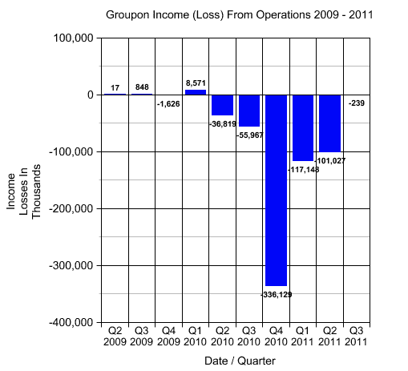

# Groupon 的季度增长率降至 9 %,但运营亏损几乎为零 

> 原文：<https://web.archive.org/web/http://techcrunch.com/2011/10/21/groupons-quarterly-growth-slows-to-9-percent-but-operating-losses-cut-to-almost-zero/>

在过去的六个月里，Groupon 受到了很多批评，有些批评是应该的，有些批评可能有点过分。对于 Groupon 对小企业和商户的价值，肯定有合理的担忧，但抛开高昂的估值不谈，我们必须记住，Groupon 仍然是一家年轻的公司，未来仍是未知的。

这家每日交易巨头的 IPO 路演定于下周开始，在此之前，Groupon [发布了一份关于其即将进行的 IPO](https://web.archive.org/web/20230203080648/https://techcrunch.com/2011/10/21/groupon-to-sell-30m-shares-at-16-18-a-pop-valuation-as-much-as-11-4b/) 的最新 SEC 文件，其中它宣布计划以每股 16 至 18 美元的价格出售 3000 万股股票，这意味着它必须筹集 4.8 亿至 5.4 亿美元——所有这些都导致估值可能高达 114 亿美元。

现在，虽然安德鲁·梅森穿着西装打着领带向潜在投资者推销足以让任何人紧张，但这家每日交易巨头最近采取了一些积极的措施，即通过 Groupon Rewards 结束兑换循环。[阅读 Erick 的分析。](https://web.archive.org/web/20230203080648/https://techcrunch.com/2011/09/27/groupon-loyalty-rewards/)

话虽如此，目前对于 Groupon 来说是不是都是阳光和月光？其巨大的估值可能会导致人们这样看待它，但该公司今天分享了其第三季度的统计数据，这些数据被埋在其更新的 SEC 文件中。

从图中可以看出，与 Q2 相比，2011 年第三季度的收入增长了 9.4%(达到 4.3 亿美元)，这无疑是一个好兆头。然而，再往前追溯，这表明 Q2 第四季度的增长率比 Q1 低 32.7%，比 Q1 低 72%。

另一方面，Q2 的毛账单收入实际上比 Q1 增长了 24.5%，该季度的总账单收入为 11.5 亿美元。本季度“累积客户”达到 2950 万，高于 Q2 的 2300 万，所有这些都面临着营销支出和运营收入(损失)的下降，从 Q2 的 1.01 亿美元下降到第三季度的 239，000 美元。

下面，我们看到，从 2010 年的 Q2 到 2011 年的 Q1，Groupon 的运营收入损失一直在增长，今年第二季度仍然很高。Groupon 最近的统计数据显示，今年第三季度，运营亏损大幅减少，尽管 Groupon 在这一类别中仍处于亏损状态，但趋势肯定是积极的。

然而，值得注意的一点是，虽然远非不诚实，但肯定是明显的(而且有点烦人):你会在第九张幻灯片[中注意到，罗宾今天早上发布的](https://web.archive.org/web/20230203080648/https://techcrunch.com/2011/10/21/video-tie-wearing-groupon-ceo-andrew-mason-pitches-ipo-to-investors/)(来自梅森对投资者的演示)给出了 Groupon 在日常交易领域面临的重大竞争的混乱景象。酪但是，我问你，生活社交在哪里？

是的，[根据 Erick 在 9 月份分享的数据](https://web.archive.org/web/20230203080648/https://techcrunch.com/2011/10/07/livingsocial-groupon-september/)，Groupon 继续占据着 54%的市场份额，但是 LivingSocial 并不仅仅是街角的一个卖柠檬水的小摊。LivingSocial 拥有至少 22%的每日交易市场，你可能会认为这将使它在 Groupon 的“竞争对手地图”上占据更突出的位置。在这一点上，纽约时报的标题比 LivingSocial 更大，这是非常可笑的。

但愿这只是 Groupon“令人敬畏”的幽默感的又一个例子。

