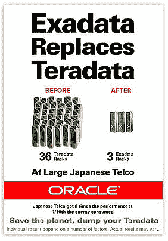

# 客座博文:确定并利用你的创业可持续性

> 原文：<https://web.archive.org/web/https://techcrunch.com/2011/09/21/guest-post-identify-and-leverage-your-start-up-sustainability/>

 *这是卢克·米勒的客座博文，他是[补偿选项](https://web.archive.org/web/20230320081555/http://www.offsetoptions.com/)的创始人兼首席执行官，这是一家位于巴塞罗纳&伦敦的初创公司，利用网络服务对抗气候变化。*

如今，大多数初创企业都专注于让一项行动、一个流程、一次采购或沟通变得更容易、更便宜、更高效。这种效率可以极大地减少对环境的影响——无论是对您的行业还是对您的消费者。从早期阶段就意识到你对环境的影响，以及你在减少他们的影响中为客户提供的价值，这使你能够理解如何有意识地建立这一点，以便它具有最低的成本和最大的收益。

好处是巨大的:吸引新客户，让你的公司与众不同，同时保护环境。

**您为什么要关心？因为大企业在乎，消费者也在乎**

根据波士顿咨询集团[链接至波士顿咨询集团调查:获取消费公司的绿色优势，2009 年 [PDF](https://web.archive.org/web/20230320081555/http://www.bcg.com/documents/file15407.pdf) ]北美和欧洲三分之一的消费者在购买时会寻找环境可持续的产品和服务。

例子一:你读过《经济学人》吗？翻到杂志的背面，看看甲骨文每周发布的广告。这是上周欧洲版的:

世界各地的大企业正在将环境要求嵌入他们的采购政策和现代管理人员的关键绩效指标中；这意味着，如果您能够解决环境问题，您不仅可以获得决策者签署的最新解决方案，还可以让他们更容易在内部销售。节省时间、金钱和环境是更容易的销售方式。

如果你正在与大企业竞争，他们通常在新的技术、政策或心态方向上行动较慢，所以这是你为自己的企业增加进一步差异化的一种方式。这不仅仅是关于你的服务器，尽管尽可能减少你的服务器的排放是一件好事。

谷歌和 T2【脸书已经在这个领域做了一些有趣的事情，而 T4 仍在云计算上犹豫不决。

**回顾您的流程如何为客户带来更可持续的结果。**

一个例子是[Garmz.com](https://web.archive.org/web/20230320081555/http://garmz.com/)(更名为 Lookk.com)。(披露:Garmz 是 Seedcamp 投资组合的一部分，我的公司也是。)

Garmz 专注于在独立设计师开始生产之前为他们的产品创造需求。这意味着设计师的风险更小，但也意味着浪费更少，因为在创作产生之前需求就得到保证。在需求和供应之间建立反馈机制是时尚界的一大进步，因为时尚界通常有极其浪费的生产和运输过程。

Airbnb。你们都知道他们。这是一项伟大的服务，最近有了第一次飞跃。这项服务的一个明显的好处是与你正在访问的地方的人进行社交互动——然而这也是资源再利用的一个很好的例子。

酒店通常很少满负荷[在繁荣时期大约 2/3](http://www.worldpropertychannel.com/international-markets/vacation-leisure-real-estate/global-hotel-performance-report-str-global-room-rates-revpar-adr-hotel-occupancy-rates-hotels-in-sao-paulo-hotels-in-brazil-hotel-deals-in-rio-de-janeiro-4586.php)。向住宅基础设施的更大资源再利用模式转变现在看起来是一个显而易见的想法，但是具有显著的环境效益。人们正在租赁房产、房间或折叠沙发，否则它们将被闲置。随着低成本航空公司国际旅行的激增，越来越多的人希望以合理的价格进行有趣的旅行，而不是没有社交功能的酒店。

共享空间并不会消耗更多的电力，它确实需要建设大量的额外基础设施(你知道吗，相对于其行业规模而言，混凝土行业是污染最严重的行业之一？约占全球排放量的 5%。[果然哇](https://web.archive.org/web/20230320081555/http://www.wbcsd.org/includes/getTarget.asp?type=d&id=ODY3MA)。根据我们的估计，与标准住宿相比，Airbnb 平均将减少至少 65%的住宿排放。

**还是看不出你的企业如何融入？**

即使你没有直接提高能源或流程效率，你也可以提供信息，帮助你的企业客户或消费者获得更多信息，做出更好的决策。如果你的服务是有帮助的，那么超越你的竞争对手去解释你可能促成的决策对环境的影响。

在你的日常生活中，一个清晰的空间就是旅行。许多在线旅行社和旅游元搜索公司正在将环境数据嵌入到客户的决策流程中。我们的新客户之一， [rome2rio](https://web.archive.org/web/20230320081555/http://www.rome2rio.com/) 不仅提供到达目的地的替代方式的新信息(例如除了飞机之外的渡轮或火车)，他们还包括旅行碳足迹的信息，以使他们的客户能够做出更明智的决定。考虑你是否能提供与你相似的价值。

**不要被落下**

要积极主动，否则就要努力赶上先行动的竞争对手。这是与前几代企业家的关键区别。这一数据现在已经有了。这是一个现在可以利用的机会，它将使您的企业更具竞争力，同时减少您对环境的影响。

因此，如果你是一个企业家，证明你比你的竞争对手更有动力，提供更多的价值，不要忘记将环境效率嵌入到你的服务产品中。这不仅仅是一个“附加物”,它应该是任何崭露头角的企业家的战略的一部分。

引领潮流，或者更重要的是让您的客户引领潮流，帮助他们减少对环境的影响并做出更好的决策——共同努力提供更好的服务，同时应对我们这个时代最大的道德挑战。