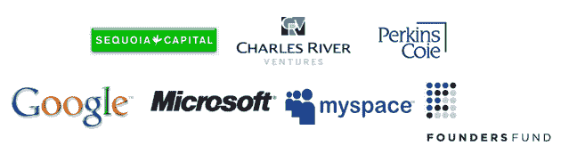

# 客座博文:与迈克尔·阿灵顿合作一个个人项目 TechCrunch

> 原文：<https://web.archive.org/web/http://techcrunch.com/2009/03/31/guest-post-working-with-michael-arrington-on-a-personal-project/>

# 客座博文:与迈克尔·阿灵顿合作一个个人项目

 *这是一篇由[卡罗尔·克拉维茨](https://web.archive.org/web/20230203074713/http://www.crunchbase.com/person/carol-kravitz)撰写的客座博文，卡罗尔·克拉维茨是一位前时尚高管，也是克拉维茨联合公司的创始人兼首席执行官，这是一家高档的独家婚介服务公司。Kravitz 正在和迈克尔·阿灵顿一起做一个个人项目，并寻求 TechCrunch 读者的帮助:*

寻找那个特别的人是一件严肃的事情(我知道，我通过寻找迷失的灵魂并将他们与那个特别的人匹配而谋生)。但我今天不是来推销我的业务的——我们只接受私人推荐，坦率地说，如果不是这个帮助 TechCrunch 创始人迈克尔·阿灵顿的绝佳机会，我不会同意让我的业务受到如此多的关注。但是，TechCrunch 读者的庞大数量意味着，你们当中有一个人可能认识愿意提供帮助的人。

坦率地说，我们正在寻求你的帮助，为迈克尔找一个妻子，或者至少是一个认真的女朋友。或者只是一次晚餐约会。

迈克尔多年来都没有长期的女朋友。在他 2005 年创办 TechCrunch 大约六个月后，他当时认真交往了四年的女友狠狠地甩了他。显然，一天写 20 个小时的博客并不能让你和另一半有太多的个人互动。即使在今天，禁止令禁止迈克尔访问洛杉矶的部分地区。

至此，事情越来越绝望。他刚满 39 岁。他很少约会，更喜欢呆在家里和他的狗拉古纳玩电子游戏。那是在他不工作的时候。

我知道我在这里没什么可做的。一个久坐不动的 39 岁单身男人做出了可疑的职业选择，现在以博客为生，这在纸面上看起来并不好。对身体也不好。在最近的一次度假中，迈克尔说他“去海滩慢跑”并且“认为他在 50 码内心脏病发作。”据我所知，他的食谱几乎全是墨西哥卷饼。

但我们正在努力让他进入战斗状态。他加入了健身房，这是一个巨大的进步，尽管他还没有去(我得到了我们雇佣的尚未使用的私人教练的报告，得到了他的许可)。他在严格节食。我们一定会很快让他恢复健康。

这就是你进来的地方。你知道谁有兴趣和迈克尔约会吗？我们想听听你的意见。想自己和他约会？非常好。[我们为您准备了一份表格，您可以填写](https://web.archive.org/web/20230203074713/http://techcrunch.com/find-mike-a-wife/)，并随意添加您自己或您认识的人的信息。TechCrunch 每月有数百万读者。大多数是秃顶的中年科技怪才，他们并不般配。但我们希望你们中至少有几个人有单身的姐妹或朋友。这里有一个特别的奖励来帮助你:如果你帮助迈克尔找到“那个人”，我们保证会在 TechCrunch 上介绍你的创业公司。

外表远没有你是谁重要，你的外形反映了这一点。至少上传五张照片，花些时间用不超过 30 个字符来描述你自己，你的希望，你的梦想，以及你在一段关系中想要什么。

我们将选出前 25 名左右的参赛者，迈克尔将与你们每个人共进晚餐。由于我们的高级赞助商 [Ustream](https://web.archive.org/web/20230203074713/http://www.ustream.com/) ，每一次约会都将进行视频直播。也感谢我们下面的其他赞助商，他们将支付我的费用，约会的中介费，如果一切顺利的话，还有婚礼。请注意，在约会期间，您需要根据自己的选择戴上帽子或穿上 t 恤，清楚地展示其中一个赞助商标志。

高级赞助商:

感谢我们的其他“给迈克找个妻子”赞助商:

