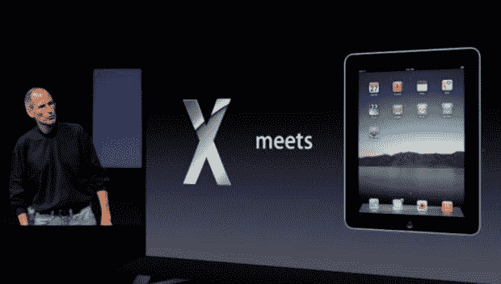

# 苹果“回到 Mac”活动指南

> 原文：<https://web.archive.org/web/https://techcrunch.com/2010/10/20/guide-apple-back-to-mac/>

# 苹果“回到 Mac”活动的 TechCrunch 指南

这是库比蒂诺繁忙的一天。今天，在苹果公司的“回到 Mac”活动上，史蒂夫·乔布斯和他的公司向苹果的忠实用户们公布了一些重大消息。不出所料，这一切都是关于 Mac 的，看起来，它将得到一个重大的翻新。

头条新闻之一是即将发布的新 Mac OS X，10.7-现在官方称为“狮子”(什么，不是“豹猫”？).乔布斯说，Lion 本质上将是 iOS 和 OS X 的合并，并预计这个可爱的孩子将在明年夏天上市。

除了硬件之外，应用程序商店正在向你身边的笔记本电脑和台式机走来，尽管它不会在 90 天后到来。坚持住。据 TC 的 Devin Coldewey 称，App Store 将“从本质上取代互联网来获取应用程序。你只需点击一下，它就会像 iPad 应用程序一样通过 App Store 应用程序进行安装。”你可以在这里阅读 CrunchGear 的综合图片[。](https://web.archive.org/web/20221210051836/http://www.crunchgear.com/2010/10/20/apple-announces-lion-mac-os-x-10-7-with-a-mac-app-store-misson-control/)

苹果对 Mac 的多次翻新继续进行，在桌面上增加了 FaceTime。从今天开始，所有 FaceTime 设备都将与桌面版 FaceTime 兼容，这意味着任何 iPhone 4 用户都可以与 Mac 交谈，甚至可以在全屏模式下交谈。它现在可以在 Apple.com 的[进行测试，但你应该看看 TC 自己的约翰·比格斯](https://web.archive.org/web/20221210051836/http://www.apple.com/mac/facetime/)[的视频评论，先浏览一下 face time](https://web.archive.org/web/20221210051836/http://www.crunchgear.com/2010/10/20/hands-on-with-facetime-for-os-x/)。

新的 MacBook Air 也在今天的 Mac-apalooza 上发布，重量只有 2.9 磅，配有新的玻璃触控板和 13.3 英寸的屏幕。苹果还提供了 11.6 英寸的版本，重量为 2.1 磅。点击查看 MG 齐格勒拍摄的新款 Air [照片。](https://web.archive.org/web/20221210051836/https://beta.techcrunch.com/2010/10/20/new-macbook-air-pictures/?utm_source=feedburner&utm_medium=feed&utm_campaign=Feed%3A+Techcrunch+%28TechCrunch%29)

乔布斯公司的声明中也加入了一些值得注意的数字，包括苹果 iOS 应用商店的官方下载量已经达到 70 亿次；全球 Mac 用户群现在不到 5000 万，苹果现在控制了美国消费市场的 20.7%；更不用说:苹果公司在 2010 财年售出了 1370 万台 MAC 电脑，是 2005 财年的三倍，上个季度吸引了 7500 万人光顾苹果商店。

要获得更深入的 TechCrunch 报道，请查看我们下面的完整帖子列表:

*   是的，苹果公司今天取消了 CD
*   [我们的收获:苹果的“回到 Mac”活动](https://web.archive.org/web/20221210051836/http://www.crunchgear.com/2010/10/20/our-take-apples-back-to-the-mac-event/)戴文·柯迪威
*   [苹果的 iLife '11 有一些相当深的脸书集成[图片]](https://web.archive.org/web/20221210051836/https://beta.techcrunch.com/2010/10/20/ilife-apple-facebook/) 由 MG 西格勒
*   [70/30:苹果的神奇赚钱机器](https://web.archive.org/web/20221210051836/https://beta.techcrunch.com/2010/10/20/app-store-sca/)作者约翰·比格斯
*   [看:新款 MacBook Air【图片】](https://web.archive.org/web/20221210051836/https://beta.techcrunch.com/2010/10/20/new-macbook-air-pictures/)MG 西格勒
*   [向 Mac 应用商店问好:像 iOS 应用商店一样，但为了你的 Mac](https://web.archive.org/web/20221210051836/http://www.crunchgear.com/2010/10/20/say-hello-to-the-mac-app-store-like-the-ios-app-store-but-for-your-mac/) 尼古拉斯·德里昂
*   [苹果宣布苹果 MacBook Air 更新，包括一款由约翰·比格斯](https://web.archive.org/web/20221210051836/http://www.crunchgear.com/2010/10/20/apple-macbook-air/)设计的更小的型号
*   如果苹果剥离 Mac 业务，它将在 MG 西格勒的财富 500 强排行榜上排名第 110 位
*   [苹果发布 Lion，Mac OS X 10.7，带有 Mac 应用商店，Misson Control](https://web.archive.org/web/20221210051836/http://www.crunchgear.com/2010/10/20/apple-announces-lion-mac-os-x-10-7-with-a-mac-app-store-misson-control/) 作者 Devin Coldewey
*   [现在就下载 OS X Facetime 测试版](https://web.archive.org/web/20221210051836/http://www.crunchgear.com/2010/10/20/download-the-os-x-facetime-beta-right-now/)作者马特·伯恩斯
*   [OS X 10.7 狮子:是 OS X 遇上 iOS。多点触控，Mac 应用商店，任务控制，更多](https://web.archive.org/web/20221210051836/https://beta.techcrunch.com/2010/10/20/os-x-lion/)MG Siegler
*   [App Store 点击 70 亿次下载](https://web.archive.org/web/20221210051836/https://beta.techcrunch.com/2010/10/20/app-store-hits-7-billion-downloads/)作者亚历克西亚·特索西斯
*   [苹果为 MAC 电脑增加 Facetime【更新:官方】](https://web.archive.org/web/20221210051836/http://www.crunchgear.com/2010/10/20/apple-adds-facetime-to-macs/)作者马特·伯恩斯
*   [苹果商店上个季度有 7500 万访客](https://web.archive.org/web/20221210051836/https://beta.techcrunch.com/2010/10/20/apple-stores-had-75-million-vistors-last-quarter/)
*   [如果苹果剥离 Mac 业务，它将在 MG Siegler 的财富 500 强排行榜上排名第 110 位](https://web.archive.org/web/20221210051836/https://beta.techcrunch.com/2010/10/20/apple-mac-business/)
*   [苹果活动直播博客:狮子来了](https://web.archive.org/web/20221210051836/http://www.crunchgear.com/2010/10/20/apple-event-liveblog-the-lion-cometh/)作者约翰·比格斯
*   [使用 VLC 在任何电脑上观看苹果的 Back To Mac 活动](https://web.archive.org/web/20221210051836/http://www.crunchgear.com/2010/10/20/use-vlc-to-watch-apples-back-to-mac-event-on-a-pc/)作者 Matt Burns
*   [苹果向苹果设备直播今天的活动【更新】](https://web.archive.org/web/20221210051836/http://www.crunchgear.com/2010/10/20/apple-to-livestream-todays-event-to-apple-devices-only/)马特·伯恩斯