# 想亲自试用一下谷歌 Chrome OS 吗？以下是方法。

> 原文：<https://web.archive.org/web/https://techcrunch.com/2009/11/19/guide-install-google-chrome-os/>

今天，谷歌 Chrome 操作系统在 T2 的公开亮相让媒体对这个新的基于网络的操作系统的潜力议论纷纷。现在它是开源的，您有机会亲自尝试一下。不幸的是，大多数人还没有准备好承担这项艰巨的任务，即将谷歌最近的开源代码转化为可启动的计算机。因此，我们在大约 15 分钟内(取决于下载操作系统本身需要多长时间)免费提供了一个分步指南。不，这不会让你的电脑直接启动 Chrome 操作系统(坦白地说，你可能还不想这么做)。但它将使用免费软件 VirtualBox 在虚拟机上运行，该软件可用于 MAC、PC 和 Linux。

首先，一些警告:我们没有自己创建 Chrome OS 版本——它是从 BitTorrent 下载的。理论上，它有可能被一些恶意黑客篡改，窃取你的谷歌账户信息(这不太可能，但谁知道呢)。如果你担心的话，有一个简单的办法:创建一个废弃的 Gmail 账户，用它来玩操作系统。还要注意，因为这是在虚拟机中运行，所以您可能不会看到很好的性能(比如 7 秒的启动时间)。但这已经足够让你自己感受一下这款操作系统了。

Digg _ URL = ' http://Digg . com/tech _ news/Want _ To _ Try _ Out _ Google _ Chrome _ OS _ For _ Yourself _ Here _ s _ How '；

首先，你需要得到一个 Chrome OS 的镜像。你可以用[这个 torrent](https://web.archive.org/web/20221211053914/http://torrents.thepiratebay.org/5170843/chromeos-image-999.999.32309.211410-a1.vmdk.bz2.5170843.TPB.torrent) 来做到。你也可以尝试一下 [GDGT](https://web.archive.org/web/20221211053914/http://gdgt.com/google/chrome-os/download/) 上传的版本，在我们的测试中也运行良好。如果你得到的是 torrent 版本，你会看到它是. BZ2 格式的。你需要把它取出来。MAC 应该能够自动做到这一点，但对于 Windows，你可能需要一个像 [Win Rar](https://web.archive.org/web/20221211053914/http://www.win-rar.com/index.php?id=24&kb=1&kb_article_id=130) 这样的工具。

一旦完成，在[这里](https://web.archive.org/web/20221211053914/http://www.virtualbox.org/wiki/Downloads)为你运行的任何操作系统下载一个版本的 VirtualBox 并安装它。注册(或拒绝注册)后，你会看到这样的屏幕。点击左上角的“新建”按钮。我们将制作一个新的虚拟机。：

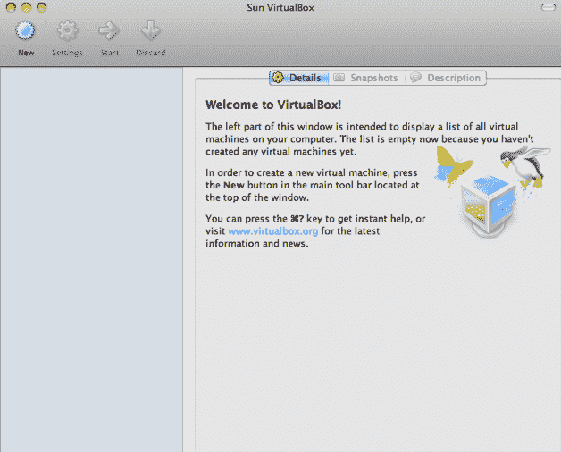

你会进入一个这样的向导。点击下一个。

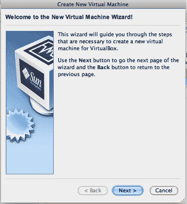

继续给操作系统起你喜欢的名字。对于操作系统，选择 Linux，以 Ubuntu 作为版本(其他设置也可能工作，但这是我们唯一工作的)。

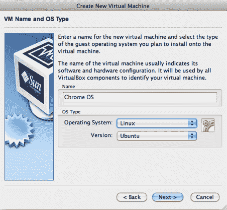

选择分配给此虚拟机的内存量。这将取决于你的电脑有多少内存。越多越好，但是如果你选择太多，你真正的电脑会变得不稳定/非常慢。

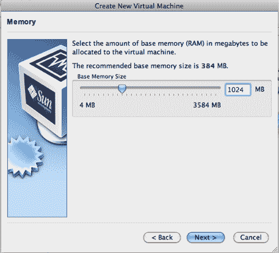

这是棘手的部分(幸运的是，这不是很棘手)。你不想创建新的硬盘，而是想使用现有的硬盘。也不要从下拉菜单中选择一个，你需要点击它右边的文件夹图标来进入“虚拟媒体管理器”。

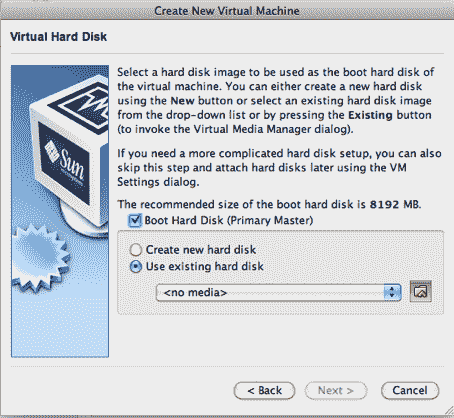

点击“添加”按钮。

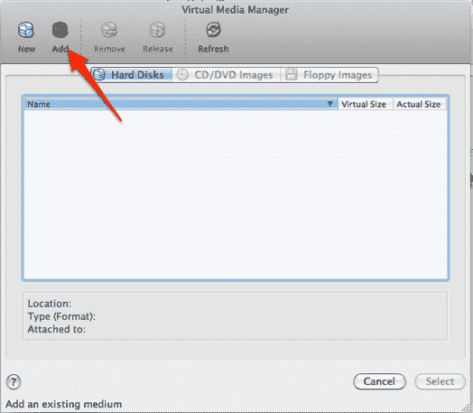

现在你要找到你之前下载的 Chrome OS 镜像。这可能在您的桌面上或下载文件夹中。找到后，点击“打开”。

到达此窗口后，点击“选择”。

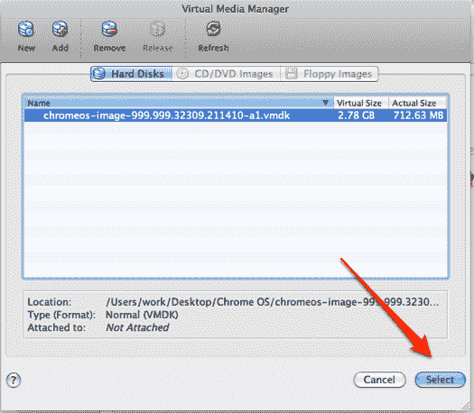

快到了。确保选中“使用现有硬盘”。点击下一个。

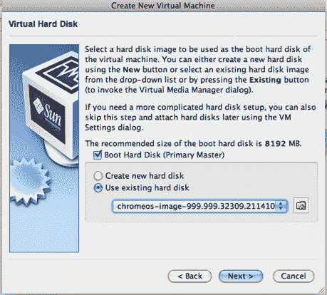

点击“完成”

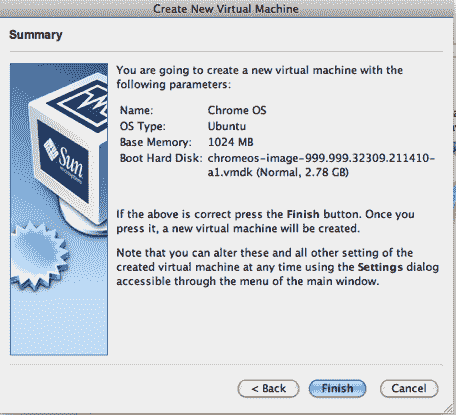

你完了！点击开始。希望屏幕会变黑，但只是一小会儿(这可能是 10 秒到 1 分钟左右，取决于你的电脑有多快)。

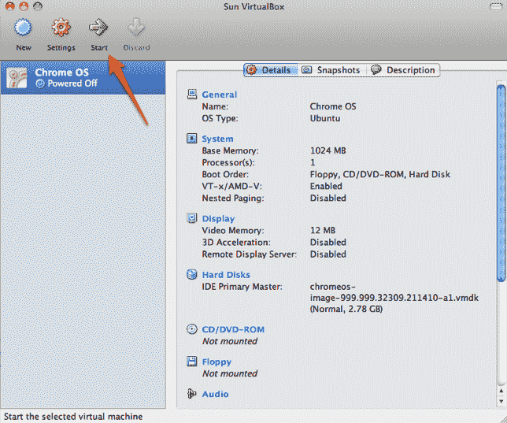

一旦你进入，你会看到一个“Chromium”(谷歌称之为 Chrome 的开发版本)的闪屏。要登录，您需要输入有效的 Google 帐户 id。你的标准 Gmail 帐户应该可以工作，但正如我们之前所说，这个版本的 ChromeOS 来自 bittorrent，所以你可能想使用一个像我们在下面的截图中那样的一次性帐户(你可以在这里制作一个)。

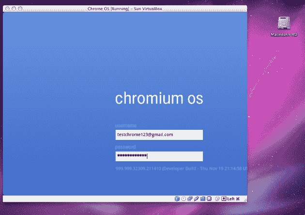

你被录取了。现在是探索的时候了。老实说，一切看起来都很像谷歌的 Chrome 浏览器，但有几个关键的区别。请注意右上角的电池寿命指示器和选项菜单。还可以尝试使用“新窗口”功能——你会发现在多个窗口之间导航很困难(如果不是不可能的话)。并且警惕书签管理器。据我所知，没有简单的方法可以摆脱它——你必须手动创建一个新的书签，一旦你点击它，它会把你踢回浏览器模式。哦，祝你找到“关机”按钮，因为我们肯定找不到。

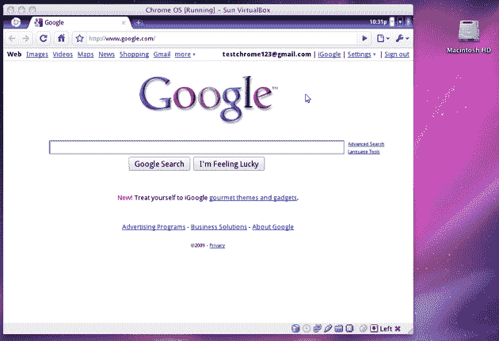

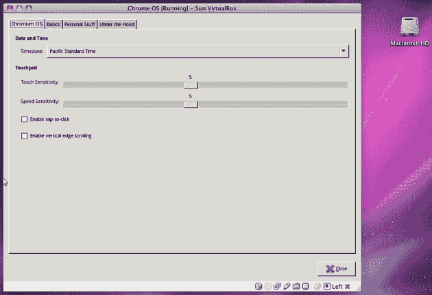

你可能不需要它，但根据 torrent 在 [ThePirateBay](https://web.archive.org/web/20221211053914/http://thepiratebay.org/torrent/5170843/chromeos-image-999.999.32309.211410-a1.vmdk.bz2) 上的列表，这次安装的共享用户密码(sudo 等功能需要它)是“chromeos”。