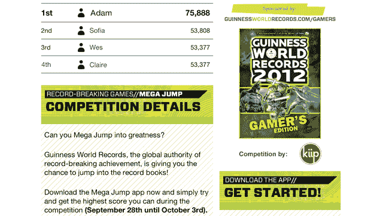

# 吉尼斯世界纪录与 Kiip 合作，让任何拥有 iPhone 的人都有机会创造纪录 TechCrunch

> 原文：<https://web.archive.org/web/http://techcrunch.com/2011/09/28/guinness-hooks-up-with-kiip-to-let-anyone-with-an-iphone-have-a-chance-at-a-world-record/>

# 吉尼斯世界纪录与 Kiip 合作，让任何拥有 iPhone 的人都有机会打破纪录

在我所见过的最奇怪的新闻稿中，[手机游戏奖励](https://web.archive.org/web/20230204072626/https://techcrunch.com/2011/04/10/kiip-is-an-entirely-new-mobile-ad-model-real-life-rewards-for-in-game-achievements/)网络 [Kiip](https://web.archive.org/web/20230204072626/http://www.kiip.me/) 和老派[吉尼斯世界纪录](https://web.archive.org/web/20230204072626/http://www.guinnessworldrecords.com/)(严肃地说)宣布他们今天将联手为手机游戏玩家提供成为官方吉尼斯世界纪录保持者的机会。是啊。

这种合作最突出的结果将是从 9 月 28 日到 10 月 3 日举行的为期五天的比赛，iPhone 游戏“Mega Jump”的玩家将通过 Kiip 争夺“Mega Jump 最高分”的吉尼斯世界纪录 Mega Jump 排行榜上得分最高的用户([此处可见](https://web.archive.org/web/20230204072626/http://www.kiip.me/gwr))将出现在《吉尼斯世界纪录:2012 游戏玩家版》中

“这是世界上第一次有人可以公开竞争世界纪录，仅仅是因为有一部手机，”Kiip 的创始人 Brian Wong 告诉我——解释说这是独一无二的，因为想要吉尼斯世界纪录的人通常必须通过模拟吉尼斯申请过程，并记录官方试图捕捉纪录的行为。

当被问及“为什么是有点非正统的伙伴关系？”时，我理所当然地这么问 Wong 解释说:“(Kiip)让成就更有回报——同时建立新的广告模式。我们对自己说——我们如何在网络中脱颖而出，并建立我们超越任何网络的品牌？”因此，我们找到了最终的方式，(世界纪录)来承认我们的库存:成就。"

Wong 告诉我，Kiip 现在通过其 20 个游戏的网络，平均每天有超过 170 万个“值得奖励”的时刻，“这只是冰山一角，”他说，“……当我们现在稍微修改我们的使命，从‘对虚拟成就的真实奖励’到‘让成就更值得奖励’。”"

Wong 证实，Kiip/吉尼斯的整合将继续进行，截至今天，所有支持 Kiip 的游戏都将有可能建立这种吉尼斯纪录竞赛，“这非常符合我们的成就时刻模型，”他强调说。

