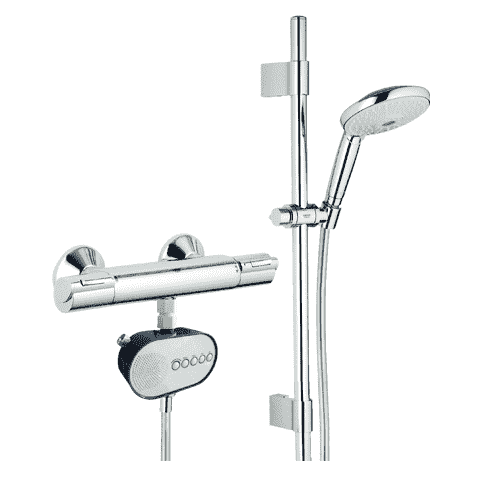

# H2O 电力公司:淋浴头供电的淋浴收音机 

> 原文：<https://web.archive.org/web/https://techcrunch.com/2011/02/17/h2o-power-shower-head-powered-shower-radio/>

# H2O 电力公司:淋浴头供电的淋浴收音机

看看这种在淋浴时给收音机供电的独特方式。普通的淋浴收音机有处理电池的麻烦，但是 H2O 淋浴电源收音机没有。不，它靠水压运转。整个收音机都是防水的，所以没有什么可担心的，它储存了多余的能量，这样当水被切断时它就不会死了。购买前唯一要考虑的是安装和拆除现有的淋浴喷头。56 美元可以得到一台收音机和一个新的淋浴喷头，所以还不错。