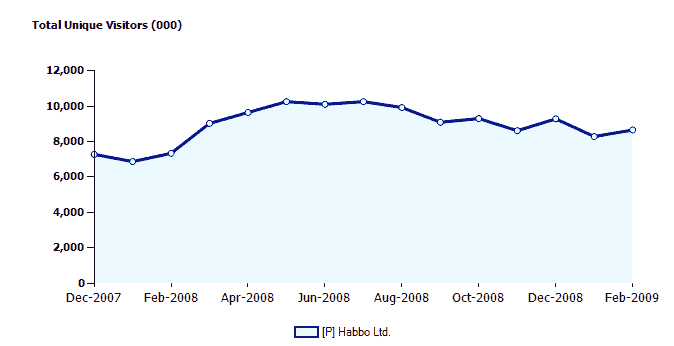

# Habbo 去年从虚拟商品和广告 TechCrunch 获得了 7400 万美元的实际收入

> 原文：<https://web.archive.org/web/https://techcrunch.com/2009/03/30/habbo-pulled-in-74-million-in-real-revenues-last-year-from-virtual-goods-and-advertising/>

# Habbo 去年从虚拟商品和广告中获得了 7400 万美元的实际收入

理论上，说服人们免费，或者说是零边际生产成本的东西，是一个很好的商业模式。实际上，这样的例子很少，而且大部分都在海外，比如总部位于赫尔辛基的青少年虚拟世界 [Habbo](https://web.archive.org/web/20230221201821/http://www.habbo.com/) 。虚拟世界的母公司 Sulake 今天为 Habbo 报告了一些选择性的财务和用户数据。2008 年，哈博的收入增长了 20%，达到 7400 万美元(5000 万欧元)，营业现金流为 700 万美元(480 万欧元)。在净收入的基础上，它甚至略有盈利，但该公司选择不披露确切的数额。

也许大部分收入被重新投入到全球扩张中，或者支付 Habbo 的 300 名员工(是的，300 名)的工资。但迄今为止，该公司不到 10%的利润率并不令人满意。Habbo 被认为是基于虚拟经济的真实企业的光辉典范之一。它也从广告中赚钱，但其收入的绝大部分来自于现实世界中的礼物和虚拟的奢侈品。

Habbo 表示，它每月吸引 1150 万独立访客(根据谷歌内部分析数据)，并创造了超过 1.2 亿个 Habbo 角色。然而，有多少已经被遗弃，还不清楚。ComScore 估计 2 月份全球独立访问者人数为 870 万，低于 12 月份的 930 万。

到 2008 年底，全球 Habbo 社区的活动也增长到 1.21 亿 Habbo 人物，回访者的数量增加了 40%以上。青少年虚拟世界的流量也在 12 月创下历史新高，独立访客超过 1150 万。其中大部分是在美国以外的其他国家，10 月份美国的独立访客人数似乎达到了 200 万。根据 comScore 的数据，今年 2 月，美国独立访客的数量下降到了 100 万。

