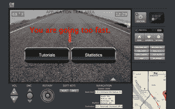

# Hack Team 的语音指导学习驾驶应用程序使与爸爸妈妈一起学习减少了家庭干扰| TechCrunch

> 原文：<https://web.archive.org/web/https://techcrunch.com/2013/04/28/hackathon-learn-to-drive/>

# Hack Team 的语音指导学习驾驶应用程序使与爸爸妈妈一起学习减少了对家庭的干扰

Jared Zoneraich 和 Nick Joseph 是两名高中生，他们在 Disrupt NY 2013 [黑客马拉松](https://web.archive.org/web/20230321004609/https://techcrunch.com/events/disrupt-ny-hackathon-2013/event-info/)上度过了一夜，使用通用汽车的 API 为初学者编写了一款车载应用。这两个人在他们的“学习驾驶”演示期间在舞台上获得了巨大的反响——尤其是车载仪表盘应用的杀手级功能:当学习者开得太快时，语音警告就会响起——这避免了与妈妈/爸爸在速度上谁是对的问题上的激烈争论。**更新:**刚刚宣布学车获得 Disrupt NY 2013 黑客马拉松比赛亚军。

其基本思想是提供语音指导，以帮助学习驾驶的人在与教练以外的驾驶员练习时，为包括平行停车和垂直停车在内的各种驾驶操作提供易于遵循的语音指令。 

该应用程序还根据学习者请求语音指导的次数，记录学习者完成每个动作的次数，并跟踪其他数据——例如学习者已经驾驶了多少小时和英里，以及一天中的什么时间。使用这些数据，该应用程序还会显示一个进度条和百分比，以显示他们距离达到最低要求的小时数还有多远，从而指示他们在参加考试时还需要多少练习。

在一次后台采访中，两人告诉 TechCrunch，一旦他们添加了一些收尾工作，如将驾驶员数据下载到微软 SkyDrive 的能力，他们希望将学习驾驶提交到通用汽车的应用商店。“学会驾驶”实际上是一个四人小组:另外两个成员是肯尼·宋和杰玛·伊斯罗夫。

后台采访如下: