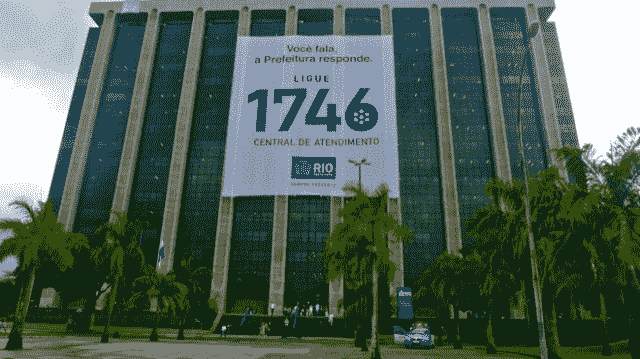
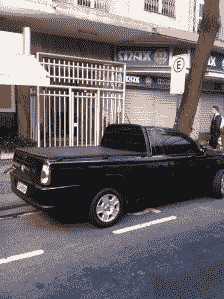
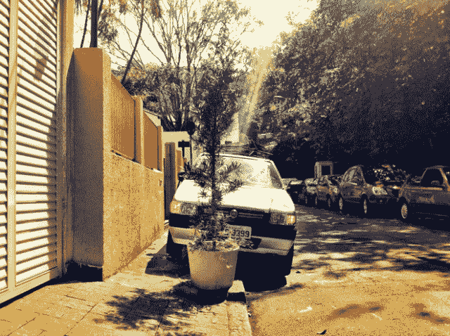
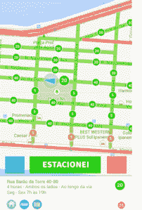
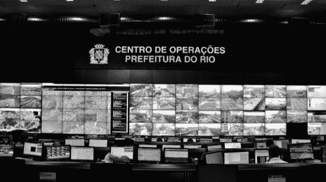
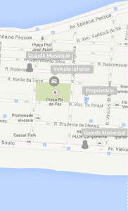

# 黑客马拉松以及如何与鲁阿·阿伯塔团队一起在里约热内卢找到停车位

> 原文：<https://web.archive.org/web/https://techcrunch.com/2013/09/22/hackathons-hyperbole-and-how-to-find-a-parking-spot-in-rio-de-janeiro/>

More posts by this contributor

**编者按:** *朱莉·鲁瓦罗是[自由撰稿人](https://web.archive.org/web/20221001161938/http://jruv.wordpress.com/about)和[RioChromatic.com](https://web.archive.org/web/20221001161938/http://riochromatic.com/)的编辑。可以在 Twitter [@jruv](https://web.archive.org/web/20221001161938/https://twitter.com/jruv) 关注她。*

我正坐在里约热内卢爱德华多·派斯市长总部 13 楼的一间办公室里。我来与佩德罗·保罗(Pedro Paulo)交谈，他是主持里约首届城市赞助的黑客马拉松(hackathon)的工作人员秘书，这是一个通宵红牛和热狗注入的技术盛会，向 75 名渴望通过应用程序让他们的城市变得更好的里约市民开放了城市数据缓存。

佩德罗·保罗(Pedro Paulo)坐在我对面的办公桌前，哲学地谈论着爱德华多·派斯(Eduardo Paes)市长是如何避开传统的、自上而下的政治治理，并开启一个由技术驱动的、与他的市政臣民对话的时代。

有黑客马拉松，还有一个名为 [Rio+](https://web.archive.org/web/20221001161938/http://www.riomais.vc/) 的新网站，可以让你提出建议并投票选出改善城市的想法。市长正在进行推特直播和流媒体直播，他上个月主持了他的第一次公开谷歌聚会。去年他去了长滩做了一个关于智能城市的 TED 演讲，上周他去了亚利桑那州的 Google Zeitgeist 谈论“政治数字民主”，一份官方新闻稿将它定义为他的“参与式管理的新概念，它与城市特别相关，并利用技术来产生更多的透明度，允许更好的监督并促进政府和人民之间更好的对话。”政治民主(n):参见黑客马拉松。

佩德罗·保罗告诉我，他们看到其他城市也在这么做——纽约、旧金山、芝加哥——然后决定让里约做得更好。他说，城市官员对黑客马拉松中出现的高质量想法印象深刻，他们计划将全部 40%的项目开发成可行的应用程序——这是与城市居民进行名副其实的应用程序对话的证据。

##### 在里约解决问题

获胜的应用程序名为“开放道路”(鲁阿·阿伯塔)，解决了里约居民每天给城市打 400 次电话抱怨的问题——非法停车。我在想象旧金山的 SFPark，它可以让你看到咪表停车位和车库停车位的实时可用性，但佩德罗·保罗正在描述一款当你违规停车时会给你发短信的应用。让你把车开走。

只是很难听到他的声音，因为 13 层以下有一群拿着扩音器的抗议者。数百名里约公立学校教师要求面见市长，讨论他们的条件，以结束长达一个月的罢工，这场罢工导致 3 万名学生失去了教师。不知道有没有这方面的 app。

城市赞助的科技活动可能看起来更像是城市浮华和新闻发布的大杂烩，而不是实现真正变化的机会。这种怀疑不会是毫无根据的，在一个自 6 月以来成千上万人走上街头要求对话的城市，而市长却在谷歌时代精神谈论政治民主。

但是，里约首届黑客马拉松所展现的是一个充满抗议文化的城市中数字公民的样子。

让我们离开市长办公室，和获胜的团队一起去伊帕内马海滩喝咖啡，我会让我的应用程序要求你移动你的汽车。但首先，我们要绕道去呼叫中心。

1746 年市长总部的横幅。当地人称这座建筑为“[大妓女](https://web.archive.org/web/20221001161938/https://www.google.com.br/search?safe=off&rlz=1C5CHFA_enUS503US503&q=Piranh%C3%A3o&bav=on.2,or.r_cp.r_qf.&biw=1347&bih=684&dpr=1&bvm=pv.xjs.s.en_US.nYXFudhZpfw.O&um=1&ie=UTF-8&hl=en&tbm=isch&source=og&sa=N&tab=wi&ei=6Oc5UvasII7O9AT8r4GICA)，意指三十年前为给红灯区让路而被驱逐的红灯区。

在里约热内卢外围的一个私人管理的呼叫中心，360 名员工——大多是年轻女性——每月接听来自里约热内卢各地忧心忡忡的居民的 20 多万个电话。

在 2011 年 3 月之前，这个城市的各个不同的市政部门都有不同的电话号码，当时他们创造了一个电话号码来管理所有部门。像拨打 311 的纽约人一样，里约居民现在可以拨打 1746 与 80 个不同的部门联系，从垃圾公司到墓地。

垃圾清除是滑坡最受欢迎的服务请求，其次是不规则停车、公共照明和清除啮齿动物。孤立地看，总数据(迄今超过 700 万个电话)构成了城市需求的脉搏以及满足这些需求的能力。

这是金矿市官员为 1746 年黑客马拉松公开的数据。他们让参与者面对的不是最受欢迎的要求，而是这个城市最难解决的要求。

“他们给了我们四个挑战，”获胜团队的项目经理莱昂纳多·埃洛伊在伊帕内马海滩边喝咖啡边解释道。“一个挑战是修剪树木，他们积压了两年半的等待列表。另一个问题是公共照明。另一个是街道上的坑洼问题，最后一个是违规停车。”

该团队出现在黑客马拉松上，计划建立一个众包地图，显示坑洞的位置，并帮助城市优先进行道路维修，但正如他们在佩德罗·保罗在黑客马拉松上的开场白中了解到的那样，已经有一个应用程序。

“所以我们就想，我们的坑洞主意——算了吧。让我们开始采访参加黑客马拉松的政府人员，”莱昂纳多说。“我们和 1746 的主管、市政警卫、来自城市清洁部门的家伙谈过——因为为一个不存在的问题提供解决方案有什么意义呢？我们想解决的不仅仅是里约居民的问题，而是同时也是居民、政府和 1746 年的问题。”

莱昂纳多和他的同事是解决里约问题的专家。团队中的三名成员——莱昂纳多·埃洛伊、尼古拉斯·艾森和伊戈尔·坎波斯——一起在 [Meu Rio](https://web.archive.org/web/20221001161938/http://www.meurio.org.br/) 工作，这是一个私人资助的社会动员平台，自该市今年 6 月爆发大规模抗议活动以来，它已成为一个非常有用的组织工具。

市长 Eduardo Paes 会见开放道路团队。

超过 100，000 名里约居民使用 Meu Rio 组织了大约 200 多个问题。与 Change.org 等美国本土平台不同，Meu Rio 反对在请愿书上签名或喜欢脸书的某些东西被视为有意义的参与。

相反，他们推出了一些工具，让活动组织者可以获取与手头问题相关的部门的城市官员的联系信息，包括脸书页面。他们利用自己的关系组织了活动家和城市之间的面对面会议。他们已经开始启动独立的项目，如 [De Guarda](https://web.archive.org/web/20221001161938/http://deguardanobondinho.org.br/) (“站岗”)，这是一个位于历史悠久的圣塔特蕾莎区的邻里监督平台，让担忧的居民关注一个储存着日益减少的历史文物供应的仓库。在德瓜达网站开通后的第一个 24 小时内，就有 1000 名当地人注册了监控摄像头。

Meu Rio 的人邀请了另外两个人来充实他们的黑客马拉松梦之队——伊戈尔·巴尔沃萨(Ygor Barboza)，一名在市中心办公室工作的 Android 程序员——就在第一次抗议发生的街道上——以及保罗·费尔南多·德·拉塞达(Paulo Fernando de Francois)，一名为政府工作的数据系统分析师:“看看我们是如何处理一个自 1746 年以来的巨大数据表的。”

“有趣的是，我们没有告诉任何人我们来自梅奥里奥，”莱昂纳多说。“我们的感觉是，政府认为我们很烦人。我们担心他们会说，“嘿，让我们忽略 Meu Rio 的家伙。"

“我们希望我们自己和我们的作品得到评价，”Meu Rio 的界面设计师 Igor 说。“但也许让他们看到我们不仅仅是来对抗他们，而是来合作的，这是件好事。”

“政府中的一些人不明白这一点，”莱昂纳多说。“他们认为我们是反对派。不是反对。是对话。”

Team Open Road 在去黑客马拉松的路上看到一个标志。

在进入黑客马拉松的路上，团队开路看到了一个标志。“我看见一辆卡车停在残疾人车位上，”莱昂纳多告诉我，“那家伙没有停车证或任何东西。于是我用 iPhone 拍了张照片，把我的投诉发到 1746。这是在早上 7:46。直到上午 9 点 20 分，1746 才将他的投诉提交给相关部门。那么，这有什么意义呢？”

他们在黑客马拉松上与一名市政警卫聊了起来，并问他当他给某人开停车罚单时会发生什么。他说，“通常有两个借口。要么是“我不知道我不能停在这里”，要么是“马上就好。”"

第一个借口在里约是合理的。“没人记得书本上合法停车位的具体内容，”莱昂纳多解释道。“这真的很复杂。你能在街道的左边或右边停车吗？一天中什么时候你可以在那里停车？你必须平行停车，还是 45 度或 90 度停车？有时没有任何迹象可以告诉你。”

更不用说约三分之一的里约居民——200 万人——生活在贫民窟，那里的铺面道路和停车位供应极其有限。在里约最大的贫民区，德国人聚居区，三分之一的居民没有通往他们家的街道，更没有停车位。

所以里约有太多不规则停放的汽车。在市中心，在科帕卡巴纳，在伊帕内马海滩，你总是看到汽车停在人行道上，汽车以错误的方式并排停放，汽车被堵在里面，一堆问题。"

莱昂纳多表示，数据缓存证实了他的个人观察:1746 市中心收到的停车投诉最多，其次是科帕卡巴纳海滩，然后是一个名为蒂茹卡的街区，夹在著名的马拉卡纳足球场和茂密的城市森林之间。

人行道停车:在里约并不少见。

这让里约的市政警卫非常头疼，据说他们有比开停车罚单更重要的事情要操心。莱昂纳多解释说:“当市政警卫不得不和一个像‘我不知道，对不起’这样的司机说话时，就会产生社会成本。”。"讨论变得激烈，你感到头疼，你感到烦恼."

1746 年的问题更多的是操作上的头痛。当有人向 1746 发送停车投诉时，呼叫中心代表手动复制信息，包括车牌号码，并将其发送给市政警卫，后者将其发送给地区部门，后者将其发送给距离非法停车最近的值班警卫。这是一个巨大的电话游戏，他们每天玩 400 次。

如果在投诉通过系统时违规的汽车还没有离开它的非法位置，值班警卫会开一张罚单，或者如果它阻塞了车道，或者在残疾人停车位，会叫一辆拖车。如果拖车来的时候违规的车还在那里，那就不能说拖车能到达那里。

没有拖车的空间。

莱昂纳多解释说:“然后我们发现，把车拖到拖车场的费用比你把车开出来的费用要贵得多。”“你必须花很多钱来租两个车位，而且真的很远。然后你要支付司机、卡车、汽油和环境影响的费用。所以得不偿失。”

“我们了解到，当他们拖走一辆有很多未付罚单的旧车时，情况会更糟。因为在里约，每年你都要为你的车支付年费。有时人们不付钱，他们的车就会被拖走。要把你的车开出拖车场，你必须付清所有的罚单。所以对很多人来说，如果他们没有钱，他们会把车留下。”这使得拖车场处于满负荷状态。

伊戈尔解释说，这个城市非常不愿意拖走汽车，以至于“有时隧道入口处会有一辆拖车，他只是让人们知道，如果他们做了什么有趣的事情，他们就会被拖走。”不是可扩展的解决方案。

停车并办理入住手续

“所以拖走汽车对城市不好，”莱昂纳多说。“市民的车被拖走对他们不好。对不得不处理的市政警卫来说不好，对交通也不好。”

“即使你给司机一张罚单，罚单是教育公民的一种方式这一概念也是有争议的，”伊戈尔说。“但如果你有一个应用程序，它会轻拍你的肩膀说，‘嘿，你给某人带来不便了。’这比惩罚一个人要人道得多。"

##### 开阔的道路

首先，让我们帮助不知道他们实际上可以在哪里停车的司机。开放道路团队在他们的应用程序中添加了该市现有的合法停车点地图。这些数据还远未完成——它只标出了市中心和里约时尚南区的合法停车位——但这是一个起点。

当你找到一个停车位时，你可以使用应用程序来查看你是否真的可以在那里停车。然后你登记入住，应用程序会问你，“它是如何找到停车位的？”你可以说这很容易，很难，或者一般般。

该登记用实时停车信息填充开放道路数据库。“所以我们正在开发一个关于停车情况的集体智能，”Igor 解释道。根据一天中的不同时间，既有关于合法停车点位置的城市数据，也有关于最佳停车位置的集体智慧。"

你可以告诉 app 你是怎么找到你的车的。

“这对这座城市也有好处，因为他们将能够了解哪里的街道停车需求最大，哪里有可用的停车场，哪里需要张贴更好的标志，”莱昂纳多说。

假设你在一个停车点登记，这个停车点有四个小时的时间限制，需要一张停车票。开放道路应用程序会告诉你。“在我们未来应用的梦想版本中，你可以直接从手机上购买新票，”伦纳德说。“但现在，当你的时间快到了，这款应用会给你发送提醒，并告诉你回到车旁的最快路线。你越快到达那里，你就越快为别人腾出时间。”

Android 开发者 Ygor 插了一句话，解释说当你回到车旁时，你会收到另一个提醒。“这个想法是，当你回到你的车上时，应用程序会问你是如何找到你的车的。”

根据莱昂纳多的说法，该应用程序会显示一个列表，为用户提供选项，例如你的车是否还好，是否被刮伤，它是否还在那里，或者是否有一辆 flanelinha。

Flanelinhas 是非常乐于助人的家伙，他们会带你到你的停车位——在里约这经常是很拥挤的——并收取一美元来照看你的车。如果他们没有官方制服，他们就是在非法提供服务。

“所以你也可以把信息传递给城市，告诉他们哪些地区有法兰尼斯，一天中的什么时候你应该在那里派一名警卫。您还可以与安全秘书分享城市中哪些区域与汽车损坏或盗窃相关的事件最多。”

现在你有了一个应用程序，它会告诉你哪里可以停车，根据一天中的时间，哪里是停车的地方，这是否是一个安全的地方，以及你的时间到了。但是，假设你把车停在人行道上或者堵住了车道——只要几分钟——因为你知道要过很长时间才会有人给你开罚单或者拖走你的车。这就是事情变得有点令人毛骨悚然——或者有趣的地方，取决于你对隐私的偏好。

里约的 IBM 运营中心拥有拉丁美洲最大的监控屏幕。

里约的 IBM 运营中心，是

[the biggest surveillance screen in Latin America](https://web.archive.org/web/20221001161938/http://www.thedailybeast.com/articles/2011/10/15/rio-de-janeiro-s-control-room-monitors-the-city-like-big-brother.html)

最近为他们监控的数据增加了一个新的层次——每个市政警卫所在位置的地图，实时显示他们的姓名、手机和状态(忙/有空)。

市政厅承诺开放道路小组可以访问这些数据，这样他们就可以将非法停车投诉直接发送给最近的值班警卫——有效地切断了从 1746 到市政警卫、地区办公室和值班警官的信息传递。

他们还将进入[交通部门的](https://web.archive.org/web/20221001161938/http://www.detran.rj.gov.br/)数据库，该数据库包含所有在里约注册的汽车，包括车主的姓名和手机号码。

因此，当警卫收到非法停车的位置和牌照的短信时，车主也会收到短信，要求他们将车开走。现在。因为一个警卫离开罚单 50 米。

谁先到谁就赢。如果车主先到，所有人都赢了，因为城市不需要叫拖车。由于 Open Road 确切知道发生了什么，他们可以向报告汽车的人发回报告，让他们知道发生了什么。

游戏动态:比赛市政警卫回到你的非法停放的汽车。

“我们必须使这个问题人性化，”莱昂纳多说。“因为如果我提出投诉，但我从未听说会发生什么，我就不会再提出另一项投诉。有什么意义？”

现在，五个有公民意识的家伙已经设计出了一个双赢的解决方案，来解决黑客马拉松过去 28 小时内该市最大的未解决投诉之一，我们回到了开放道路是否会重见天日这个棘手的问题上。

Open Road 团队表示，他们已经准备好提交最低可行的产品，或者如果城市给他们适当的资源，就把它一直带到实施阶段。

“但是没有免费的午餐，”莱昂纳多说。“还有工作要做。1746 年的数据库一团糟。我们需要协调地图停车位的数据库。我们需要对谷歌地图进行调整。我们需要和交通部门谈谈，看看他们的 API 怎么样，如果他们有 API 的话。很有可能他们将不得不建造一个。这是一个州级部门，因此必须有人与他们谈判才能实现。市政警卫执勤的地图比较容易，因为是市级数据，准备好了。”

“谁来支付短信费用呢？我们需要和政府达成协议。因此，在这一点上，它更多地取决于政府，而不是我们。我们可以做一些简单的事情，但我们的问题是，我们要以他们的速度前进。球在他们的球场上。”

如果这个城市实现了它的承诺，他们可能就有那种可以扩展到其他城市的热门数据项目。Paes 市长可以有一个现实生活中的政治民主的例子。