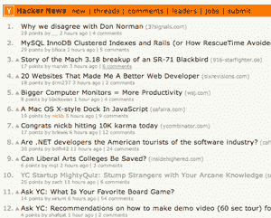

# 黑客新闻封杀 Valleywag 

> 原文：<https://web.archive.org/web/https://techcrunch.com/2008/04/11/hacker-news-considers-banning-valleywag/>

Y Combinator 上的一个小型但有影响力的类似 digg/reddit 的科技新闻网站  [黑客新闻](https://web.archive.org/web/20230209002320/http://news.ycombinator.com/)正在[询问其用户](https://web.archive.org/web/20230209002320/http://news.ycombinator.com/item?id=160704)是否应该禁止来自硅谷八卦网站 Valleywag 的报道。

Y Combinator 创始人保罗·格拉厄姆写道*“一些用户建议我们禁止 Valleywag，不是因为他们写了什么特别的东西，而是因为他们的文章总是故意链接诱饵。我个人同意。在 99%的 Valleywag 文章中，最有趣的是标题。但我不想被指责审查，所以我想我应该先征求一下意见。”*

经过 20 个小时的投票，400 多名投票者中有 60%的人对这项禁令投了赞成票。一位评论者写道*“不要依赖民主的暴政。以此为契机，建立一个基于原则的框架，并全面应用。当你制定宪法时，你必须私下进行，以伟大的思想和永恒的原则为基础……事实上要重视人的真正本质。”*

根据投票结果，黑客新闻[然后禁止他们](https://web.archive.org/web/20230209002320/http://news.ycombinator.com/item?id=161031)进入网站。

黑客新闻仍处于蜜月期——它还没有吸引如此大的读者群，以至于巨魔已经占据了永久的住所。在[提到他们](https://web.archive.org/web/20230209002320/https://techcrunch.com/2008/03/10/little-known-hacker-news-is-my-first-read-every-morning/)几次后，看到一些评论要求我不要再写他们，我问社区是否希望我不要提到他们。对[的反应不一](https://web.archive.org/web/20230209002320/http://news.ycombinator.com/item?id=146604)。

很明显，该网站旨在进行明智而深思熟虑的讨论，所以毫不奇怪，他们正在考虑禁止被称为 Valleywag 的有毒荒地。问题是，希望避开 Valleywag 巨魔的大型网站会不会也开始禁止它们？