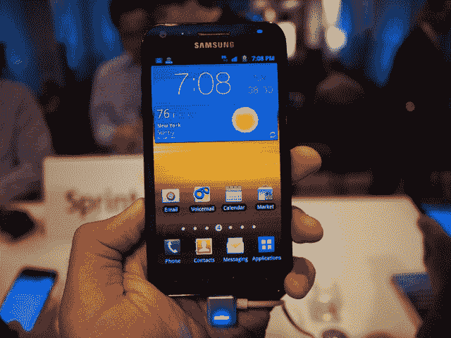
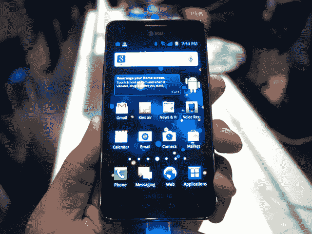
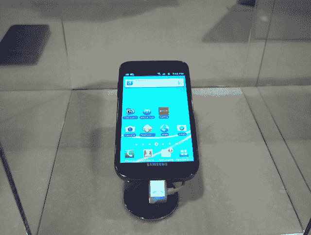

# 动手操作:三星为美国电话电报公司、T-Mobile 和 Sprint 开发的 Galaxy S II TechCrunch

> 原文：<https://web.archive.org/web/https://techcrunch.com/2011/08/30/hands-on-samsungs-galaxy-s-ii-for-att-t-mobile-and-sprint/>

自二月份以来，我们一直在等待 Galaxy S II 的到来。随着手机在欧洲和亚洲流动，很难保持耐心。但今天是一天:三星 Galaxy S II 的美国版本已经上市，我们准备在纽约三星的媒体活动上近距离接触。

美国版和国际版有多大不同？Super AMOLED Plus 显示屏的分辨率是否因尺寸而降低？感觉和看起来一样好吗？新的和改进的 TouchWiz 用户界面怎么样？真的好点了吗？别担心。我们在这里回答所有这些问题，甚至更多。

**Sprint 的 Galaxy S II Epic 4G Touch:** 

除了那个极其详尽的名字，这件事让我头晕。我仍然有点纠结于这款手机和美国电话电报公司的 GSII，但就设计而言，GSII Epic 4G Touch 相当好看。直边和圆角(与完全圆形的 T-Mo 迭代相反)看起来和感觉起来都很锐利。这也让我想起了另一款你可能听说过的流行手机，iPhone 4。

问题是:Sprint 的迭代和 T-Mo 的一样，都有 4.52 英寸的 Super AMOLED Plus 显示屏。这听起来非常笨重，但实际上它真的很棒。问题是，Sprint 的 4.52 英寸显示屏和美国电话电报公司的 4.3 英寸显示屏都号称分辨率为 800 x 480 像素，这意味着美国电话电报公司的显示屏看起来超级丰富和流畅，而 Sprint 的相比之下有点像素化。

拿在手里，史诗般的 4G Touch 并没有看上去那么有吸引力。感觉有点……便宜——几乎就像它的体积而言太轻了。我知道光应该是一个好东西，但这里的重量感觉不好。

我想这是你的电话，但对我来说，它缺乏良好的，坚实的感觉。

**AT & T 的 Galaxy S II:**

我不喜欢厚此薄彼，但美国电话电报公司的版本最受欢迎。为什么？因为更大的屏幕并不总是意味着更好的屏幕。正如我之前所说，由于美国电话电报公司一直忠于 Galaxy S II 的 4.3 英寸屏幕，这款设备的 800 x 480 分辨率绝对是华丽的。

你可能会认为不同型号之间的差异很小，但在拍摄图片和视频时，这种差异就变得非常明显。增加的像素密度有所不同，尤其是当手机并排放置时。

我们通常不太喜欢制造商喜欢在他们的 Android 设备上安装的这些自定义用户界面，但新的和改进的 TouchWiz 并不那么糟糕。它明显比我们之前看到的版本更快，更简洁。这当然不是我们喜欢的手机功能，但至少三星在 UI 方面有所改进。

虽然它比 T-Mobile 小了一根头发，但美国电话电报公司的变体设计比 T-Mobile 更棱角分明。事实上，它与国际版 Galaxy S II 几乎完全相同——这对我们来说完全没问题。我的意思是，那种型号的*在上市的头 55 天就卖出了 300 万辆。如果没坏的话，对吧？*

 ***T-Mobile Galaxy S II:**

曾经被称为大力神的 T-Mo 的 GSII 仍然有些神秘。他们把这个藏在玻璃后面，所以我们实际上并没有和它亲密接触。然而，我可以诚实地说，这不是我最喜欢的 S II 外形；这些曲线和 4.5 英寸的屏幕尺寸使它有点像 Infuse 和 Nexus S 的混合体，只是看起来不如其他两个版本时尚。

屏幕很漂亮，但同样，像素分辨率与 Sprint Epic 4G Touch 相同。由于三星不会让 pink 的版本开箱，所以很难说它是否会像 Sprint 的那样“太轻”。不管怎样，这肯定会是 T-Mo 最畅销的书之一。

对完整规格感兴趣吗？查看我们对官方声明的[早期报道](https://web.archive.org/web/20230210005052/https://techcrunch.com/2011/08/30/samsung-announces-the-galaxy-s-ii-for-t-mobile-sprint-and-att/)。*