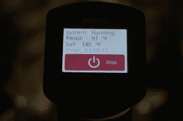
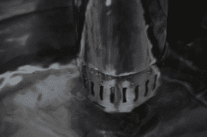

# 动手操作 Anova 自动录像系统 TechCrunch

> 原文：<https://web.archive.org/web/https://techcrunch.com/2013/09/09/hands-on-with-the-anova-automatic-sous-vide-system/>

真空烹饪可能是最高科技的食物准备方法之一，家庭厨师可以在没有化学学位和/或杀死自己和周围人的情况下进行。这就是为什么我特别兴奋地尝试了 [Anova](https://web.archive.org/web/20221006002005/http://www.sousvides.com/) ，这是一种自动真空循环器，可以在大约一个小时内将一块冷鸡肉变成多汁的味觉。

Sous vide 是一种偷猎形式，其中肉类和蔬菜被真空密封在袋中，然后在低温下在循环水中慢慢烹饪。例如，Anova 允许你将鸡胸肉密封在袋子里，完全煮熟，不会损失任何汁液或烧焦肉。煮熟后，你可以用手烤焦鸡肉表面，做出你尝过的最好吃的鸡肉。

【T2

方差分析出奇的简单。要使用它，你需要一大壶水和一个电源插座。你必须把肉密封在塑料袋里——不幸的是，拉链袋可能不起作用，所以还需要一个真空热封机。然后你设置温度和时间。比如我把右边的鸡用 60 摄氏度煮了 45 分钟。然后我给它加盐，并在热锅上烤。

该系统的温度范围为 25 摄氏度至 99 摄氏度，每分钟 12 升的水泵在烹饪时循环水。理想情况下，你应该在倒入食物之前预热系统，因为食物舒适地躺在温水中不是一个好主意。

创始人兼创造者 Jeff Wu 声称已经制造出了市场上第一个负担得起的家用真空吸尘系统。虽然有一些开源和 DIY 项目，但这是我们见过的最“苹果式”的一次性模型之一。吴拥有生物化学、计算机科学和金融方面的背景。他为制药和化工公司制造硬件。

“我帮助开发的大部分(如果不是全部)产品都与新药研究、医学研究或新材料的开发直接相关，”他说。“在我的工作中，我遇到了很多聪明人——大多数是博士研究员、研究生和诺贝尔奖获得者——这也是我偶然发现苏维的原因。”

“大约 4 年前，我在波士顿访问麻省理工学院/哈佛大学/不列颠哥伦比亚大学(不记得是哪一所)的一个研究小组，看到一些研究生在实验室循环器中腌制一些鸡肉，然后在热盘子上吃完。这让我有足够的兴趣在我们的实验室进行尝试，这是一个巨大的错误，几乎扼杀了这个项目，”他说。“我基本上不知道自己在做什么，因为 2009 年没有任何清晰的指南，最重要的是，我的包被科学循环器的涡轮吸入了。”

所以是不是很神奇？是的。我有点上瘾了。这个东西[只有 199 美元](https://web.archive.org/web/20221006002005/http://www.sousvides.com/)(你还需要投资 70 美元的真空封口机和一个大锅)的事实使它非常引人注目，它在几个小时内就做出了一些美味的食物。我一直想知道高级餐厅是如何制作大部分多汁肉类和非浸泡蔬菜的，现在我知道了。因为它需要很少的准备，你可以设置它，然后忘记它。你也可以将食物在低温下放置长达 72 小时，从而创造出一些令人惊叹的慢煮食物，它们不像一锅烤豆子那样邋遢，但却一样美味。

同样，对于一个相当酷的烹饪工具来说，199 美元是一笔很大的投资。然而，如果你是一个美食家，你想尝试 sous vide，这可能是最好的设备。网上还有其他的[水炉](https://web.archive.org/web/20221006002005/http://www.amazon.com/Sous-Vide-SVK-00001-Supreme-Water/dp/B003AYZIB4)，但是那些都超过了 400 美元或者更高。这是第一个“独立”模型——你确实需要其他设备来使它工作，但不是很多——而且它非常容易使用，设计优雅。

很明显，做好的炖肉是一种非常激烈的烹饪技巧。值得庆幸的是，像吴这样的食品爱好者正在做 Anova 这样的酷东西。