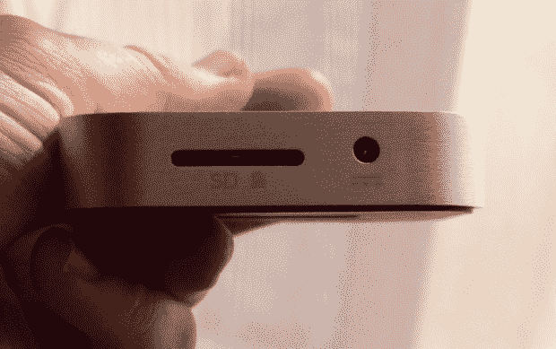

# 亲身体验 Iomega 超级英雄 iPhone 备份和充电器 

> 原文：<https://web.archive.org/web/http://techcrunch.com/2011/02/09/hands-on-with-the-iomega-superhero-iphone-back-up-and-charger/>

# 亲身体验 Iomega 超级英雄 iPhone 备份和充电器

我非常喜欢倒车。一直这么做。这就是我对 Iomega 超级英雄 iPhone 备份解决方案感兴趣的原因。基本上就是一个内置 SD 卡的充电器。要使用它，你必须下载一个免费的 [iPhone](https://web.archive.org/web/20230203033512/http://crunchgear.com/tag/iPhone) 应用程序，插上附带的 4GB 存储卡，然后放进你的手机。该应用程序允许您将联系人和其他个人信息备份到卡上，并为 iPhone 充电。它还会备份您的照片。

一旦你安装了应用程序，整个过程是自动的。它在第一次较长的初始备份之后生成增量备份。我自己的 iPhone 的备份花了大约五分钟。
 这个装置，平心而论，是相当巧妙和精心设计的。它包在刷铝和没有按钮。它本质上是一个火灾和忘记备份系统。例如，你可以在出差时随身携带它，这样你就可以在旅途中备份你的 iPhone，而不是在旅途中连接到一个潜在的讨厌的 PC。然而，我担心普通的商务旅行者不愿意带着这个冰球到处走，而不是原来的小 iPhone 充电器。

它适用于所有的 iPhones 和 iPod Touch。它不能备份你的音乐。它值 70 美元。

无论如何，当你晚上插上电源时，这是一个备份你的 iPhone 的好方法，我想，一个 it 人员会喜欢这个来充电，从而确保如果 iPod 从未被束缚，它至少会有一些备份容量。虽然并不惊人，但这是一个有趣的想法和出色的实现。

[产品页面](https://web.archive.org/web/20230203033512/http://go.iomega.com/en-us/products/smartphone/iphone-backup/?partner=4760)

[http://player.ooyala.com/player.swf?embed code = v2 cjgxmjrrx 5m 5-019 D2 ij 31 rktcmvzq&version = 2](https://web.archive.org/web/20230203033512/http://player.ooyala.com/player.swf?embedCode=V2cjgxMjrRX2m5-019D2iJ31RktCmVzQ&version=2)