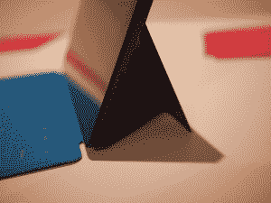
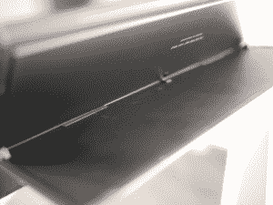
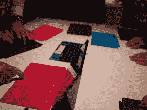
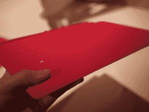
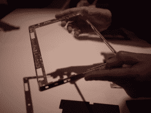
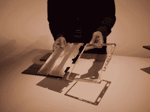
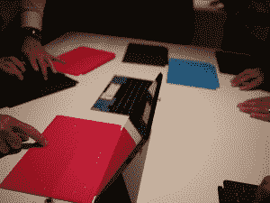
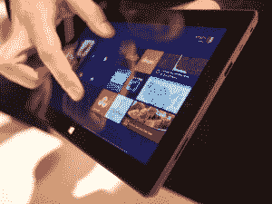
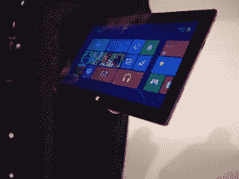

# 从里到外亲自体验微软 Surface 

> 原文：<https://web.archive.org/web/https://techcrunch.com/2012/06/18/hands-on-with-the-microsoft-surface-inside-and-out/>

我们刚刚第一次接触了微软的 Surface，这是一款全新的设备，似乎是微软对苹果 iPad、MacBook Air、安卓平板电脑和现有 Windows 平板电脑套件的响亮而清晰的回应——基本上，这是当今最强大和最受欢迎的移动计算设备的整个格局。这是一个非常雄心勃勃的努力，该公司正竭力强调这是由微软从内到外，从硬件到软件打造的。

现在值得一提的是，相当多的表面细节很难确定。该设备将有两个主要版本，用于 Windows RT 的[微软 Surface](https://web.archive.org/web/20221225132655/http://www.microsoft.com/surface/) ，以及用于 Windows 8 Pro 的微软 Surface。微软已经明确表示，它已经从整体上收缩了该设备的制造，但在颗粒层面上没有给出太多颜色:谁制造了构成 Surface 的处理器，构成 Surface 的其他组件等等。定价还没有透露——微软只是说 RT 消费者版本和更高性能的 Pro 版本的价格点将与他们的同行“竞争”。RT 应该会在假期推出(与此同时， [Windows 8 也将推出](https://web.archive.org/web/20221225132655/https://techcrunch.com/2012/06/17/windows-8-youll-absolutely-hate-it-at-first-but-give-it-a-chance-anyway/))，而 Pro 版平板电脑将在三个月后推出。

以下是我们使用该设备的图片。点击每一个来放大它。

首先，我们看了一下内置在 Surface 中的支架，这是与 iPad 的一个明显区别，因为用户必须购买单独的配件。该支架可以轻松、时尚地在平板电脑上点击，并发出令人满意的“咔嚓”声——该公司表示，他们花了大量时间开发使其工作的三个铰链，模仿豪华汽车的车门。

 

接下来我们看了附带的盖子，它可以兼作触摸键盘。它有一种柔软的橡胶感，但当你触摸它们时，按键不会压缩。它也不会弯曲，不像 iPad 保护套——显然，它不仅仅是覆盖屏幕。微软表示，制作铰链和盖子是为了给它一种书卷气。它们有几种不同的颜色。

 

然后，我们看了看该设备的一些组成部分——Vapor MG，这是由微软开发的注册商标的镁合金，它构成了内部骨架和表面的外部。微软对此感到自豪，因为它既坚固、轻巧又时尚——他们几次向我们指出，它远远优于塑料，当你看到它的外观和感觉时，这一点就很明显了。

 

接下来是让触摸键盘工作的组件。如果你喜欢的话，你也可以买一个更传统的触觉“按钮”键盘。他们说，它比现有平板电脑上的普通屏幕键盘更快更快。

最后是大揭秘——屏幕打开了(是的，只有动手操作的一部分让我感受到了触摸屏是如何工作的。)这绝对是一个高清屏幕，但我没有放大和缩小照片的能力，无法看到你能多快地渲染一幅图像。

至于设备的手感？它的边缘有点倾斜，但肯定比最新版本的 iPad 更加方正。就我个人而言，我觉得它结束了 Surface 更商业化的感觉，而 iPad 的娱乐性更强。但是，这又是一个完全主观的想法。

 

总之，这是一个非常好的，经过深思熟虑的，令人印象深刻的来自雷德蒙的人们的努力(顺便说一下，为什么这个活动在洛杉矶举行仍然是一个谜，但我想这是我们这些专注于技术的人们参观 glitz 和 glam 总部的一个很好的借口。)距离 Surface 的实际发布还有几个月的时间，但我们目前看到的情况看起来非常有希望。

以下是 TechCrunch 迄今为止对 Surface 的一些其他报道，请继续关注该设备的更多更新: