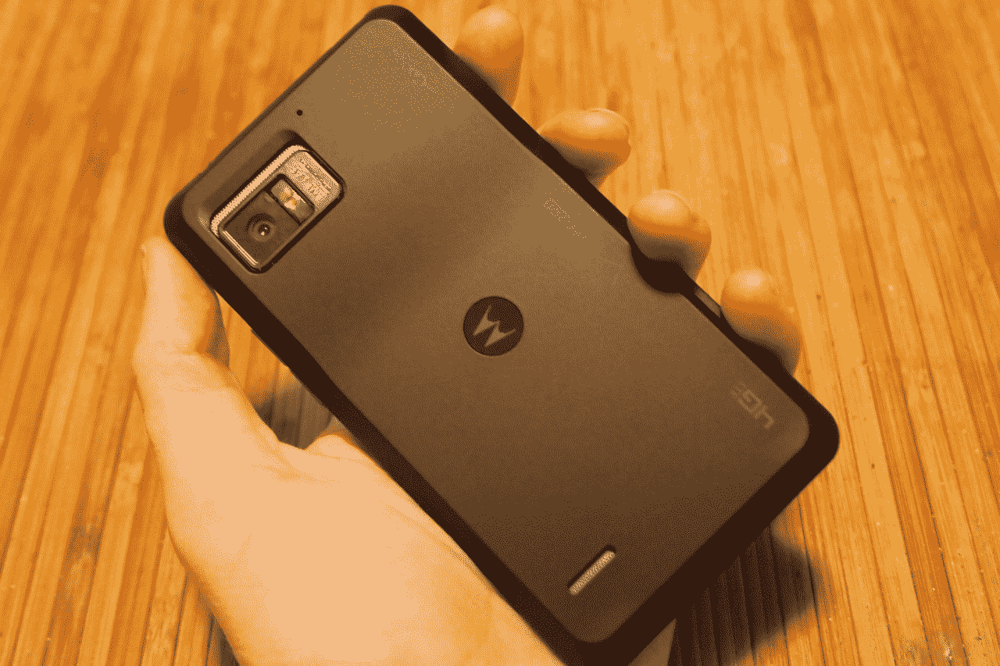
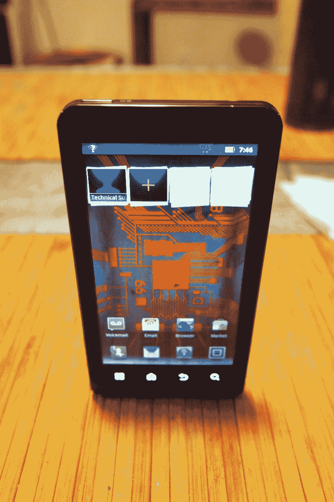

# 为威瑞森 TechCrunch 动手操作摩托罗拉 Droid Bionic

> 原文：<https://web.archive.org/web/https://techcrunch.com/2011/09/07/hands-on-with-the-motorola-droid-bionic-for-verizon-2/>

# 为威瑞森动手操作摩托罗拉 Droid Bionic

今天，摩托罗拉和威瑞森宣布了机器人仿生。它花了很长时间才来到这里，但它最终是正式的。我们永远不会再写关于它被推迟了多久的帖子了。相反，我们开始写手机本身，这对每个人来说都更有趣。

我们有一个更长的审查在工作中，但我们认为这将是很好的给你们一些关于这个坏男孩的新公告的第一手印象。就规格而言，我们似乎在很久以前就已经确定了那些:

*   威瑞森 4G LTE
*   安卓 2.3.4 姜饼
*   1GHz 双核处理器
*   1GB 内存
*   800 万像素后置摄像头、VGA 前置摄像头(1080p 视频捕捉)
*   4.3 英寸 qHD 显示屏
*   不含 Lapdock 配件

但对于冷酷的事实来说，这已经足够了。手机*感觉如何*？

*   尺寸:对我来说，Bionic 有点大，运动尺寸为 2.63 英寸 x 5 英寸 x 0.43 英寸。它的上后边缘有点隆起，使它比承诺的 0.43 英寸厚一点，但它的重量很好地平衡了笨重和廉价的感觉。
*   **显示屏:**屏幕略微凹陷——非常适合保持无划痕——分辨率为 960×540 像素。老实说，我不能说它击败了 AT Galaxy S II 上的 Super AMOLED Plus 显示屏，但肯定存在竞争。
*   **手感:**手感柔软，背板手感很好，但不太会处理印花。虽然表圈更小，但处理污迹却更加困难。
*   **性能:**毫无疑问，仿生是时髦的。它可以毫无问题地处理我扔给它的几乎所有东西(一些游戏、一些网页浏览和一些 Hulu 风格的视频播放)。但我确实期望加载应用程序本身会更快。在打开一些游戏、相机和浏览器时有一点延迟。

机器人仿生将于 9 月 8 日在威瑞森上市，合同价格为 299 美元。幸运的是，一些促销活动正在进行，可能会帮助你的钱包。如果你计划从功能手机转向仿生手机，并且你的合同即将到期，你可以获得一张 100 美元的礼品卡来支付你的新仿生手机的价格。如果你打算全力以赴，得到那个花哨的拉普多克，如果你同时购买仿生和拉普多克，你会得到 100 美元的邮寄回扣。