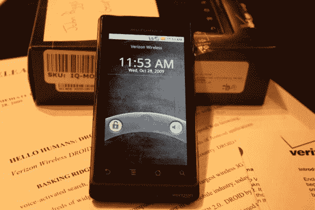

# 动手操作摩托罗拉 Droid:性感 TechCrunch

> 原文：<https://web.archive.org/web/https://techcrunch.com/2009/10/28/hands-on-with-the-motorola-droid-sexy/>

# 动手操作摩托罗拉 Droid:性感

朋友们，罗马人，你们来了，来自威瑞森的摩托罗拉 Droid，这是你们过去几个月一直垂涎的手机。它现在静静地坐在我旁边的桌子上，想知道你在哪里。机器人想要你。

在与摩托罗拉 Cliq 和摩托罗拉自己的操作系统 MotoBlur 合作后，我对这款手机抱有很高的期望。现在看看它，我很高兴地报告，威瑞森终于有了一个值得再看一眼的 Android 手机。

我需要多一点时间打电话来表达我的赞美/批评，但迄今为止，我注意到了一些事情:

*   Google Nagivation 是 Android 家族不可思议的新成员，看起来很棒。独立导航应用的家伙需要担心。*   硬件相当不错。键盘很宽敞，很容易滑开。*   没有一个 MotoBlur 突出展示的插件，包括威胁要让手机崩溃的 Twitter 插件。*   这款手机非常精致，但安装的应用程序似乎很少。在与 Hero 和 Cliq 一起工作后，你可能会想到各种各样愚蠢的时钟和社交网络应用程序。这个没有这些。*   It has the best start-up sound in the whole world.

    [YouTube http://www.youtube.com/watch?v=dxyOkasszN4&hl=en&fs=1&]