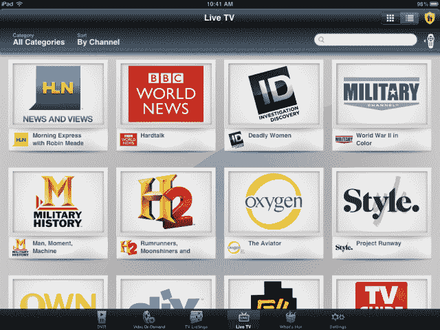
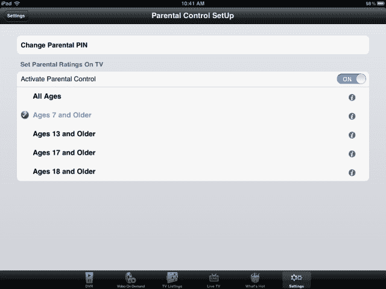
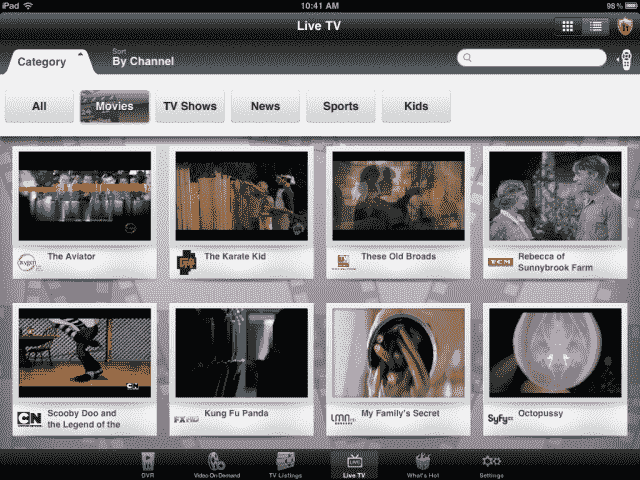
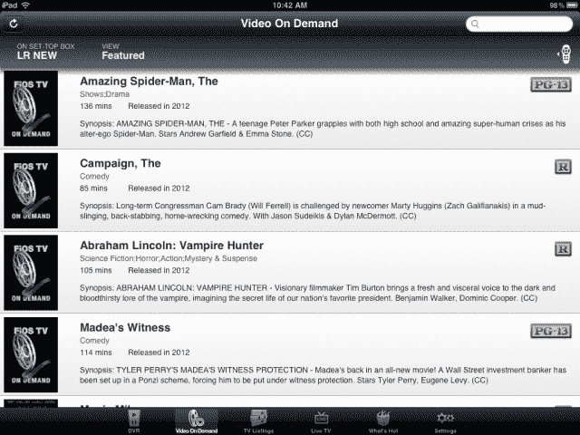
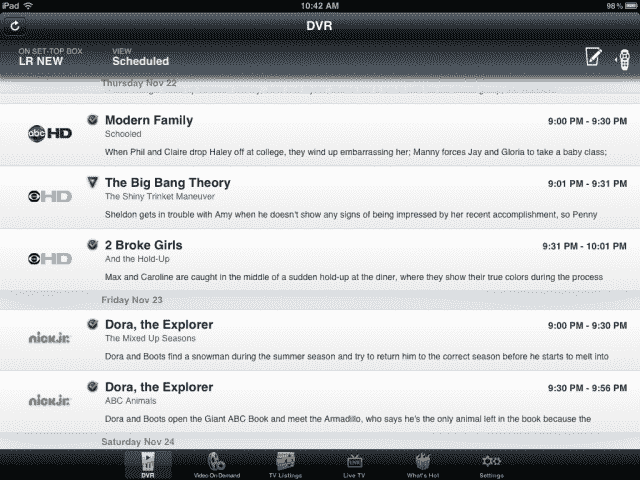
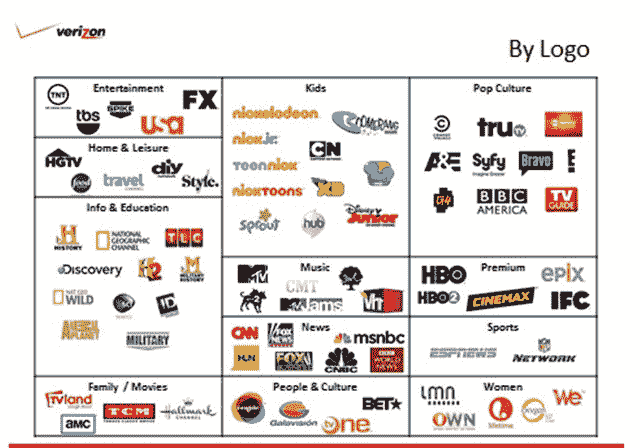

# 使用威瑞森·FiOS 移动应用程序 TechCrunch 进行操作

> 原文：<https://web.archive.org/web/https://techcrunch.com/2012/11/22/hands-on-with-the-verizon-fios-mobile-app/>

威瑞森更新了 iPad 的 FiOS 移动应用程序，现在有 75 个直播电视频道。与威瑞森过去发布的一些移动体验不同，新的应用程序不需要你在苹果电脑或个人电脑上安装软件来充当中介——相反，一切都直接从你家里的威瑞森路由器流出。

昨晚，当这个应用程序第一次被推出时，我正在 T2 远离电脑喝酒，但是今天早上，由于假期的停工期，我终于能够测试它了。我现在正在写这个应用程序，这一事实就证明了它的成功——它让这个孩子忙得不可开交！

在你变得过于兴奋之前，有一个重要的警告:威瑞森说，直播电视选项将只适用于高清机顶盒。标准清晰度机顶盒不能与远程控制应用程序通信，但当然，升级始终是一种选择。您还需要威瑞森的用户 ID 和密码(比如登录 HBO GO 时所用的)以及 FiOS 的互联网和电视服务。

新应用包括娱乐、信息和教育、音乐、家庭/电影、儿童、人物和文化、流行文化、体育和女性等类别的顶级有线电视频道，以及 HBO、Cinemax、IFC 和 Epix 等高端频道(针对订户)。(见本文底部的完整列表)。

不过，请注意，FiOS 移动应用不提供对 NBC、ABC、CBS 或 FOX 等本地频道的流媒体访问。由于许可问题，它也不会包括您当前 FiOS 订阅的所有频道，但 75 是这类应用程序的一个健康的开始。

**为父母**

计划与孩子一起使用该应用程序的父母应注意，首次启动时会出现一个弹出窗口，询问您是否要启用家长控制。这项功能允许您配置一个四位数的 PIN 码来控制对成人内容的访问，就像今天的 FiOS 机顶盒一样。然而，设置 PIN 可能会给父母一种错误的安全感——PIN 本身并不能实现他们可能想要的内容限制。默认情况下，它被设置为“18 岁或以上”，这是“所有年龄”选项的第一步。

【T2

对于更小的孩子，家长需要进入设置部分(右下角按钮)，然后在 17 岁以上、13 岁以上或 7 岁以上之间选择。我很惊讶没有一个选项只选择“电视 G”内容，特别是考虑到这个应用程序作为不断播放儿童卡通片的替代品会有多有用，但也许威瑞森正在向美国父母传递一个信息:*蹒跚学步的孩子不应该看无人监管的电视*。那好吧。

**电视直播**

直播电视频道以类似网格的模式显示，您可以点击顶部的按钮按频道排序或按类别过滤。如果你想找一些特定的东西，搜索框也是可用的。可以说，这是一个比电视遥控器和大屏幕上的电视指南更容易使用的界面，但话说回来，我这么说是出于移动优先的心态。如果你是守旧派，喜欢更传统的指南，你可以切换到应用程序的那个部分。如果您愿意，实况电视指南还允许您从网格视图切换到类似列表的视图。

**看电视**

当您轻按以观看节目时，视频不会立即全屏显示。相反，下面显示了关于该节目的附加信息，左边是一个可滚动的垂直指南，让您在其他直播电视节目中上下移动。(见本帖顶部图片)。你必须点击顶部的一个按钮才能进入全屏模式。

在很大程度上，这很好，尽管我有一个奇怪的经历，我同时听到了两个音频流——一个来自以前的频道，另一个来自新的频道。关闭应用程序并重新打开它修复了该问题，此后再也没有出现过该问题。

**没有 DVR 播放**

这款应用还有一个视频点播区，你可以在这里点播和观看电影。但是最令人失望的是 DVR 部分。您可以在这里查看、管理或取消您的录像，但不能回放。就用户体验而言，这是一个很大的失误，因为我们今天观看的许多内容都是时移的，而不是实时的。但这不一定是威瑞森的错——总的来说，是内容提供商不希望录制的内容出现在手机上。尽管如此，由于这款应用程序与家庭的 Wi-Fi 网络相连，似乎你可以说这款应用程序并不是真正的“移动”应用程序，而是一款屏幕更小的电视替代品。

如果你不确定要看什么，另一部分可以帮助你找到受欢迎的节目。这个“热门话题”部分，就像同名的 FiOS 小部件一样，显示热门内容。威瑞森实际上使用来自订户观看模式的数据来实时生成这些推荐，而不是编辑性地选择内容，这带来了一些有趣的发现。

总体而言，这款应用对 FiOS 用户来说是一个受欢迎的升级，尽管在加载和使用导航时仍有一些滞后。遗憾的是，这是对威瑞森应用程序的普遍抱怨——它们往往很慢。但是新的界面和设计比威瑞森以前提供的有了很大的进步，如果这个应用能够播放本地频道和 DVR 内容，它可以很容易地从好变得很好。

你可以在 iTunes 下载新的应用程序。iPhone FiOS 移动远程应用程序也于 19 日升级，但不提供流媒体服务。

