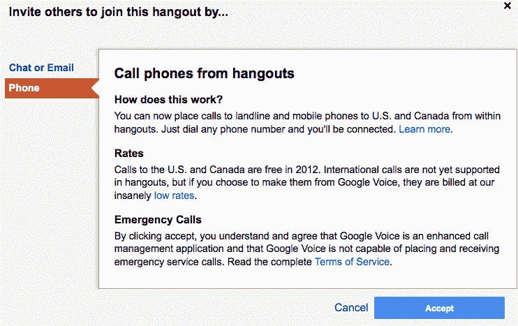

# Google+现在可以让你通过免费的语音通话与人进行交流 

> 原文：<https://web.archive.org/web/https://techcrunch.com/2011/12/01/hangouts-voice-calls/>

# Google+现在可以让你通过免费的语音通话与人进行视频会议

视频会议可能成为电话会议的新方式。谷歌员工 Jarkko Oikarinen】刚刚宣布美国和加拿大的人现在可以在[的住处通过 extras](https://web.archive.org/web/20221209093831/https://plus.google.com/hangouts/extras) 进行免费语音通话。这意味着人们不再需要守在电脑旁，甚至不需要有一个谷歌账户就能加入 G+视频聊天。你只要打电话给他们，他们的声音就能被任何人听到，他们也能在会议中听到。这可能是让人们加入 Google+最具创新性的功能的好方法，也可以填补由于社交网络当前用户数量较低而可能有点稀疏的聚集点。

要激活该功能，只需启动一个 Hangout，单击顶部的邀请按钮，选择“电话”，然后输入电话号码。如果收件人拿起电话，他们会立即联系上。这项免费服务预计将持续到 2012 年。不支持国际电话，但谷歌建议你使用谷歌语音。除了将手机上的人加入现有的群组视频聊天之外，该功能还可以用来进行快速免费的一对一通话，而无需设置谷歌语音帐户。这样一来，Hangouts 可以更直接地挑战 Skype。

互联网中继聊天的创始人 Oikarninen 说，这个功能“对聚会线路和电话会议都有帮助。”这可能是一个简单的方法来做集体决定，举行会议，或者只是玩玩。一旦人们有了去处，他们就会变得非常有趣，但是让他们去那里是 Google+到目前为止最大的问题。通过让任何有手机的人都可以访问它们，Google+可以让人们对他们的移动性着迷，这样他们就有希望在未来从网络上开始自己的社交活动。

