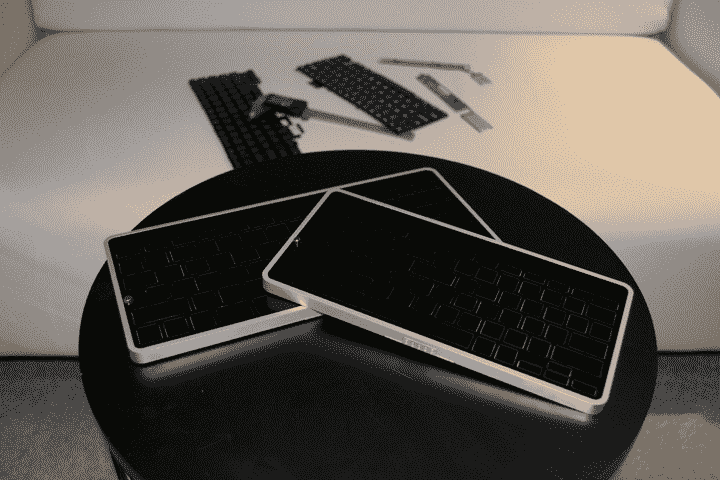

# Kickstarter 创始人 Woe TechCrunch 的故事展示了硬件创业的时停时合

> 原文：<https://web.archive.org/web/https://techcrunch.com/2013/08/27/hardware-startup-stops-and-fits-showcased-by-kickstarter-tales-of-founder-woe/>

如果你怀疑在你的整个生活中，用你一直想象的开瓶器(完美的设计，诚实的)制作 iPhone 外壳会很困难，那么看看最近 Kickstarter 的几次失败就知道了，这些失败已经存在很长时间了。[levitar 键盘](https://web.archive.org/web/20230130225448/http://www.kickstarter.com/projects/1372319351/levitatr-a-keyboard-with-elevating-keys-for-ipad-t/posts)和 [Syre iPod nano 蓝牙表带](https://web.archive.org/web/20230130225448/http://www.kickstarter.com/projects/syre/meet-syre-the-worlds-first-bluetooth-ipod-nano-wat/posts)都是在 Kickstarter 最初开始的令人兴奋的狂野西部时期萌发的项目，在它开始收紧对硬件活动的控制之前，它们都是案例研究，如果即使是最善意的硬件创业公司都失败了会发生什么。

Kickstarter 从来没有声称自己是一个店面，因此遇到问题和无法交付的项目应该是任何和所有支持者都熟悉的领域。任何使用它相当长时间的人都知道，你会得到一些没有实现的项目，你会得到一些最终交付的项目，但也是大量交付不足的项目。但有时，你会遇到这样的项目，创始人对他们遇到的问题非常透明，以至于值得特别注意哪里出了问题。

## 漂浮者未能离开地面

 悬浮键盘就是这样一个项目。James Stumpf 的这个项目最初是在 2011 年作为 iPad 和平板电脑的键盘配件设计的，它给人留下了深刻的印象，因为一旦配件通电，按键就会神奇地出现在光滑的平面上。它由俄亥俄州代顿的企业家詹姆斯·斯顿夫设计，在 45 天内达到并超过了 60，000 美元的融资目标，似乎有合理的机会在 2011 年 11 月的预期上架日期前发货。

Stumpf 通过 2013 年 8 月 12 日发布在 Kickstarter 上的支持者更新，宣布 Levitatr 失败。他列举了该产品过于雄心勃勃的目标、资金短缺、无数次失败的许可谈判和他自己普遍缺乏经验，作为项目失败背后的主要激励因素。Stumph 说，他为这个项目筹集的资金都花在了建造它的尝试上，他还提供了一份项目清单来证明这一点。Stumpf 还声称在这一过程中欠下了相当多的个人债务。

漂浮术的崩溃是因为它更多的是概念而不是具体的，它的物理原型承诺了一件事，但从工程的角度来看，这是一个巨大的挑战。Stumpf 将项目失败背后的部分原因归咎于缺乏妥协的意愿，但这真的会导致贪多嚼不烂:换句话说，在项目开始时，只承诺你知道你能够构建的东西。

许多 Kickstarter 项目就这样消失在夜幕中，但 Stumpf 特意通过 Dropbox 发布了一长串支持文档，以支持他对事情发展过程的描述，他还善于通过更新让支持者了解他的试验和磨难。Kickstarter 旨在成为一个可能出错的地方，我认为 Levitatr 是你在失败中可能希望的最佳情况的完美例子，因为它至少为其他寻求建立硬件创业公司的人提供了一些指导。

## Syre 没有王冠

另一个可能道歉太多而解释不够的例子是几乎已经过时的 iPod nano 的 Syre 蓝牙手表带。马上，你就看到问题了；这是一个为苹果最新一代 iPod nano 设计的项目，这款小巧的方形产品非常适合普通人的手腕。事实上，在苹果停止销售该设备很久之后，它还没有发货，这绝对不是一个好消息。

Syre 旨在通过在表带配件中嵌入一个简单、低调的加密狗来添加蓝牙，从而解决第六代 iPod nano 的主要监管问题。该项目筹集资金所基于的实体模型显示了一种有吸引力的紧凑型设备，这种设备帮助该项目在 2012 年 8 月筹集了近两倍于其 75，000 美元的目标。然后，后来对支持者的更新显示了一个非常不同的设备作为最终的工程原型，它本质上是一个橡胶纳米表带外壳，末端伸出一个大而难看的蓝牙加密狗——本质上，其圆滑设计的所有价值都消失了，支持者对这一变化表示失望。

严格来说 Syre 没有死，但是可以说病人没有表现出任何大脑活动。项目创始人 Anyé Spivey 今天发布了一个更新，描述了项目的状态和前进的选择，两者都相当严峻。苹果决定改变 iPod nano 的设计并在新型号中引入蓝牙，这对消费者和潜在经销商的需求产生了可以理解的负面影响:像其他任何以第六代 nano 为重点的产品一样，它现在的潜在受众非常有限，增长潜力完全为零。

Kickstarter 旨在帮助那些不一定能够自行投入第一次生产的项目起步，而不是提供资金来支持一项业务的长期发展，因此即使银行里有 13.3 万美元，Syre 也立即面临资金问题。设计还没有最终完成，工程在一开始还只是半个构想，Spivey 说他被苹果的 Mi 团队“误导”了，还不得不花很多钱为那些选择了包括 iPod 在内的奖励级别的支持者锁定 nanos。

由于这两个项目都是构想和资助的，Kickstarter 对其处理硬件项目的方式进行了相当大的改变。该网站在批准硬件活动上线时要谨慎得多，并要求在每种情况下都有一个功能原型。总的来说，过去一年 Kickstarter 上的硬件项目比以往任何时候都多，这对该网站、对支持者以及最终对创始人和创作者来说都是一件好事。然而，不管有没有新规则，失败仍然是这种启动资金的另一面(就像传统方法一样)，从出错的项目中可以学到很多东西。