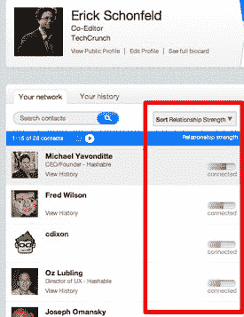
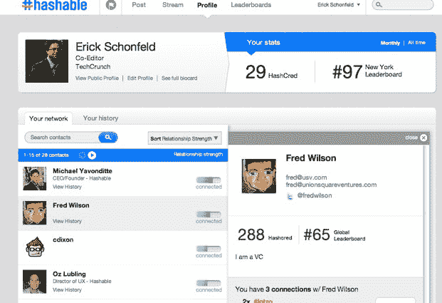

# Hashable 开始衡量你人际关系的强度 

> 原文：<https://web.archive.org/web/http://techcrunch.com/2010/12/09/hashable-strength-relationships/>

昨晚，社会介绍服务公司[向会员推出了](https://web.archive.org/web/20230203060140/http://hashable.com/)[新网站设计](https://web.archive.org/web/20230203060140/http://twitter.com/#!/mikeyavo/status/12948926499917824)。虽然该网站仍然是半封闭的(你需要现有会员的邀请或介绍才能进入——在 Twitter 上关注 [@hashable](https://web.archive.org/web/20230203060140/http://twitter.com/#!/hashable) 的前 500 名读者将获得一个)，但它正在尝试一些非常有趣的方法来对你的在线社交关系进行排名。该网站的新功能之一是允许你通过你在 Hashable 上的关系强度来查看你的联系人。你与那个人的互动越多，以及他们是否会回应，决定了你是否“亲密”、“有联系”，或者仅仅是“认识”。

Hashable 正在以一种非常轻量级的方式挑战 LinkedIn。与静态的分离度不同，你可以确切地看到你所联系的人与你可能寻求介绍的其他人有着最紧密的联系。每当你发布一个连接，Hashable 现在也开始显示“hashbits”。hashbit 只是一个偶然发现的信息，显示了你认识的一个人是如何与你认识的另一个人联系在一起的。

你可以通过 Twitter 或电子邮件与 Hashable 上的人联系，它既是一个商业介绍服务，也是一个升级版的在线通讯录。首席执行官 Michael Yavonditte 称之为“关系书”,因为它可以记录你的商业关系。它以一个简单的#intro 开始(你通过在一条推文中使用标签“#intro”和他们的 Twitter 句柄来介绍人们)，但早期用户也记录他们何时#刚认识某人，或出去#喝酒、#午餐或#晚餐。你可以用 Hashable 公开#感谢某人，或者自己编散列。我用它来记录初创公司创始人给我做#演示的时候。这些描述性标签使这些哈希比特更有趣，因为它们充实了人们之间的关系。想象一下，当人们开始在这项服务上约会时。

你用的 Hashable 越多，你得到的积分就越多。每个城市都有排行榜，很快也会有行业和职业排行榜。所以人们会竞相成为最受关注的创业律师。这是一种衡量超级网络用户地位的方法。

但是，即使您不喜欢这项服务的竞争方面，您也可以将其作为一种简单的方式来跟踪您遇到的人，并私下或公开地为自己写下关于这些会议的笔记。然后，如果你想再次见到那个人，你可以看看你的历史，或者你可以通过标签搜索你已经得到的所有#演示或者你刚刚认识的人。你与任何特定的人互动越多，你的联系强度就越强。

在接下来的几周内，一旦 Hashable 更加开放，我们将会看到这种新形式的商业网络是否流行。雅冯迪特几天前退出了领英，他无疑希望你也能这样。

这是我去年 10 月对他进行的一次视频采访:

